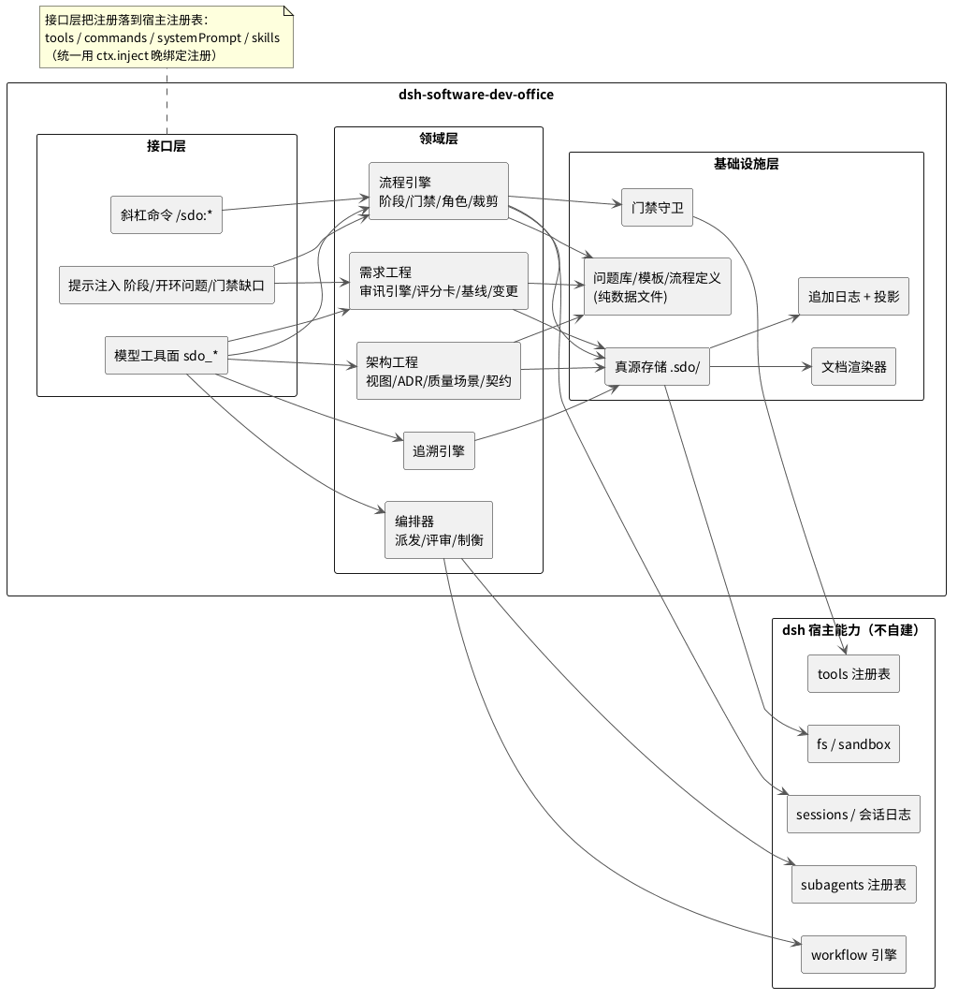
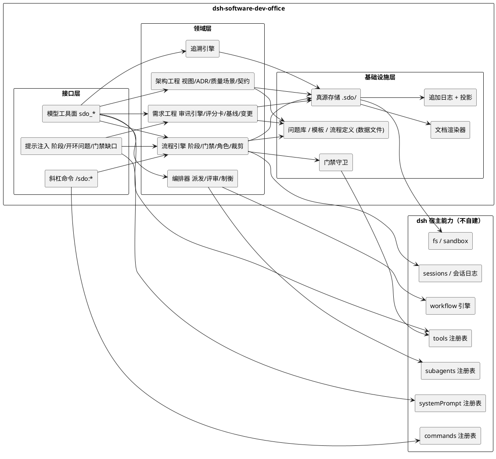
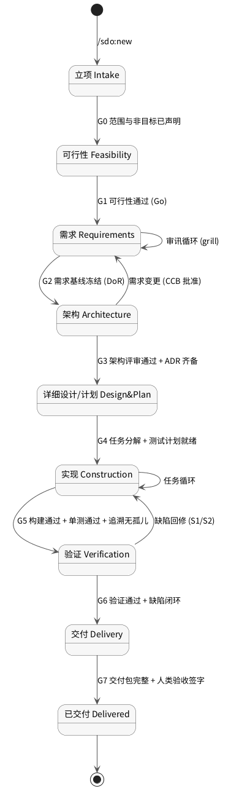
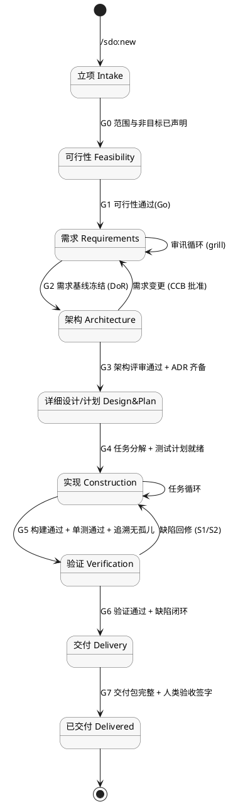
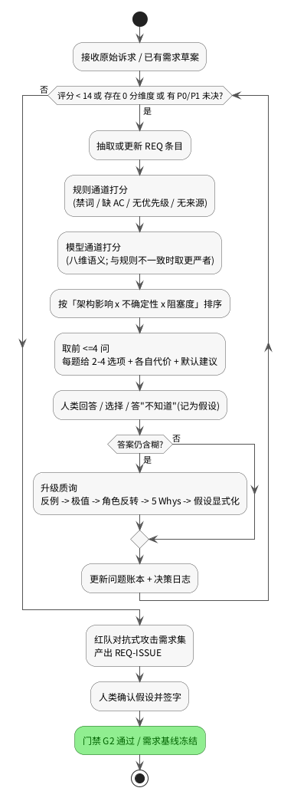
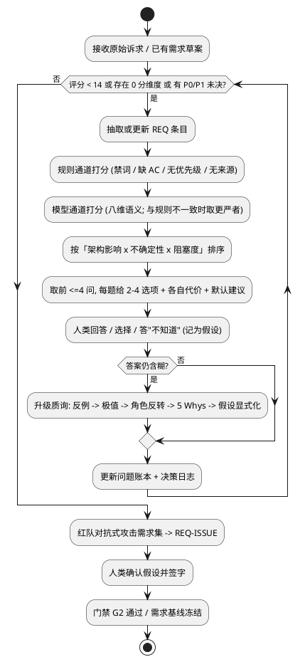
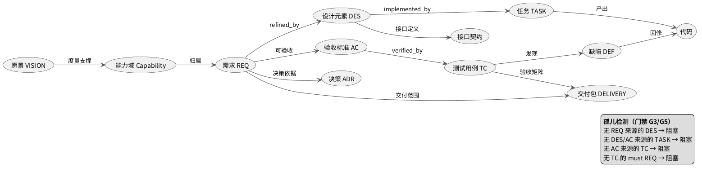
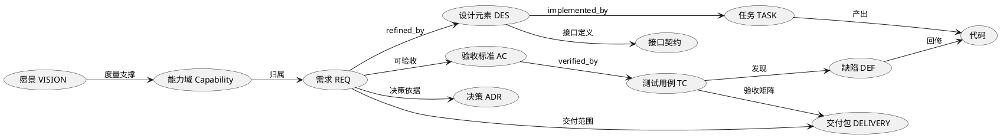

# dsh-software-dev-office 设计初稿

| 项 | 值 |
|---|---|
| 文档版本 | v0.8（dsh `0.2.0-rc.1` 单一基线 + 四条新增需求 + 单会话原则 + 三轮评审落地 + Q-08/09/10 实测，待评审） |
| 日期 | 2026-09-29 |
| 插件包名 | `dsh-software-dev-office`（简称 SDO，下称「本插件」） |
| 宿主 | deepseek-harness (dsh) `0.2.0-rc.1`，原生 Cordis 插件（**只支持 0.2.0 线，不做 0.1.5 兼容**） |
| 定位 | 基于软件工程方法论的「Agent 研发办公室」：从可行性分析、需求收集、架构设计，到开发、测试，最终产出可部署产物 |
| 明确不含 | 发布（deploy/release to production）与运维（operate/monitor） |
| 读者 | 插件作者、dsh 集成方、评审者 |
| 本文件性质 | dsh `0.2.0` 基线设计（v0.2 已收敛）；用于评审与收敛，同时作为本插件自身「需求→设计」链路的示范 |

> 说明：本文中的代码、命令、路径、标识符保留原文；叙述用中文。文中所有关于 dsh 扩展点的陈述，均已对照实例内 `@deepseek-ai/*` 包的真实 README/类型核查（见 §2.1）。
>
> ✅ **版本基线（v0.2 收敛）**：本文已从「`0.1.5-rc.2` 初稿」**整体重写为 `dsh 0.2.0-rc.1` 单一基线**。原增补报告 [`2026-09-29-dsh-0.2.0-rc.1新特性与SDO设计增补.md`](./2026-09-29-dsh-0.2.0-rc.1新特性与SDO设计增补.md) 的修订建议已**逐条并入本文**，该报告自此只作为**调研证据与包级差分记录**保留，不再是本文之外的第二份设计口径。
>
> 本次收敛涉及的实质变化（对 0.1.5 方案而言是替换，不是兼容）：
>
> | 方面 | 0.1.5 时代的写法 | 本文采用的 0.2.0 写法 |
> |---|---|---|
> | preset 交付（入口） | 随包 `presets/` 目录 + `dsh-agent-presets` 的 `roots` 扫描 | **声明式插件行**：`@deepseek-ai/dsh-agent-preset` 的 `config.plugins`（§11.2/§11.4） |
> | 多代理编排 | 全自研任务板 + `.sdo/inbox` 单写者协议 | **`ctx.agentTeams` 原生团队**（任务板 CAS + 持久 mailbox + 写范围提示），自研协议降级为真源写入（§8.3） |
> | 改动证据 | 模型自述 | **`workspace/changes` 的 `(sessionId, seq)`** 作为 G5/G6 证据（§10.4） |
> | 依赖版本 | `peerDependencies` 用 `^0.1.5-rc.1` 浮动范围 | **精确钉版 `0.2.0-rc.1`** + cordis `~4.0.4`（§11.6） |
> | 开发期改动生效 | 一律需重启 dsh | 启用 `dsh-hmr` 后源码与 profile 配置可热重载（§11.6） |
>
> **v0.3 追加（2026-09-29，四条新需求 + 三项已定决策）**：
>
> | 新需求 | 结论落点 |
> |---|---|
> | 任务拆分 + 多 subagent 协同开发 | §8.6 任务拆分（WBS→任务卡→DAG）、§8.7 协同协议；REQ-023/024/025 |
> | 可视化看板（各 agent 状态与工作内容） | §10.5；**两步走**：M0–M5 文本看板（`/sdo:board`，处处可用）→ M6 Web 交互面板（client 插件）；REQ-026/027 |
> | 成本监视 + 开发预算 | §10.6 成本账与预算模型（`ctx.tokenMeter` + `dsh-session-stats`）；REQ-028/029/030 |
> | 入口：明确指定才接管 | §11.2 **preset-only**：插件行只写在 preset 的 `config.plugins` 里，未选中的会话**根本未装载**；REQ-031/032 |
>
> **三项决策**（本次由用户拍定，已固化为约束）：① 入口**只做 preset**，不做会话中途接管开关（C-07）；② 看板**两步走**；③ 预算**只监视 + 提醒，不硬停**（C-08，故不注册 `llm/stream` 拦截）。
>
> **v0.4 追加（2026-09-29，单会话原则）**：用户决策——**所有流程在同一个会话内完成**。据此：
>
> - 新增约束 **C-09 单会话原则** 与需求 **REQ-033**（§3.4 / §3.2），AC-014 验收；
> - **preset 只承担入口**：`presets/` 只有**一份** `sdo-office.patch.yml`；**角色一律由派发时刻的 `persona` + `toolFilter` 表达**（§8.2 / §9.1 / §11.4）；
> - 连带的简化：看板不需要跨会话聚合（§10.5）、成本归集以单一 Lead 会话为根（§10.6）、M7 =「角色卡与文档」（§13）；
> - 诚实边界：**角色隔离的上限是 `toolFilter`，没有装配级隔离**（RISK-21 / §14.3 第 5 条）。
>
> **v0.5（2026-09-29，评审意见落地）**：§14.2 的 14 个开放问题完成评审，结论已落进正文——工具粒度（Q-01）、评分卡权重固定且项目不可改（Q-02）、**红队 `normal`/`critical` 默认开启且用户可停用（须留痕）**（Q-03）、`project.json` 入库（Q-04）、**`prototype/` 物理隔离 + G7 拒绝**（Q-05）、看板两步走（Q-06）、**架构阶段强制 plan mode**（Q-07）、**默认只展示已消耗、预算限值可选填入**（Q-11）、看板保留窗口 N（Q-12）、**超限时询问用户**（Q-13）、**模型不得改预算**（Q-14）；Q-08/Q-09/Q-10 维持"待实测"；评审新暴露 5 个问题 **Q-15~Q-19**（trivial 的红队默认、面板交付时点、plan mode 触发者与 G3 去重、无交互环境的降级、询问频率）。
>
> **v0.6（2026-09-29，第二轮评审落地）**：Q-15~Q-19 的结论进正文——`trivial` 档红队**默认不开但可按用户要求开**，且启用/停用是**会话内**开关（用户自然语言驱动 `sdo_redteam(action=off|on)`，写 `redteam/mode` 留痕、**可重开**）；**M6 只做"投影 + 面板骨架"，完整交互面板移入 v2**（M6 工期 8–12 → 5–7，总计 **48–72 人日**）；**plan mode 由 SDO 主动驱动进入**，且**用户计划评审与 G3 门禁是两道**；超支询问在**无交互应答者时降级为提醒 + `budget/decision: deferred`**（C-08 在任何环境都成立），并**每跨一个阈值档问一次**。新增待决 **Q-20**（无交互时第一道 plan 评审怎么处理）。
>
> **v0.7（2026-09-29，Q-20 落地）**：**Q-20 采用②（阻塞）**——无交互评审通道（headless/ACP）时，SDO **在进入架构阶段之前**检测评审通道；不可用则**不进入 plan mode**、把架构阶段标为 `blocked`、写 `plan/review-blocked` 留痕、**不触达 G3**、**不提供跳过评审的开关**，remedy 指向"在 Web/CLI 会话接续同一 `.sdo/`"。新增 **RISK-22**（headless 下架构阶段无法推进）与 §14.3 第 14 条边界；§13 M2 增该分支负例、§12.2 增 **E2E-16**；**§14.2.3 待决清零**（后续新问题按序续编新 ID）。
>
> **v0.8（2026-09-29，Q-08/Q-09/Q-10 实测落地）**：三项待实测全部有了结论——**Q-08** ✅ 数组顺序**严格按数组次序**（非文件名序），后列文件可按行 id 覆盖前列，且**同 id 用 `insert` 重复插入不覆盖**（组合树留两行、挂载取后者），覆盖必须用 id 定向补丁；**Q-09** ⚠️ **能同装但不能混用**（团队工具与旧 subagent 控制工具**同名**：`send_message`/`interrupt_agent`/`list_agents`，官方 profile 用 `disabled: true` 二选一），§8.2 的"可混用"据此修正；**Q-10** ✅ **preset 内以包名引用第三方插件行可解析并挂载**，**RISK-15 关闭、M0 入口假设成立**。**实测同时发现：声明式 preset 机制只由 `dsh-web-app` 提供**（全实例随包 patch 里只有 `dsh-web-app/cordis.patch.yml` 含 `agent-preset-registry`）→ 按用户决策 **SDO 先明确 Web-only**，非 web profile 的入口登记为 **Q-21**（后续再议），Q-18/Q-20/RISK-22/§14.3 第 14 条标注"本期不可达"。另新增 **§11.7 开发与验证环境（已实测）** 与证据文档 [`docs/verification/2026-09-29-q08-q09-q10.md`](./verification/2026-09-29-q08-q09-q10.md)。
>
> **明确不在范围内**：`0.1.5` 线（含 `0.1.5-rc.x`）的兼容、双版本适配、迁移桥。凡出现 `0.1.5` 字样，均为「历史对照/差分证据」，不构成实现约束。

---

## 目录

1. [问题与定位](#1-问题与定位)
2. [可行性分析](#2-可行性分析)
3. [本插件自身的需求（SRS 摘要）](#3-本插件自身的需求srs-摘要)
4. [总体架构](#4-总体架构)
5. [需求工程子系统（解决「做什么」）](#5-需求工程子系统解决做什么)
6. [架构设计子系统](#6-架构设计子系统)
7. [流程模型引擎](#7-流程模型引擎)
8. [角色与编排：Agent 办公室](#8-角色与编排agent-办公室)
9. [工具面、命令面与门禁强制](#9-工具面命令面与门禁强制)
10. [产物与可部署性](#10-产物与可部署性)
11. [插件实现方案](#11-插件实现方案)
12. [质量保证与验收](#12-质量保证与验收)
13. [实施路线图](#13-实施路线图)
14. [风险登记册与开放问题](#14-风险登记册与开放问题)
15. [附录](#15-附录)

---

## 1. 问题与定位

### 1.1 要解决的问题

当前 agentic coding 的主流失败模式不是「代码写不出来」，而是**做错了东西**：

| 失败模式 | 表现 | 根因 |
|---|---|---|
| 需求含糊即开工 | 模型自行补全了几十个未言明的假设，交付后大改 | 没有强制消歧的关口 |
| 需求与实现脱节 | 文档写一套、代码做另一套，无人能回答「这行代码对应哪条需求」 | 没有追溯与单一真源 |
| 架构缺位 | 直接进入编码，接口与数据模型边写边改，后期返工 | 没有设计与决策记录 |
| 流程不可选 | 小改动套重流程，或大项目裸奔 | 流程写死在提示词里，无法裁剪 |
| 质量控制靠自觉 | 「测试通过了」是一句话，不是证据 | 缺门禁与证据链 |
| 交付物不完整 | 有代码没部署说明、没验收矩阵、没回滚点 | 交付定义（DoD）不明确 |

SDO 的答案：**把软件工程里被验证过的机制（需求基线、门禁、追溯矩阵、决策记录、角色分离、流程裁剪）从「人的纪律」变成「agent 运行时可执行、可拦截、可审计的机制」。**

### 1.2 核心命题：解决「做什么」

用户诉求中权重最高的两件事是**需求对接**与**架构设计**。本插件因此把重心压在前半程：

- **需求侧**：做到「grill-me 之上」。不是一段提示词劝模型多问几句，而是一台**审讯引擎**——可计算的歧义评分、未决问题账本、禁词触发的强制量化、对抗式红队质询、以及**不达标就无法进入设计阶段的硬门禁**。
- **架构侧**：不是画几张图，而是**质量属性驱动的设计**：刺激-响应-度量风格的质量场景、ATAM-lite 权衡分析、ADR 决策留痕、Schema-first 接口契约，并与需求双向追溯。

### 1.3 非目标与边界（显式声明）

软件工程的第一课是**定义不做什么**。本插件明确不做：

| 非目标 | 理由 |
|---|---|
| 发布/上线/灰度 | 用户明确排除；且涉及生产凭据与流程审批，超出插件信任边界 |
| 运维/监控/告警/值班 | 同上；SDO 交付到「可部署产物 + 部署说明」为止 |
| 取代人的验收 | SDO 提供验收矩阵与证据，**签字权始终在人** |
| 成为 CI/CD 系统 | SDO 生成构建与测试的**调用与证据**，不实现调度与流水线托管 |
| 通用项目管理（甘特/资源） | 只保留与「研发正确性」直接相关的计划与追溯 |
| 强制拦截一切文件写入 | 见 §14「能力边界」：默认只拦本插件工具与交付门禁，可选启用阶段纪律守卫 |

### 1.4 与现有 dsh 能力的关系（不重复造轮子）

SDO 站在现有能力之上，**不自建**任何已有基础设施：

| 已有能力 | 包 | SDO 如何使用 |
|---|---|---|
| 工具注册表 | `@deepseek-ai/dsh-tools` | `ctx.tools.register(defineTool(...))` 注册 `sdo_*` 工具；用 `ctx.tools.guard` 实现门禁 |
| 提示词注册表 | `@deepseek-ai/dsh-system-prompt` | `ctx.systemPrompt.context({...})` 每轮注入「当前阶段 / 开环问题 / 门禁缺口」 |
| 斜杠命令 | `@deepseek-ai/dsh-commands` | `ctx.commands.register({...})` 提供 `/sdo:*` 确定性命令 |
| 角色装配（preset） | `@deepseek-ai/dsh-agent-preset` + `@deepseek-ai/dsh-agent-preset-registry` | 随包交付**唯一一份** `presets/sdo-office.patch.yml`（`config.plugins` 内含本插件行）——**入口即装配**；角色不靠 preset，靠派发时的 `persona` + `toolFilter`（§8.2 / §11.2） |
| 技能 | `@deepseek-ai/dsh-skill`（程序化）/ `@deepseek-ai/dsh-skill-filesystem`（preset 作用域） | 首选 `ctx.skills.register` 交付角色卡与模板；仅在需要"只对某 preset 可见"时用 `customSkillDirs` |
| 子代理 / 工作流 | `@deepseek-ai/dsh-subagent`、`@deepseek-ai/dsh-workflow` | 派发角色任务、并行评审与测试；受 `maxActiveSubagents` 容量约束 |
| 具名团队（实验性） | `@deepseek-ai/dsh-experimental-agent-team` + `-tool-agent-team` | 持久 mailbox 与共享任务板；经 `TeamOrchestrator` 适配层使用（§8.3） |
| 改动证据 | `@deepseek-ai/dsh-workspace-changes` | 读 `ctx.workspaceChanges.summary/diff`，把每轮改动的 `(sessionId, seq)` 记为 G5/G6 证据（§10.4） |
| 计划模式 | `@deepseek-ai/dsh-plan-mode` | 架构设计阶段复用「先探索后落笔」的纪律 |
| 人机问答 | `@deepseek-ai/dsh-tool-ask-user` | 审讯提问与门禁签字 |
| 交付呈现 | `@deepseek-ai/dsh-tool-present` | 把 SRS/SDD/交付清单登记为交付物 |

**一句话定位**：SDO 不是另一个 coding agent，而是**架在这些能力之上的方法论执行器（methodology runtime）**。

---

## 2. 可行性分析

本节既是插件的第一个功能（`sdo_feasibility_assess`），也是本设计自身的第一次应用。采用 TELOS 框架。

### 2.1 技术可行性（已核实）

| 需要的能力 | 核实结论 | 依据 |
|---|---|---|
| 注册模型可见工具 | 支持。`defineTool({name, description, parameters, output, execute})`，`execute(args, exec)` 拿到类型化参数与 `exec.signal`；失败用 `throw`（无 `isError` 通道） | `dsh-tools` README.zh.md「注册工具」 |
| 工具层拦截（门禁） | 支持。`ctx.tools.guard(guard)` 为**单调**同步守卫，返回理由即拒绝，后续监听器无法翻案；`tools/pre-execute` waterfall 可返回 allow/deny/ask | `dsh-tools` README.zh.md「对调用实施策略」 |
| 每轮提示注入 | 支持。`section({name, order, text})` 进 system 正文；`context({...})` 成为每轮 user 角色快照；`variable(name, fn)` 提供 `{{name}}` | `dsh-system-prompt` README.zh.md；`dsh-memory-layer` 实战用法 |
| 斜杠命令（宿主侧确定性执行） | 支持。`ctx.commands.register({name, description, input:{hint}, handler})`，handler 直接针对 agent 运行且**不产生模型消息**，可调用 `agent.followup()` 注入提示；命令面仅交互式适配器（Web/CLI）可达 | `dsh-commands` README.zh.md |
| 角色 = 独立装配 | 支持，且**已声明式化**（0.2.0 起 `dsh-agent-presets` 被移除）。preset 由一行插件声明：`@deepseek-ai/dsh-agent-preset`，`config: {id, name?, description?, order?, plugins: [...]}`，`plugins` 就是该角色的子插件行列表；`@deepseek-ai/dsh-agent-preset-registry` 提供 `default` 与选择。**注册表不扫描目录、不接受 preset 路径**；新建/覆盖 preset 都是 bundle 补丁（插入一行，或按行 `id` 覆盖其 `config.plugins`）。声明提前加载，修改只影响之后创建的 Agent | `dsh-agent-preset/README.zh.md`、`dsh-agent-preset-registry/README.zh.md`、`dsh-web-app/presets/standard.patch.yml` |
| 逐子代理指定角色 | 支持，但**逐子代理仍只有四个可配维度**：`persona`、`toolFilter`、`agentOptions`、`maxDepth`。新增限额：Host 委派设置 `maxDepth` 默认 **1**（工具显式指定优先）；`maxActiveSubagents` 默认 **8**，限制**可续接**父子链的存活子代理数，超额以 `ACTIVATION_LIMIT_REACHED` 拒绝且**不排队**。**仍然不存在 `agentType`/按名指定 preset 的子代理** | `dsh-subagent/README.zh.md`、`dsh-tool-subagent` 类型定义 |
| 具名团队编排 | 支持（实验性）。`ctx.agentTeams`（`TeamService`）：`spawnTeammate(caller, {name, description, prompt, context:'fresh'\|'fork', provider, signal})`、`sendMessage`、`createTask`/`getTask`/`listTasks`/`updateTask`（CAS，带 `expectedRevision`）、`waitForChange`、`interrupt`、`listMembers`。任务板持久、mailbox 持久（消息挺过崩溃与重启）、`writeScopes` 只提示不阻断。**`SpawnTeammateRequest` 不含 `persona`/`toolFilter`**，且需要持久会话存储才能激活；单进程、共享 cwd、无稳定性承诺 | `dsh-experimental-agent-team/README.zh.md`、`lib/types/types.d.ts` |
| 随包交付角色技能 | 支持且**可程序化**：`ctx.skills.register({name, description, content, invocation})`；亦可走 `dsh-skill-filesystem` 的 `customSkillDirs`（preset 作用域） | `dsh-skill` README.zh.md「嵌入式 skill」 |
| 工具按角色收窄 | 支持。`ctx.tools.restrict(filter)` 允许/拒绝掩码；派发时另有 `toolFilter` 逐子代理生效 | `dsh-tools` README.zh.md「按 agent 限制工具」 |
| 派发子代理 / 并行 | 支持。`subagent`（spawn，可 continuable）与 `subagent_fork`（继承对话，利于 KV cache）；workflow 引擎提供 `agent()/pipeline()/parallel()/phase()` | `dsh-web-app/presets/standard.patch.yml` 的 `delegation` group；本会话工具面 |
| 会话事件与生命周期 | 支持。会话事件、`tools/pre-execute`/`post-execute`/`result`、命令生命周期事件（`command/run`、`command/done`） | `dsh-tools`、`dsh-commands` README.zh.md |
| 落盘 | 支持。纯 Node 内置模块即可（参考 `dsh-memory-layer`：原子写 + `0600` 权限，零第三方运行时依赖） | `dsh-memory-layer/src/store.ts` |

**已识别且必须正面处理的技术约束**：

1. **preset 只能在空白会话同步/切换**（`dsh-agent-preset-registry` README：会话日志保存 preset ID 与**空白会话**的切换记录；`dsh-client-ui-agent-preset` README：选择默认值会同步当前新任务页面的空白会话）。→ 角色隔离模式必须接受「新会话 + 文件交接」。
2. **子代理继承父方装配**（子代理加入父方装配），因此**同会话内无法通过 subagent 换角色工具面**；角色只能靠 prompt 角色卡 + `restrict`/`toolFilter` 生效的工具子集来表达。
3. **插件无法天然阻止模型直接改文件**。→ 门禁必须落在「本插件工具 + 可选阶段纪律守卫 + 交付门禁」三处，并在文档中诚实声明边界（§14）。
4. **可续接子代理容量是硬限额且不排队**：`maxActiveSubagents` 默认 **8**（`maxDepth` 默认 **1**），超额以 `ACTIVATION_LIMIT_REACHED` 拒绝，宿主**不会排队**。→ 编排器必须在派发前做容量预算，而不是"发出去等报错"（§8.3）。
5. **Teams 是实验性 API**：无稳定性承诺、单进程、共享 cwd、需要持久会话存储才能激活。→ 必须封装在 `TeamOrchestrator` 适配层之后，并保留 `subagent` 降级路径（§8.3、§14.1 RISK-11）。

**结论**：技术可行，五项约束都可设计化处理，无需修改 dsh 内核。

### 2.2 经济与进度可行性（粗估）

| 里程碑 | 内容 | 粗估人日 |
|---|---|---|
| M0 骨架与入口 | 包结构、入口 preset（preset-only）、存储与追加日志、工具注册框架、最小提示注入、文本看板骨架 | 4–6 |
| M1 需求工程 | 审讯引擎（评分卡/账本/禁词/红队）、需求条目模型、DoR 门禁、变更控制 | 8–12 |
| M2 架构工程 | 视图模型、ADR、质量场景与 ATAM-lite、契约、追溯 | 6–10 |
| M3 流程引擎 | 流程即数据的 schema、瀑布/快速原型/敏捷、门禁状态机、阶段推进 | 5–8 |
| **M4 拆分与协同** | WBS→任务卡、容量预算与排队、协同协议（领取/回报/阻塞）、适配层与降级、评审/测试/交付派发 | 10–14 |
| **M5 成本与预算** | 用量归集与结算采样、单价表与金额、预算模型与提醒三通道、`sdo_cost` | 6–9 |
| **M6 看板** | 宿主聚合投影、文本看板 `--expand`/`--all`、client 面板**骨架**（完整交互属 v2 — Q-16） | 5–7 |
| M7 角色卡与文档 | `skills/` 八张角色卡（§8.1 的 8 个角色）、角色工具掩码表（§9.1）、L3 守卫、配置与使用文档 | 4–6 |

合计约 **48–72 人日**；按 MVP（M0+M1 核心+M3 双流程+渲染）计约 **20–26 人日** 可见效。成本主要是模型调用（审讯轮次 + 评审/测试派发），可用流程裁剪与「快速原型模式」控制——**而这正是本插件要自己度量的东西**（§10.6）。

> 与 v0.2 估算的差异：新增的四条需求（任务拆分与协同、看板、成本与预算、opt-in 入口）是主要增量；**单会话原则（C-09）**把角色收敛为派发时的 `persona` + `toolFilter`（M7 缩小）；**Q-16 采用③**把 M6 缩为"投影 + 面板骨架"（8–12 → 5–7，完整交互移到 v2）。其中 0.2.0 的原生能力吸收了不少实现量——编排复用 `ctx.agentTeams`、计量复用 `ctx.tokenMeter`/`dsh-session-stats`、看板复用 `sessionProjections` 与官方 client 插件范式。上表按保守上限估，实际以 M0 完成后实测为准。

### 2.3 法律与合规可行性

- 参考的社区 `grill-me` skill 为公开仓库内容（[karthikrshet/aiskills](https://github.com/karthikrshet/aiskills/blob/main/skills/requirements/grill-me/SKILL.md)）。本设计**借鉴其质询方法（分批提问、强制给选项、禁止无目标的开放式追问），不复制其文本**；问题库与评分卡为本设计自研。
- 运行时零第三方依赖（仅 Node 内置 + `@deepseek-ai/*`），许可证风险低。
- SDO 会在工作区写 `.sdo/` 产物：需遵守 dsh 的文件沙箱策略，默认只在 workspace 内读写，不回写用户仓库之外的位置。

### 2.4 运行（组织）可行性

| 风险 | 缓解 |
|---|---|
| 用户不愿被反复「审讯」 | 每轮 ≤4 问、每题自带 2–4 个可选项与代价、支持批量答复；提供 `quick` 档（只问 P0）；快速原型流程可显式跳过深度审讯并记 waiver |
| 过程被感知为负担 | 门禁只在**阶段边界**生效，不打断日常编辑；`/sdo:status` 一条命令看全貌 |
| 模型自评失真 | 评分卡「规则 + 模型」双通道：规则检出禁词/缺项，模型给出语义分，两者不一致时取更严者并标红 |
| 产物与代码漂移 | §4.1 原则 1：文档是**派生视图**，真源在 `.sdo/`，渲染带 `generated` 头，改文档无效 |

### 2.5 可行性结论

**Go（有条件）**：

- **条件 A**：接受「角色隔离的强度上限是逐子代理 `toolFilter`」这一 dsh 约束，并把它当作诚实边界写进 §14.3。
- **条件 B**：门禁只覆盖本插件工具与交付环节；不承诺拦住模型的任意写入（除非启用阶段纪律守卫，且需容忍误报）。
- **条件 C**：先做需求 + 追溯 + 门禁的 MVP 并在一到两个真实项目上验证，再投入流程引擎与角色卡/派发。

---

## 3. 本插件自身的需求（SRS 摘要）

> 自举：本节用 SDO 自己的需求语法书写，作为格式示范。`REQ-xxx` 为需求编号，`AC-xxx` 为验收标准（Given/When/Then），优先级用 MoSCoW。

### 3.1 干系人

| 干系人 | 关注点 |
|---|---|
| 插件使用者（开发者本人） | 少返工、需求一次问清、产物可直接交付 |
| 评审者/同事 | 能快速读懂需求与架构决策，能查追溯 |
| 下游维护者 | 交付物含部署说明与回滚点，无需口头交接 |
| dsh 宿主 | 插件不越权、不污染全局、可卸载、失败可降级 |

### 3.2 功能性需求

| ID | 需求 | 优先级 |
|---|---|---|
| REQ-001 | 插件须能创建一个「研发项目」上下文：名称、范围（含非目标）、干系人、选择的流程模型 | Must |
| REQ-002 | 须支持从原始诉求抽取结构化需求条目（REQ），每条含陈述、理由、来源、优先级、类型 | Must |
| REQ-003 | 须提供需求审讯：按轮返回有限个高价值问题，问题必须带可选项与后果说明 | Must |
| REQ-004 | 须对每条需求维护**歧义评分**（多维），并维护未决问题账本 | Must |
| REQ-005 | 须能在需求未达 DoR 时**拒绝**进入架构设计（硬门禁，非提示） | Must |
| REQ-006 | 须支持需求基线冻结与变更请求（含影响分析） | Must |
| REQ-007 | 须支持对抗式红队质询（独立角色攻击需求集）；`normal` / `critical` 档**默认执行**，用户可要求停用（停用须留痕） | Must |
| REQ-008 | 须能生成并维护架构视图：上下文、组件、运行时、数据、部署 | Must |
| REQ-009 | 须维护 ADR（架构决策记录）：背景、决策、备选方案、后果、状态 | Must |
| REQ-010 | 须支持质量属性场景（刺激-响应-度量）与 ATAM-lite 权衡评估 | Should |
| REQ-011 | 须支持 Schema-first 接口契约定义 | Should |
| REQ-012 | 须维护全链路追溯：REQ ↔ DES ↔ TASK ↔ TC ↔ DEFECT | Must |
| REQ-013 | 须支持可插拔流程模型：瀑布、快速原型、敏捷（+可选螺旋） | Must |
| REQ-014 | 每个阶段须有入口准则（DoR）与出口准则（DoD），并支持 waiver（记理由与批准人） | Must |
| REQ-015 | 须支持任务分解与按角色派发（subagent/workflow/team） | Must |
| REQ-016 | 须记录评审结果与缺陷 | Should |
| REQ-017 | 须支持测试计划、用例（追溯到需求）、执行记录 | Must |
| REQ-018 | 须把真源渲染为人类文档（SRS/SDD/测试计划/交付说明） | Must |
| REQ-019 | 须产出可部署交付包清单：构建产物、部署说明、配置清单、验收矩阵、回滚点 | Must |
| REQ-020 | 须提供 `/sdo:*` 斜杠命令查看状态与推进阶段（不产生模型消息） | Should |
| REQ-021 | 须在每轮注入当前阶段、开环问题数、门禁缺口（限长） | Should |
| REQ-022 | 须随包交付**角色卡**（需求/红队/架构/流程官/实现/测试/评审/交付，共 8 张），并在**派发时刻**以 `persona` + `toolFilter` 在**本会话内**表达角色 | Must |
| REQ-023 | 须能把需求/设计**拆分**为可派发的**任务卡**：目标、输入契约、输出契约、DoD、证据要求、依赖（DAG）、写范围、估算规模 | Must |
| REQ-024 | 须支持**多 subagent 并行协同开发**：按角色收窄工具、受容量预算约束的并行派发、互斥写范围划分、结构化结果回收 | Must |
| REQ-025 | 协同状态（任务、负责人、依赖、消息）须**挺过崩溃与 reload**，且并发更新不得互相覆盖 | Must |
| REQ-026 | 须提供**可视化看板**，展示每个 agent 的角色、当前任务、状态与工作内容（两步交付：文本看板 → Web 交互面板） | Must |
| REQ-027 | 看板每行须能展开看到**工作内容**：任务卡摘要、依赖、最近证据、阻塞原因 | Should |
| REQ-028 | 须**计量**会话与各 agent 的 token 消耗（未缓存输入/输出/缓存读/缓存写）与墙钟时间 | Must |
| REQ-029 | 须支持**成本展示与可选预算**：默认只展示**已消耗**（token 与估算金额）；用户可选填入**预算限值**与按阶段/角色的分摊，填入后给出剩余与阈值提醒；超限时**询问用户**（金额为**估算**，非账单） | Must |
| REQ-030 | 预算接近阈值时须**提醒**（注入到每轮状态块 + 看板 + 命令）；**超限时须询问用户**（追加预算 / 继续并记豁免 / 收敛范围）并留痕，但**不得阻断**模型调用与工具执行 | Must |
| REQ-031 | **opt-in 接管**：只有显式选择 SDO preset 的会话才加载本插件并接管；其他会话必须**零注入、零工具、零成本** | Must |
| REQ-032 | 须能**退出接管**：改用其他 preset 或新会话不选 SDO 即回到原生行为，且不留下影响会话的状态 | Must |
| REQ-033 | **全流程须在同一个会话内完成**：用户不需要切换会话、也不需要在多个会话里重复交代上下文 | Must |
| REQ-034 | 须把原型代码**物理隔离**在 `prototype/`、标记 `throwaway: true`，并由交付门禁拒绝其进入交付包 | Must |

### 3.3 非功能性需求（对齐 ISO/IEC 25010）

| ID | 类别 | 需求 |
|---|---|---|
| NFR-001 | 功能适合性 | 所有门禁判定必须**可复现**：同一 `.sdo/` 状态与同一输入，判定结果一致，不依赖模型随机性 |
| NFR-002 | 性能 | 逐轮提示注入 ≤ 1500 字符；单次工具调用本地处理 ≤ 200ms（不含模型） |
| NFR-003 | 可靠性 | 状态写入必须原子（临时文件 + rename）；进程中断不得产生半写文件 |
| NFR-004 | 可靠性 | 所有状态变更走**追加日志**，快照可重建；日志损坏时能重建到最后一个完整事件 |
| NFR-005 | 可维护性 | 流程模型、问题库、文档模板均为**数据文件**，新增不改代码 |
| NFR-006 | 可移植性 | 纯 Node ≥ 20 内置模块 + `@deepseek-ai/*`；零第三方运行时依赖；路径处理跨平台 |
| NFR-007 | 安全性 | 默认只在 workspace 内读写；不落盘任何凭据；注入内容按不可信数据框定 |
| NFR-008 | 可用性 | 任何门禁拒绝必须返回「缺什么、怎么补、在哪补」，不得只回「失败」 |
| NFR-009 | 兼容性 | 对齐 dsh `0.2.0-rc.1`，**这是唯一目标版本线**（不做 0.1.5 兼容与双版本适配）；`@deepseek-ai/dsh-*` 一律**精确钉版** `0.2.0-rc.1`，`@deepseek-ai/cordis` 用 `~4.0.4`。0.2.0 起安装与 profile 启动会按声明的 peer 范围校验运行时版本，范围写宽或写错会导致插件装不上、或需要用户精确版本豁免 |
| NFR-010 | 可降级 | `tools`/`systemPrompt`/`commands`/`llm`/`sessionProjections`/`tokenMeter`/`agentTeams` 任一缺失时插件仍可加载，相应能力降级而非静默失效 |
| NFR-011 | 零打扰 | **未被接管的会话必须零成本**：不产生任何提示注入、不注册任何模型可见工具、不写任何会话事件、不做任何计时工作 |
| NFR-012 | 诚实性 | 成本一律标注为**估算**：必须注明口径（token 来源、单价表来源、估算时点），**任何界面与文档都不得把估算呈现为账单** |
| NFR-013 | 时效性 | 看板与成本数字由投影驱动，滞后不超过一个已提交事件；文本看板渲染必须幂等（同状态同输出） |
| NFR-014 | 采样时限 | 子代理/teammate 的用量必须在**结算时刻当场采样并落盘**；不得设计为事后回读（非存活会话无法读取） |
| NFR-015 | 可观测不侵入 | 计量与看板不得改变被观测轮次的模型可见内容（除预算提醒这一段限长文本） |

### 3.4 约束与假设

**约束**：C-01 目标 dsh 版本线 **`0.2.0-rc.1`（唯一线，不考虑 0.1.5）**；C-02 不得修改 dsh 内核；C-03 不引入第三方运行时依赖（宿主侧；M6 的客户端面板只允许**构建期**依赖）；C-04 preset 只能在空白会话切换；C-05 子代理继承父装配且可续接容量硬限额（默认 8，不排队）；C-06 实验性能力（`ctx.agentTeams`、`dsh-experimental-*`）必须经适配层隔离并可降级，领域逻辑不得直接散落调用；**C-07 入口只做 preset**——本插件不提供会话中途接管开关，接管与否完全由「该会话用了哪个 preset」决定（用户决策）。**⚠️ 实测补充（2026-09-29）**：声明式 preset 机制**只由 `dsh-web-app` bundle 提供**，因此**本插件目前只在 Web profile 可用**（headless/ACP/SDK 里没有 preset，也就没有入口）——按用户决策**先明确 Web-only**，非 web profile 的入口方式见 **Q-21**（后续再议）；**C-08 预算不硬停**——超预算只提醒、不阻断模型调用与工具执行（用户决策），因此不注册 `llm/stream` 拦截；**C-09 单会话原则**——一个项目的全部流程在**同一个会话**内完成；preset 只承担入口，角色只在**派发时刻**以 `persona` + `toolFilter` 表达（用户决策）。

**假设**：A-01 使用者接受「先问清再动手」；A-02 项目产物可提交进版本库（`.sdo/` 无敏感信息）；A-03 人类在门禁处可用；A-04 使用者能提供单价表（若未提供，预算只能按 token 计量，不显示金额）。

### 3.5 验收标准（示例，Given/When/Then）

| ID | 追溯 | Given | When | Then |
|---|---|---|---|---|
| AC-001 | REQ-005 | 项目处于需求阶段且 REQ-003 歧义评分 9/16 | 调用 `sdo_design(action=create)` | 拒绝执行，返回评分明细与未决问题清单，且**不产生任何设计产物文件** |
| AC-002 | REQ-004 | 原始诉求含「系统要足够快」 | 调用 `sdo_requirement(action=capture)` | 该需求被标记含未量化词，评分扣分，并在账本生成一条「量化指标」待问项 |
| AC-003 | REQ-014 | 某阶段 DoD 未满足但用户决定继续 | `sdo_gate(action=waive, reason=..., approver=...)` | 生成 waiver 记录（含理由、批准人、时间、受影响准则），阶段推进，且状态页显示「带豁免推进」 |
| AC-004 | REQ-012 | REQ-001 已基线，尚无对应 DES | `sdo_gate(action=check, id=G-design)` | 失败，报告「REQ-001 无设计覆盖」 |
| AC-005 | REQ-019 | 所有 Must 需求已验证、无未闭环 S1/S2 缺陷 | `sdo_deliver(action=package)` | 产出 `DELIVERY.md` 与产物清单：构建命令与产物、部署步骤、配置项、验收矩阵、回滚点 |
| AC-006 | NFR-004 | `project.json` 被删除 | 调用 `sdo_status` | 从 `journal.jsonl` 重建快照并正常返回，不报错 |
| AC-007 | REQ-031/NFR-011 | 一个**未**选择 SDO preset 的会话 | 观察其系统提示与工具目录 | 既无 SDO 注入文本，也无任何 `sdo_*` 工具（零接管、零成本） |
| AC-008 | REQ-023 | 需求已基线、尚无任务 | `sdo_plan(action=decompose)` | 产出任务卡（含 DoD、证据要求、依赖、写范围）；抽查一张**故意缺 DoD** 的卡被拒 |
| AC-009 | REQ-024/C-05 | 3 个互不依赖的实现任务 | `sdo_dispatch` 并行派发 | 每个子代理收到角色收窄后的工具面与**互斥**写范围；超出容量预算时**排队**而非报 `ACTIVATION_LIMIT_REACHED` |
| AC-010 | REQ-025 | 派发进行中强杀进程后重启 | 读任务板与看板 | 任务 owner、依赖与 mailbox 完整恢复；基于过期 revision 的更新被拒（CAS 生效） |
| AC-011 | REQ-026/027/028 | 已完成若干轮开发 | `/sdo:board` | 每个 agent 一行：角色/模式/当前任务/状态/起止/消耗；可展开看到任务卡摘要、依赖与最近证据（文本形态） |
| AC-012 | REQ-029/NFR-012 | 已配置单价表与总额 | `/sdo:budget` | 显示按阶段/角色的消耗与剩余；**每处金额都带「估算」标注与口径说明** |
| AC-013 | REQ-030/C-08 | 消耗已达预算 80% | 进行下一轮 | 状态块出现限长预算提醒；模型调用与工具执行**不受任何阻断** |
| AC-014 | REQ-033/C-09 | 一个项目从 `sdo_init` 走到 `sdo_deliver` | 全程观察会话数 | **只有一个会话**：期间不出现"请新建会话""请切换 preset 再继续"之类要求；所有角色以子代理形式出现 |
| AC-015 | REQ-022 | 派发"测试工程师"与"评审员"两类子代理 | 检查其可见工具集 | tester 看不到 `edit`/`write` 类与设计工具；reviewer 看不到实现工具——**由 `toolFilter` 强制**，不是提示 |
| AC-016 | REQ-034/Q-05 | 原型阶段在 `prototype/` 产出若干文件 | `sdo_gate(action=check, id=G7)` | 判定失败并指出"交付包含 `prototype/` 内容"；清理或显式豁免（留痕）后通过 |
| AC-017 | REQ-007/Q-03 | 一个 `normal` 档项目的需求自评 Ready | `sdo_gate(action=check, id=G2)` | 红队质询**默认已执行**（有 `REQ-ISSUE-*` 或一条"无发现"记录）；若用户要求停用，则门禁要求存在停用留痕事件 |
| AC-018 | REQ-029/Q-11 | 未填 `budget` 的项目 | 观察状态块、`/sdo:budget` 与看板 | 只显示**已消耗**（或只显示 token），**不出现剩余/百分比/阈值提醒**，也不出现任何询问 |
| AC-019 | REQ-032 | 一个已被 SDO 接管的项目 | 新建会话且**不选** SDO preset（或改用其他 preset） | 新会话完全是原生行为：无 SDO 注入、无 `sdo_*` 工具、不读 `.sdo/`；旧会话的 `.sdo/` 产物对其他会话无副作用 |
### 3.6 MVP 范围（MoSCoW 收敛）

- **Must（MVP）**：REQ-001/002/003/004/005/006/008/009/012/013/014/017/018/019，**以及六条骨架性需求：REQ-022（角色卡＝派发时收窄）、REQ-023（任务拆分）、REQ-028（成本计量）、REQ-031/032（opt-in 接管与退出）、REQ-033（单会话完成）、REQ-034（原型隔离）**
- **Must（第二梯队，同样不能砍）**：**REQ-007（红队；Q-03 定 normal/critical 默认开启）**、REQ-024（并行协同）、REQ-025（协同状态持久）、REQ-026（文本看板）、REQ-029/030（成本展示与可选预算、提醒与超限询问）
- **Should（M2 之后）**：REQ-010/011/016/020/021/027（看板展开明细）
- **Could（后续）**：REQ-026 的 Web 交互面板（M6）、更强的红队/度量
- **Won't（本期）**：发布、运维、CI 托管、多人实时协同、**会话中途接管开关（C-07 已排除）**、**预算硬停（C-08 已排除）**

> **为什么把入口与成本提到 MVP**：入口（REQ-031）决定"插件是否存在于该会话"，是其它一切需求的前置；成本计量（REQ-028）若不从第一行代码就在场，后面无法补出可信的历史账（子代理会话结算即消失，见 NFR-014）。

---

## 4. 总体架构

### 4.1 设计原则

| # | 原则 | 落地方式 | 对应软件工程概念 |
|---|---|---|---|
| 1 | **真源唯一，视图派生** | `.sdo/` 下 YAML/JSONL 是唯一真源；`SRS.md`/`SDD.md` 由 `sdo_render` 生成，带 `<!-- generated: do not edit -->` 头 | Single Source of Truth；文档即构建产物 |
| 2 | **流程即数据** | 流程模型是 YAML（phases/gates/artifacts/roles）；引擎解释执行 | Process tailoring；配置优于编码 |
| 3 | **门禁即机制** | `ctx.tools.guard` + 前置检查；拒绝必须给出缺口清单 | Quality Gate；防错（poka-yoke）优于规劝 |
| 4 | **证据优先** | 门禁通过必须挂证据（命令、输出摘要、评审记录、签字） | Verification & Validation；审计追踪 |
| 5 | **追溯闭环** | REQ↔DES↔TASK↔TC↔DEFECT 双向链接，覆盖率可计算 | Requirements Traceability Matrix |
| 6 | **追加日志 + 投影** | 变更写 `journal.jsonl`，`project.json` 为投影；单写者语义 | Event Sourcing / CQRS-lite；配置管理 |
| 7 | **职责分离** | 作者不得评审自己的产物；测试独立于实现 | Separation of Duties；四眼原则 |
| 8 | **人在环上** | 需求基线、架构决策、交付验收需人签字 | Human-in-the-loop；里程碑评审 |
| 9 | **可裁剪** | 流程与门禁可按项目规模裁剪，但裁剪本身要留痕 | Tailoring with justification |

### 4.2 分层架构



<details>
<summary>PlantUML 源（<code>diagrams/sdo-layers.puml</code>）</summary>



</details>

### 4.3 组件职责与接口

| 组件 | 职责 | 对外接口（要点） |
|---|---|---|
| `interface/tools` | 暴露模型可见工具，做入参规范化与错误可读化 | `sdo_*` 工具注册 |
| `interface/commands` | `/sdo:*` 确定性命令（不产生模型消息） | `ctx.commands.register` |
| `interface/inject` | 每轮注入阶段/开环问题/门禁缺口（限长） | `ctx.systemPrompt.context({name, order, text})` |
| `domain/requirements` | 需求条目、审讯引擎、评分卡、基线、变更影响分析 | 见 §5 |
| `domain/architecture` | 视图、ADR、质量场景、契约、架构-需求链接 | 见 §6 |
| `domain/process` | 流程定义加载、阶段状态机、门禁判定、裁剪 | 见 §7 |
| `domain/trace` | 链接维护、覆盖率计算、孤儿检测 | `link/query/report` |
| `domain/orchestrate` | 角色卡生成、派发、评审配对、制衡检查 | 见 §8 |
| `integration/*` | **适配层**：把 `ctx.agentTeams` / `ctx.subagents` / `ctx.workspaceChanges` / `ctx.tokenMeter` / `ctx.sessions` / `ctx.sessionProjections` 归一化为 SDO 自己的 `DispatchBackend` / `ChangesSource` / `UsageSource` / `BoardSink` 接口，并实现"服务缺席即降级" | 见 §8.3 / §10.5 / §10.6（C-06：只有这一层认识实验性 API） |
| `domain/plan` | 任务拆分：需求/设计 → 任务卡（含 DoD、证据要求、依赖 DAG、写范围、规模估算） | 见 §8.6 |
| `domain/collab` | 协同协议：领取/回报/阻塞/接管、独立写范围仲裁、结果回收与校验 | 见 §8.7 |
| `board/projection` | 把会话树（驾驶舱 + 所有子代理/teammate）的状态、任务、消耗**聚合为挂在 Lead 会话上的单个投影单元** | `ctx.sessionProjections.register({key:'sdo', …})`（§10.5） |
| `board/render` | 文本看板渲染（Web / CLI / headless 通用）与文档化快照 | `renderBoard(kind, opts)`（§10.5） |
| `cost/ledger` | 成本账本：按会话与 agent 归集 token 与墙钟、折算金额、预算判定与提醒文案 | `sample/aggregate/budget`（§10.6） |
| `infra/store` | 原子写、路径约束、schema 校验、权限收紧 | `read/write/append` |
| `infra/journal` | 追加事件、快照投影、重建 | `append/project/rebuild` |
| `infra/render` | 真源 → Markdown 文档 | `render(kind)` |
| `infra/guard` | 门禁守卫注册、阶段纪律守卫（可选） | `ctx.tools.guard` |
| `data/*` | 流程定义、问题库、模板、评分规则（纯数据） | 文件加载 |

### 4.4 数据模型（核心实体）

```yaml
# .sdo/project.json  —— 投影快照（真源是 journal.jsonl + 各实体 YAML）
project:
  id: PRJ-001
  name: "支付对账服务"
  created: 2026-09-29T10:00:00Z
  process: waterfall          # waterfall | prototype | agile | spiral
  phase: requirements         # 当前阶段 id
  phaseHistory: [{phase: intake, entered: ..., exited: ...}]
  scope:
    in:  ["对账差异检测", "差异工单"]
    out: ["自动调账", "财务凭证生成"]      # 非目标必须显式
  stakeholders: [{id: STK-01, role: 业务方, concerns: [...]}]
  glossary: {差异: "...", 对账周期: "..."}
  metrics: {success: ["差异识别率 ≥ 99%"], guardrail: ["误报率 ≤ 1%"]}

# .sdo/requirements/REQ-001.yml
requirement:
  id: REQ-001
  title: 对账差异检测
  kind: functional            # functional | quality | constraint
  statement: "系统须在每日对账后识别出金额或状态不一致的记录"
  rationale: "人工核对成本高且漏检"
  source: {stakeholder: STK-01, raw: "对账太慢，经常漏"}
  priority: must              # must | should | could | wont
  ambiguity:
    score: 11                 # 0..16，越低越含糊
    dimensions: {goal: 2, user: 1, scenario: 1, data: 1, interface: 2, constraint: 1, acceptance: 2, boundary: 1}
    open: [Q-0007, Q-0009]    # 未决问题
  acceptance:
    - id: AC-001
      given: "已导入 T 日与 T-1 日对账文件"
      when:  "执行对账"
      then:  "输出差异清单，含记录 ID 与差异类型"
  status: draft               # draft | grilled | baselined | changed | dropped
  version: 0.1
  baseline: null              # 冻结时写入 {at, by, evidence}

# .sdo/decisions/ADR-001.yml
decision:
  id: ADR-001
  title: "对账采用批处理而非流式"
  status: accepted            # proposed | accepted | superseded | rejected
  context: "日切后集中对账，T+1 交付即可；流式成本高"
  decision: "批处理 + 分片并行"
  alternatives:
    - {option: 流式 CDC, pros: ["时效高"], cons: ["引入 Kafka", "运维成本"]}
    - {option: 批处理, pros: ["简单", "可重跑"], cons: ["时效 T+1"]}
  consequences: ["需要可重跑的分片任务", "需定义数据迟到窗口"]
  related: [REQ-001, QA-002]
  decidedBy: human

# .sdo/quality/QA-001.yml
qualityScenario:
  id: QA-001
  source: "日切任务"
  stimulus: "单日 500 万条对账记录"
  artifact: "对账引擎"
  environment: "正常负载"
  response: "在窗口内完成并输出差异清单"
  measure: "≤ 30 分钟，P99"
  related: [REQ-001]

# .sdo/risks/RISK-001.yml
risk:
  id: RISK-001
  description: "上游对账文件格式变更导致解析失败"
  category: technical
  probability: 3      # 1..5
  impact: 4           # 1..5
  exposure: 12
  response: mitigate  # avoid | mitigate | transfer | accept
  action: "契约测试 + 格式版本号 + 解析失败阻断当日交付"
  owner: STK-01
  status: open

# .sdo/trace/links.jsonl —— 追加式链接（from -> to, type）
{"from":"REQ-001","to":"DES-003","type":"refined_by","at":"..."}
{"from":"DES-003","to":"TASK-011","type":"implemented_by","at":"..."}
{"from":"AC-001","to":"TC-004","type":"verified_by","at":"..."}

# .sdo/journal.jsonl —— 唯一真源（追加），所有状态变更
{"seq":1,"at":"...","actor":"human","type":"project/created","data":{...}}
{"seq":2,"at":"...","actor":"agent:analyst","type":"requirement/captured","data":{"id":"REQ-001"}}
{"seq":3,"at":"...","actor":"human","type":"requirement/answered","data":{"q":"Q-0007","answer":"..."}}
{"seq":4,"at":"...","actor":"human","type":"gate/waived","data":{"gate":"G-req-ready","reason":"...","approver":"..."}}
```

### 4.5 工作区目录布局

```
<workspace>/
├─ .sdo/                          # 真源（可提交进版本库）
│  ├─ config.yml                  # 项目级配置（人类编辑）：流程默认、预算 budget（限值可选）、单价表 pricing、看板选项
│  ├─ project.json                # 投影快照（可重建；**决定入库**，便于人类阅读与 code review — Q-04）
│  ├─ journal.jsonl               # 追加事件日志（唯一真源；含 budget/*、cost/*、dispatch/*、team 事件索引）
│  ├─ requirements/REQ-*.yml
│  ├─ questions/Q-*.yml           # 审讯问题账本
│  ├─ decisions/ADR-*.yml
│  ├─ quality/QA-*.yml
│  ├─ design/DES-*.yml            # 设计元素
│  ├─ contracts/*.yaml            # 接口契约（OpenAPI/JSON Schema）
│  ├─ tasks/TASK-*.yml            # 任务卡：DoD、证据要求、依赖 DAG、写范围、负责人、revision
│  ├─ tests/TC-*.yml, runs/TR-*.jsonl
│  ├─ defects/DEF-*.yml
│  ├─ risks/RISK-*.yml
│  ├─ trace/links.jsonl
│  └─ gates/G-*.json              # 门禁判定与证据
├─ docs/                          # 派生视图（生成物，勿手改）
   ├─ SRS.md  ├─ SDD.md  ├─ TESTPLAN.md
   ├─ TRACE.md  ├─ QUALITY.md  ├─ DELIVERY.md
   └─ BOARD.md                    # 看板快照（可选，`/sdo:board --write` 生成）
├─ prototype/                     # 原型代码的**物理隔离区**（Q-05）：其中文件一律 throwaway，可整目录删除
└─ <真实源码目录>/
```

**原型隔离是物理约定，不只是标记（Q-05 评审结论）**：原型代码必须落在 `prototype/`，文件带 `throwaway: true`；原型结束后由 `sdo_requirement(action=capture, source=prototype)` 把发现**回填为需求**（§7.2），原型本身可整目录删除。G7 交付门禁会检查交付包**不含** `prototype/` 内容（除非显式豁免并留痕）。

**看板与成本不新增真源**：任务状态在 `tasks/`，派遣与消耗事实在 `journal.jsonl`（`dispatch/*`、`cost/*`）；看板是对两者的**投影视图**（§10.5），成本账是对 journal 的**聚合**（§10.6）。这样"看板显示的数字"永远可以回到事件流复算。

**为什么 `.sdo/` 在仓库内**：研发产物属于项目资产，应随代码一起版本化、可 diff、可评审、可离线交付。与 `dsh-memory-layer` 把记忆放 `$DSH_HOME` 的选择不同——那是跨项目的个人知识，这是项目资产。

### 4.6 阶段与门禁状态机（瀑布视图）



<details>
<summary>PlantUML 源（<code>diagrams/sdo-gates.puml</code>）</summary>



</details>

**门禁三态**：`passed` / `failed` / `waived`。`waived` 必须记录 `reason`、`approver`、`time`、`criteria`，且在任何状态页与交付文档中显式标注「带豁免推进」。这是让流程可裁剪而不腐化的关键。

---

## 5. 需求工程子系统（解决「做什么」）

这是本插件的差异化重心。分四层：**三层需求模型 → 审讯引擎 → 红队 → 基线与变更控制**。



<details>
<summary>PlantUML 源（节选，完整文件见 <code>diagrams/sdo-grill.puml</code>）</summary>



</details>

### 5.1 三层需求模型

| 层 | 名称 | 内容 | 门禁作用 |
|---|---|---|---|
| L1 | 愿景（Vision） | 为什么做、给谁、成功度量、护栏指标 | 立项门禁 G0 |
| L2 | 能力（Capability） | 一组相关需求的能力域（如「差异检测」「工单流转」） | 可行性门禁 G1 |
| L3 | 可验收需求（REQ） | 单条、可测、有验收标准、有优先级 | 需求门禁 G2（DoR） |

**规则**：L3 需求必须挂在某个 L2 能力下；L2 必须支撑某个 L1 度量。孤儿需求（无能力归属）与孤儿能力（无度量归属）都会被 `sdo_trace(action=report)` 标红。

### 5.2 审讯引擎（grill-me 之上的引擎化）

#### 5.2.1 八维歧义评分卡

每条需求在 8 个维度上各打 0/1/2 分，满分 16：

| 维度 | 2 分（清晰） | 1 分（部分） | 0 分（缺失） |
|---|---|---|---|
| 目标与价值 | 有可测成功度量 | 有定性目标 | 只有动作描述 |
| 用户与干系人 | 明确角色 + 权限边界 | 知道有谁用 | 未提 |
| 场景与流程 | 主流程 + 异常流程 + 状态迁移 | 只描述主流程 | 只有结果 |
| 数据与领域模型 | 实体/关系/生命周期明确 | 提到字段 | 只有名词 |
| 接口与集成 | 上下游、协议、失败语义明确 | 知道有对接 | 未提 |
| 约束与非功能 | 量化指标（数值+条件） | 定性要求 | 未提 |
| 验收与判定 | Given/When/Then 完整 | 只有期望描述 | 无 |
| 边界与例外 | 非目标 + 降级 + 极端输入明确 | 提到部分 | 无 |

**双通道打分**：规则通道负责**硬信号**（禁词、缺 AC、无优先级、无来源）→ 直接扣分；模型通道负责**语义判分**（依据需求文本与已答问题）。两者不一致时**取更严者**并标记 `needs_review`。这满足 NFR-001 的可复现要求：规则通道完全确定，模型通道只影响分数高低、不改变门禁的硬条件。

**权重固定（Q-02 评审结论）**：八维**等权**、每维 0/1/2 分、DoR 阈值 14/16，全部写在随包数据文件 `src/data/scoring.yml` 里，**项目不可自定义**（可复现性优先；自定义权重留到 v2）。`scoring.yml` 是**随包数据**而非项目配置——项目改不动它，也就改不动门禁刻度。

#### 5.2.2 禁词表（强制量化触发器）

命中即生成强制量化待问项，并扣减对应维度分：

```
高效, 快速, 尽快, 及时, 友好, 易用, 简单, 灵活, 稳定, 可靠, 兼容,
大规模, 高性能, 智能, 合理, 完善, 优化, 尽可能, 适当, 若干, 等等
```

#### 5.2.3 提问的四条纪律（继承并强化 grill-me）

1. **批量上限 4 问**：按「架构影响 × 不确定性 × 阻塞程度」排序取前 N。永不一次抛 20 问。
2. **禁止无选项的开放追问**：每题必须给 2–4 个具体选项，并标注每个选项的代价与影响。
3. **每题必备三件事**：为什么问（影响哪条 REQ/哪个决策）、不问的后果、默认建议值（用户答"不知道"时采用并记为假设）。
4. **追问到底（升级阶梯）**：答案仍含糊时，升级手段依次为——反例质询（举出让它失败的输入）→ 极值质询（0 / 1 / 百万）→ 角色反转（攻击者或审计员视角）→ 5 Whys → 假设显式化。

#### 5.2.4 问题对象

```yaml
# .sdo/questions/Q-0007.yml
question:
  id: Q-0007
  targets: [REQ-001]
  dimension: constraint
  severity: P0            # P0 阻塞基线 | P1 影响设计 | P2 改善
  why: "对账窗口决定是批处理还是流式，直接改变架构（影响 ADR 候选）"
  consequence_if_unasked: "可能选错架构，T+1 与准实时返工成本高"
  options:
    - {label: "T+1 批处理", cost: "时效低；实现简单；可重跑"}
    - {label: "准实时(5min 微批)", cost: "需调度与状态管理；复杂度中"}
    - {label: "流式", cost: "需引入消息中间件；运维成本高（本插件不覆盖运维）"}
  default_recommendation: "T+1 批处理"
  answer: null
  status: open            # open | answered | assumed | obsolete
  asked_at: null
  answered_by: null
```

#### 5.2.5 DoR（需求就绪定义）——门禁 G2 的判定

一条需求 **Ready** 当且仅当：

- [ ] 歧义评分 ≥ **14/16**，且 **没有任何维度为 0**
- [ ] 无 `P0` 未决问题（`P1` 未决不得超过 2 条，且必须转入风险登记）
- [ ] 验收标准存在，且每条可用 Given/When/Then 复述
- [ ] 优先级已定为 must/should/could/wont
- [ ] 来源（干系人或原始诉求）可追溯
- [ ] 涉及的非功能要求已量化为「指标 + 条件 + 阈值」
- [ ] 非目标已在该能力域内显式声明
- [ ] 术语表无未定义词

**项目级 Ready**：所有 must 需求 Ready、L1 度量齐备、能力域无孤儿、无跨需求冲突未裁决。

> 门禁的可计算性是本设计的核心：G2 不是「问问模型觉得够不够」，而是对上述清单的机械判定 + 证据挂载。

### 5.3 与 grill-me 的对照

| 维度 | 社区 `grill-me` skill | SDO 审讯引擎 |
|---|---|---|
| 形态 | 一段提示词（指导模型行为） | 引擎：评分卡 + 问题账本 + 规则通道 + 门禁 |
| 触发 | 用户或模型自觉 | 阶段状态机在需求阶段主动驱动；命令 `/sdo:grill` |
| 收敛判定 | 人说「需求完整了」 | 可计算的 DoR（§5.2.5），未达标无法推进 |
| 记录 | 「记录到 notes」 | 追加式决策/问答日志，可追溯、可审计、可恢复 |
| 强制力 | 无（模型可跳过） | 工具层门禁：未 Ready 时设计工具**拒绝执行** |
| 跨会话 | 单会话 | 跨会话、跨角色、可恢复；开环问题注入每轮提示 |
| 对抗性 | 隐含 | 显式「需求红队」角色（§5.4） |
| 追问升级 | 未定义 | 四级升级阶梯（§5.2.3 第 4 条） |

**这就是「做到 grill-me 的程度，并再进一步」的具体含义。**

### 5.4 红队质询（对抗式）

需求达到自评 Ready 后，派发一个**独立**子代理（`subagent`，角色卡=需求红队），其唯一目标是**攻击**需求集：

| 攻击角度 | 具体问法 |
|---|---|
| 遗漏干系人 | 谁会被这个功能伤害？谁的操作会因此变多？ |
| 隐含假设 | 哪些话没说但被当作前提？若不成立会怎样？ |
| 成本 | 哪条需求最贵？可以用 1/5 成本满足 80% 价值吗？ |
| 可测性 | 这条验收标准能被伪造通过吗？ |
| 内部冲突 | 哪两条需求在极端情况下互斥？ |
| 反面场景 | 什么输入会让系统做出「正确但有害」的行为？ |
| 三无检查 | 没有非目标 / 没有降级策略 / 没有回滚手段的需求有哪些？ |

红队输出**缺陷式**条目（`REQ-ISSUE-*`），每条必须回到需求或转为风险，不允许"仅供参考"。评审独立性由编排器强制（作者 ≠ 红队）。

**默认启用（Q-03 + Q-15 评审结论）**：`normal` 与 `critical` 档**默认就跑红队**，不需要人先点头；`trivial` 默认不开、用户明确要求时可开。用户可用**自然语言**要求在本会话内停用或重开（`sdo_redteam(action=off|on)`），每次切换写 `redteam/mode` 事件留痕——详见 §7.5。

### 5.5 基线与变更控制（CCB-lite）

- **基线**：`sdo_requirement(action=baseline)` 冻结当前 REQ 集合，写入 `version` 与证据（DoR 判定 + 人类签字）。基线是架构设计的输入契约。
- **变更**：基线后任何需求修改必须走 `sdo_requirement(action=change)`，生成变更请求 CR，包含：变更内容、理由、**影响分析**（受影响 DES/TASK/TC 清单，由追溯图自动算出）、成本估计、决策（批准/拒绝/延期）。
- **影响分析是自动的**，因为追溯矩阵已存在——这正是"先建追溯"的回报。

---

## 6. 架构设计子系统

### 6.1 五个必填视图（IEEE 1016 简化）

| 视图 | 回答 | 产物 | 门禁要求 |
|---|---|---|---|
| 上下文（Context） | 系统边界、外部实体、交互 | `design/context.yml` | 每个外部实体有接口与失败语义 |
| 组件（Component） | 模块划分、职责、依赖 | `design/DES-*.yml` | 每个组件追溯到 ≥1 条 REQ |
| 运行时（Runtime） | 关键流程、时序、并发 | `design/runtime.yml` | 覆盖每条 must 需求的主流程 |
| 数据（Data） | 实体、关系、生命周期、一致性 | `design/data.yml` | 与领域模型一致，含迁移策略 |
| 部署（Deployment） | 运行单元、依赖、配置、资源 | `design/deploy.yml` | 与"可部署产物"清单一致 |

**规则：无需求不设计。** 每个设计元素必须 `refined_by` 至少一条已基线需求；`sdo_trace` 报告"无需求支撑的设计元素"为孤儿并阻塞 G3。

### 6.2 质量属性驱动与 ATAM-lite

先写**质量场景**（刺激-响应-度量，§4.4 `qualityScenario`），再做权衡分析：

```yaml
# .sdo/quality/eval-001.json
evaluation:
  method: ATAM-lite
  scenarios: [QA-001, QA-002, QA-003]
  findings:
    risks:        [{scenario: QA-002, risk: "500万条单事务处理超窗口"}]
    sensitivity:  [{point: "分片大小", affects: [QA-001, QA-002]}]
    tradeoffs:    [{point: "批大小", wins: [QA-001], loses: [QA-003], note: "越大越快但内存峰值高"}]
    non_risks:    [QA-004]
  decision_needed: [ADR-002]
```

`decision_needed` 必须转成 ADR；这是把"评估"变成"决策"的闭环。

### 6.3 ADR（架构决策记录）

- 一次决策一条，**不可改写**（只能 `superseded` 由新 ADR 取代）。
- 必须含**备选方案及各自代价**——只记录结论的 ADR 视为不合格（门禁检查项）。
- ADR 挂 `related: [REQ/DES/QA]`，进入追溯图。

### 6.4 Schema-first 接口契约

契约先于实现：

```
.sdo/contracts/openapi.yaml        # HTTP 接口
.sdo/contracts/events/*.schema.json # 消息/事件
.sdo/contracts/errors.md           # 错误码与失败语义（含重试/幂等约定）
```

门禁 G3 检查：每个跨组件交互都有契约；每个契约声明失败语义；契约变更走 CR。

### 6.5 详细设计与计划（G4）

由 `sdo_plan(action=decompose)` 产出任务卡，每张卡：

```yaml
task:
  id: TASK-011
  implements: [DES-003]
  satisfies: [REQ-001]
  role: developer            # 建议执行角色
  estimate: {unit: ideal_hours, value: 6}
  iteration: 1
  dod: ["代码通过静态检查", "单测覆盖该任务新增逻辑", "契约测试通过"]
  status: todo               # todo | doing | done | blocked
```

同时产出测试计划（§12.1）与迭代计划。G4 要求：所有 must 需求都有任务覆盖、测试计划覆盖所有 AC。

---

## 7. 流程模型引擎

### 7.1 流程即数据

流程模型是纯数据文件（NFR-005：新增流程不改代码）：

```yaml
# src/data/processes/waterfall.yml（示意）
id: waterfall
name: 瀑布模型
description: 阶段串行、门禁严格、产物齐备；适合需求稳定、合规要求高的项目
phases:
  - id: intake
    role: office
    entry: []
    exit:   [G0]
    artifacts: [VISION.md]
  - id: feasibility
    role: analyst
    entry: [G0]
    exit:   [G1]
    artifacts: [FEASIBILITY.md]
  - id: requirements
    role: analyst
    entry: [G1]
    exit:   [G2]
    artifacts: [SRS.md, TRACE.md]
    loop: {tool: sdo_requirement, action: grill, until: "dor.project"}
  - id: architecture
    role: architect
    entry: [G2]
    exit:   [G3]
    artifacts: [SDD.md, DECISIONS.md, QUALITY.md]
  - id: design-plan
    role: architect
    entry: [G3]
    exit:   [G4]
    artifacts: [PLAN.md, TESTPLAN.md]
  - id: construction
    role: developer
    entry: [G4]
    exit:   [G5]
    loop: {tool: sdo_task, action: next, until: "tasks.all_done"}
  - id: verification
    role: tester
    entry: [G5]
    exit:   [G6]
    artifacts: [TESTREPORT.md]
  - id: delivery
    role: delivery
    entry: [G6]
    exit:   [G7]
    artifacts: [DELIVERY.md]
gates:
  - id: G0
    name: 立项门禁
    criteria:
      - {id: C-01, check: "project.scope.in 非空"}
      - {id: C-02, check: "project.scope.out 非空", desc: "非目标必须显式声明"}
      - {id: C-03, check: "project.stakeholders 非空"}
  - id: G2
    name: 需求基线门禁 (DoR)
    criteria:
      - {id: C-10, check: "requirements.all(dor)", desc: "每条需求满足 §5.2.5"}
      - {id: C-11, check: "questions.open(P0) == 0"}
      - {id: C-12, check: "trace.orphans.requirements == 0"}
      - {id: C-13, check: "human.signoff", desc: "人类基线签字"}
# ...
```

### 7.2 四种内置流程对照

| 维度 | 瀑布 waterfall | 快速原型 prototype | 敏捷 agile | 螺旋 spiral |
|---|---|---|---|---|
| 适用 | 需求稳定、合规/交付刚性 | 需求不明、探索性、UI/交互密集 | 需求演进、要早期可用 | 高风险、大型、需风险驱动 |
| 阶段结构 | 串行 + 门禁 | Timebox 探索 → 原型 → 需求确认 → 转入主流程 | 迭代循环（1–2 周） | 四象限循环（目标→风险→工程→评审） |
| 需求处理 | 全量基线后冻结 | 先粗后精，原型即需求探针 | Backlog + 迭代内冻结 | 每圈只细化当圈需求 |
| 关键规则 | 变更走 CCB | **原型标记 throwaway，禁止直接进生产** | 每迭代必须产出可运行增量 + DoD | 每圈必须有风险结论 |
| 门禁 | 每阶段 G | 原型验收门 + 需求确认门 | 迭代 DoD + 发布前门 | 每圈风险评审门 |
| 本插件侧重 | 门禁与追溯 | 原型的"丢弃"强制与需求回填 | backlog 与迭代 DoD | 风险登记与圈次收敛 |

**快速原型的关键纪律**：原型代码必须落在 `prototype/`（物理隔离，Q-05）并标注 `throwaway: true`，**不得进入交付产物**；原型结束后由 `sdo_requirement(action=capture, source=prototype)` 把发现**回填为需求**，并记录"原型结论"；随后 `prototype/` 可整目录删除。否则原型会变成技术债的伪装。

### 7.3 门禁的判定与证据

| 判定类型 | 实现 | 可复现 |
|---|---|---|
| 结构检查（字段非空、链接存在、覆盖率） | 纯代码，确定性 | ✅ |
| 规则检查（禁词、量化、AC 完整性） | 纯代码 | ✅ |
| 语义检查（需求是否真的说清楚了） | 模型 + 评分卡，只在硬条件之外加减 | ⚠️ 由硬条件托底 |
| 人类签字 | `ask_user_question` / 命令 | ✅（记名） |

**门禁结果对象**：

```json
{
  "gate": "G2", "phase": "requirements", "status": "failed", "at": "...",
  "criteria": [
    {"id": "C-10", "ok": false, "detail": "REQ-003 评分 9/16；REQ-007 缺 AC"},
    {"id": "C-11", "ok": false, "detail": "P0 未决：Q-0007, Q-0011"},
    {"id": "C-12", "ok": true},
    {"id": "C-13", "ok": false, "detail": "待人类签字"}
  ],
  "remedy": [
    "运行 `sdo_requirement(action=grill, target=REQ-003)` 补齐约束与边界",
    "为 REQ-007 编写 Given/When/Then 验收标准"
  ],
  "evidence": [
    {"kind": "workspace-changes", "sessionId": "sess-...", "seq": 42},
    {"kind": "artifact", "path": ".sdo/gates/G2.json", "sha256": "..."}
  ]
}
```

**NFR-008 的体现**：失败必须给出 `remedy`（缺什么、怎么补）。

**证据校验（与 §9.1 / §10.4 对应）**：涉及"构建成功""测试通过""改动确实发生"这类判定，其证据必须落在三档里（① 命令 + 输出摘要 / ② 产物 + 哈希 / ③ `workspace/changes` 的 `(sessionId, seq)`），且**②③ 至少存在一项**；只有 ① 时该准则判为 `ok: false`，`remedy` 要求补充可复核证据。这使"模型说做完了"永远不足以过门禁。

### 7.4 阶段推进与回退

- `sdo_gate(action=check)` 只判定；`sdo_gate(action=advance)` 在门禁通过或豁免后推进。
- **回退是正常流程**：验证阶段发现缺陷 → 回实现；需求变更获批 → 回需求与架构。回退会在 `phaseHistory` 留痕，并保留旧基线快照。
- 每个阶段进入时写 `phase/entered` 事件，退出写 `phase/exited`（含门禁结论）。这让"过程"本身可审计。

### 7.5 裁剪（Tailoring）

小改动不该套重流程。`sdo_init` 接受 `scale: trivial|normal|critical`：

| 规模 | 流程建议 | 门禁裁剪 | 红队（Q-03 / Q-15） |
|---|---|---|---|
| trivial | 直接实现 + 事后记录 | 只保留 G5/G6；需求以一句话 + AC 记录 | 默认**不开**；**用户明确要求时可开** |
| normal | 瀑布或敏捷 | 全门禁 | **默认开启**；用户可要求停用 |
| critical | 瀑布 | 全门禁 + ATAM-lite + 双人评审 | **默认开启**；用户可要求停用 |

**红队的启用与停用（Q-03 + Q-15 评审结论）**：

- `normal` 与 `critical` **默认开启**红队质询（§5.4），不需要人先点头；`trivial` 默认不开，但**用户明确要求时可以开**。
- **开关的粒度是"会话内"**：用户在会话里说「不使用红队」「这轮先别跑红队」之类的自然语言 → 模型调用 `sdo_redteam(action=off)` → **本会话内暂时停用**；说「恢复红队」「打开红队」→ `sdo_redteam(action=on)` **重开**。这是**会话级**开关，**不是项目级配置**——换会话需重新表达（与 C-09 单会话一致）。
- **每次切换都留痕**：写 `redteam/mode {enabled, reason, at}` 事件（仅记日志、整值替换，取最后一条为当前状态），并在状态块显示 `红队: 停用（本会话）`，交付文档中同样标注。
- 停用只影响**是否派发红队子代理**，不改变 DoR 的其余硬条件（八维评分、P0 未决、AC 完备、人类签字）——**红队不是唯一防线**；G2 门禁会核验"红队已执行**或**存在停用留痕"。

**裁剪必须留痕**：`sdo_init` 写入 `tailoring: {scale, waived_gates: [...], reason, approver}`，并在交付文档中显示。避免"流程被悄悄跳过"。

---

## 8. 角色与编排：Agent 办公室

### 8.1 科室编制（角色卡）

| 角色 | 代号 | 职责 | 关键产物 | 禁止事项 |
|---|---|---|---|---|
| 产品/需求分析师 | `analyst` | 抽取需求、审讯、写 SRS、维护账本 | REQ、Q、SRS.md | 不得自行补全未确认的需求（只能记为假设） |
| 需求红队 | `red-team` | 对抗式攻击需求集 | REQ-ISSUE | 不得提出无追溯的"建议" |
| 架构师 | `architect` | 视图、ADR、质量场景、契约 | DES、ADR、SDD.md | 不得设计无需求支撑的元素 |
| 流程官/PM | `office` | 流程选择、门禁、计划、风险 | gate、TASK、PLAN、RISK | 不得代替业务方做需求决策 |
| 实现工程师 | `developer` | 按任务卡实现、写单测 | 代码、TASK 状态 | 不得改契约（需 CR）；不得自评 |
| 测试工程师 | `tester` | 测试计划、用例、执行、缺陷 | TC、TR、DEF | 不得修改被测实现（独立性） |
| 评审员 | `reviewer` | 设计/代码/测试评审 | REVIEW | 不得评审自己的产物 |
| 交付官 | `delivery` | 打包、部署说明、验收矩阵 | DELIVERY.md | 不得发布/上线（非目标） |

每张角色卡是一份 `SKILL.md` 风格的文档（随包 `skills/` 交付），含：目标、输入契约、输出契约、DoD、禁止事项、提问/评审模板。**共 8 张**，与 §9.1 的角色掩码表一一对应；驾驶舱（`sdo-office` 会话的主模型）不设角色卡。

### 8.2 角色的实现（单会话原则）

**单会话原则（C-09）**：一个项目的全部流程——可行性、需求、架构、拆分、实现、测试、交付——都在**同一个会话**（驾驶舱）内推进。**preset 只承担入口，不承担角色**；角色**不是会话**，而是**派发出去的一次子代理运行**。

| 角色怎么被表达 | 机制 | 强度 |
|---|---|---|
| persona（角色卡） | `ctx.subagents.start(provider, { persona })`，文本来自随包 `skills/role-*.md` | 提示层，软约束 |
| **toolFilter（工具收窄）** | 同一次调用的 `toolFilter`（允许/拒绝掩码），**由插件施加** | **硬约束**——角色看不到越界工具 |
| `agentOptions` / `maxDepth` | 同一调用的模型与深度 | 硬约束 |
| 输出契约 | `outputSchema`：返回结构不合规即拒收 | 硬约束 |

**已核实的关键事实**：dsh **不存在** `agentType` 或"按名指定 preset 的子代理"——子代理加入父方装配，所以**没有"换个装配来跑这个角色"这条路**。角色的可强制维度只有上表四个，且**全部在派发时刻逐子代理指定**。推论：**角色隔离的强度上限就是 `toolFilter`**，不存在装配级隔离。

**编排后端（与角色正交，不是"角色模式"）**：

| 后端 | 角色能否强制 | 协作状态 | 用途 |
|---|---|---|---|
| `subagent`（**默认**） | ✅ `persona` + `toolFilter` + `outputSchema` | 靠 `.sdo/` 文件交接 | 日常；**需要角色边界时只能用这个** |
| `native-team`（实验性） | ⚠️ 只有 `persona`（`SpawnTeammateRequest` 不含 `toolFilter`） | 原生持久 mailbox + 任务板 CAS | 长周期并行实施；**不能用来强制角色边界** |
| `inline` | —（不派发） | — | 单角色小任务 |

**推荐**：默认 `subagent`；需要跨轮次协作、且状态要活过崩溃时切 `native-team`——但要清楚此时角色只剩提示约束，因此**涉及权限与独立性的任务（评审、测试）必须留在 `subagent` 后端**。

> ⚠️ **不得在同一个 preset 内同时启用两套委派工具（Q-09 实测结论）**：`dsh-experimental-tool-agent-team` 与 `dsh-tool-subagent-control` 提供**同名工具** `send_message` / `interrupt_agent` / `list_agents`（另有 `subagent`/`subagent_fork` 被 `spawn_teammate`/`wait_agent`/`team_task_*` 取代）。二者**同装不会报错**（实测：无审计拒绝、注册表级工具面 24/24 且零重名），但**运行期会在 agent 作用域叠加**，谁生效不由 SDO 控制。因此：**每个 preset 二选一**，并按官方 `dsh-experimental-agent-team-profile` 的做法用 `disabled: true` 关掉另一套（该官方 patch 正是关掉 `tool-subagent` / `tool-subagent-control` / `tool-subagent-list-agents` / `tool-subagent-fork` 四行）。
>
> 结论改写：三个后端共用同一 `.sdo/` 真源与同一门禁，但**切换发生在装配层（preset），不是运行时混用**。

> 实现注意：`ctx.subagents.start` 返回的 `run.result` **不会因子代理业务失败而 reject**——它以 `stopReason: 'error'` 正常 resolve。派发器必须检查 `stopReason`，否则会把失败当成功。真正 reject 的只有基础设施故障。teammate 路径同理：`spawnTeammate` 的失败以持久 `failed` 成员记录表达（名字永久保留、不复用），不能只看 Promise 是否 resolve。

### 8.3 派发（编排器）

派发层是 SDO 内部的 **`TeamOrchestrator` 适配层**：领域逻辑只依赖这个接口，**不直接散落调用实验性 API**（C-06）。三个后端由配置 `orchestrator` 选择、能力缺失时**自动降级**；各后端的角色强制能力见 §8.2 的表（此处不重复，避免两处口径）。

**派发前必须做容量预算（硬约束）**：宿主对**可续接**子代理有 `maxActiveSubagents`（默认 8）的硬限额，且**超额不排队**（直接 `ACTIVATION_LIMIT_REACHED`）；Teams 侧另有 `maxMembers`（默认 16）。因此编排器在派发前先算在飞数量，超出时**自行排队或降级**，而不是"发出去等报错"。

```ts
// 编排器内部（示意）：统一接口 + 两种后端
interface DispatchRequest {
  taskId: string                        // TASK-011
  role: RoleId                          // developer | tester | reviewer | ...
  prompt: ContentBlock[]                // 角色卡提示（含任务卡、REQ/AC、契约、DoD、禁止事项、返回格式）
  toolFilter?: ToolRestriction          // 角色工具边界（仅 subagent 后端可用）
  outputSchema?: JSONSchema             // 返回结构契约
  writeScopes?: string[]                // 建议写入范围（native-team 的写范围提示）
  blockedBy?: string[]                  // 依赖的任务
}

// A. subagent 后端：角色可强制
const run = await ctx.subagents.start('spawn', {
  label: `${req.taskId}/${req.role}`,
  parent: exec.agent!, signal: exec.signal,
  persona: roleCardPrompt(req.role, req),
  toolFilter: req.toolFilter,
  outputSchema: req.outputSchema,
})
const res = await run.result
if (res.stopReason !== 'completed') { /* 记为阻塞，不记成功 */ }
await run.dispose()

// C. native-team 后端：协作状态持久，但拿不到 persona/toolFilter
await ctx.agentTeams.spawnTeammate(lead, {
  name: `${req.role}-${req.taskId}`, description: roleDescription(req.role),
  prompt: req.prompt, context: 'fresh', provider: 'spawn', signal,
})
await ctx.agentTeams.createTask(lead, {
  subject: req.taskId, description: renderTaskCard(req),
  blockedBy: req.blockedBy, writeScopes: req.writeScopes,
})
// 领取/完成一律 CAS：基于过期 revision 的更新会被拒绝，不会互相覆盖
await ctx.agentTeams.updateTask(lead, { taskId, expectedRevision, action: 'claim' })
await ctx.agentTeams.updateTask(lead, { taskId, expectedRevision, action: 'complete' })
// 等待变化而不是轮询（超时 10s–1h，只报告是否超时，随后重新读状态）
await ctx.agentTeams.waitForChange(lead, 60_000, signal)
```

```
sdo_dispatch(task=TASK-011, role=developer, orchestrator=native-team|subagent|inline)
  → 容量预算：在飞可续接子代理数 / 团队成员数是否还有名额
  → 生成角色卡提示（含：任务卡、相关 REQ/AC、契约、DoD、禁止事项、返回格式）
  → 记录 dispatch 事件（谁派给谁、何时、依据哪条任务卡、用哪个后端）
  → 收集返回：状态、证据（命令与输出摘要）、阻塞项、新问题
  → 校验：stopReason / 持久成员终态、outputSchema 结构化结果、证据非空
```

**派发返回契约**：`SubagentResult = { output, structured?, diagnostic?, stopReason }`。`structured` 即 `outputSchema` 校验后的对象，可直接入账为任务证据；`diagnostic` 用于记录失败原因。native-team 后端额外返回持久成员与任务 revision。

- **并行**：无依赖的任务/评审可并行（`parallel()`），但**写同一文件的实现任务不得并行**（否则互相覆盖）。native-team 会就 in-progress 任务的重叠 `writeScopes` 给出**警告——但绝不阻止**（README 原文），所以这条纪律仍需 SDO 自己守。
- **单一写者不变量（重要）**：`.sdo/` 真源的唯一写者是**编排器自身**。0.1.5 方案里"并行 agent 各写 `.sdo/inbox/<actor>-<ts>.json`、再由编排器串行合并"的**多写者协议已删除**：子代理/teammate 只返回结构化结果与证据，由编排器串行写入 `journal.jsonl`。这既规避并发写冲突，也与原生任务板/mailbox 的分工不重叠。
- **任务归属不会自动释放**：teammate 不活动、被 interrupt、进程退出或失败都**不释放 owner**，编排器必须显式 `updateTask(action: 'release'|'reassign')`。
- **单会话**：所有派发都由**同一个驾驶舱会话**发起（C-09 / §8.2）。
- **进程边界**：Teams 是**单进程**保证（重试 + 目标会话去重），不支持多个 harness 进程并发操作同一支团队。

### 8.4 制衡与独立性

| 检查 | 规则 | 强制方式 |
|---|---|---|
| 作者 ≠ 评审者 | 评审人 actor 不得等于产物作者 | `sdo_review(action=record)` 校验并拒绝 |
| 测试独立于实现 | 测试用例由 tester 角色产出，不由 developer 产出 | 派发时角色检查 |
| 红队独立 | 红队输入只有需求集，不继承设计结论 | 派发时上下文隔离 |
| 需求决策属人 | `priority`/`scope` 变更需人类确认 | 门禁 `human.signoff` |

这些是 SE 的分离原则在 agent 编排中的直接映射，也是"多 agent 会互相吹捧"这一失效模式的解药。

> **原生团队任务板不替代这套校验**：`ctx.agentTeams` 提供的是**协作机制**（任务 CAS、持久 mailbox、写范围提示），它既不校验"作者 ≠ 评审者"，也不保证评审者拿到独立上下文——它甚至允许 Lead 把任务 reassign 给任意成员。因此独立性仍由 `sdo_review` 的 actor 校验与派发时的角色/上下文隔离强制，两者不可互相替代。

### 8.5 人机协同关口

| 关口 | 时机 | 人做什么 |
|---|---|---|
| G0 立项 | 范围/非目标确认 | 拍板非目标（AI 容易把非目标写得太宽） |
| **G2 需求基线** | 审讯收敛后 | 回答审讯问题、确认假设、签字冻结 |
| G3 架构 | 设计完成后 | 确认关键 ADR 与权衡（尤其质量属性取舍） |
| G6 验证 | 测试完成后 | 确认验收标准与残留风险 |
| G7 交付 | 交付包完成 | 验收签字 |

审讯问题与门禁签字都走 `ask_user_question` / `/sdo:*` 命令，**不消耗模型消息往返**（命令路径）。

**架构阶段强制进入 plan mode（Q-07 + Q-17 评审结论）**：进入架构阶段时，**SDO 主动驱动 `ctx.planMode` 把会话切进 plan mode**（不要求人输入 `/plan`——plan-mode README 明确"命令以外的入口可以直接驱动 `ctx.planMode`"），退出时产出 `SDD.md`。由于 `dsh-plan-mode` 明确"**每个工具仍然可用**"，这不是靠工具收窄实现的隔离，而是**纪律 + 可核验状态**：

1. SDO 读 `ctx.planMode` 状态并驱动切换，每轮状态块显示 `plan: on/off`；
2. 未处于 plan mode 时，L3 守卫（`gateLevel: strict`）或 L2 门禁对**写类工具**返回 `deny`/`ask`，理由为"架构阶段先提交计划"（§9.4）；
3. **两道评审（Q-17 采用②）**：第一道是 `exit_plan_mode` 触发的**用户计划评审**（人批准计划）；第二道是 **G3 门禁**（五视图/ADR/契约/追溯准则 + 人类签字）。两道都过才进入详细设计（G4）。

**无交互评审通道时：阻塞（Q-20 采用②）**：headless/ACP 没有交互式评审通道，而 `dsh-plan-mode` 明确"没有可用的交互评审时 `exit_plan_mode` 无法运行"。因此：

1. **在进入架构阶段之前就检测**评审通道是否可用（不等 `exit_plan_mode` 失败才发现）；
2. 不可用时**不进入 plan mode**，直接把架构阶段标为 `blocked`，原因 `plan review requires an interactive reviewer`，并给出 remedy：**在 Web/CLI 会话里继续**（新建一个选择 `sdo-office` 的会话，接续同一个 `.sdo/`）；
3. 同时写事件留痕（`plan/review-blocked {reason, at}`），G3 **不会被触达**；
4. **不提供"跳过第一道"的开关**——"宁可不做，也不跳过评审"是刻意的，代价写进 §14.3 与 RISK-22。

> 取舍说明：为什么不"先进 plan mode 再阻塞"——那会把会话**卡在 plan mode 里且无法退出**（退出依赖交互评审），属于自造死锁。因此阻塞发生在**入口**，而不是进入之后。

### 8.6 任务拆分（WBS → 任务卡 → DAG）

**降维链**：`REQ-*`（要什么）→ `DES-*`（怎么分解成部件/契约）→ `TASK-*`（谁在什么时候改哪些文件，做完怎么验）。每张任务卡必须能回答"我在做哪条需求"——否则不允许进入派发（追溯硬约束，接 §10.1b）。

**任务卡字段**（落 `.sdo/tasks/TASK-*.yml`）：

| 字段 | 含义 | 硬性 |
|---|---|---|
| `id` / `subject` / `description` | 标识、标题、说明 | 必填 |
| `inputs` / `outputs` | 输入契约（读哪些 REQ/DES/契约）、输出契约（产出什么、放哪） | 必填 |
| `dod[]` | 完成定义（可判定条目，不是"做好"） | **必填且非空** |
| `evidence_required[]` | 必须提交的证据形态（命令+输出／产物+哈希／`workspace/changes` 引用） | 必填 |
| `blockedBy[]` | 依赖的其他任务 id（构成 DAG） | 可空 |
| `writeScopes[]` | **该卡允许写入的路径前缀**（互斥仲裁依据） | 必填 |
| `role` | 目标角色（决定 persona + toolFilter） | 必填 |
| `size` | 规模粗估（小/中/大，或改动面计数） | 必填 |
| `revision` | CAS 版本号 | 系统维护 |

**拆分准则（可执行版）**：

1. **单卡单角色**：一张卡只能派给一个角色；跨角色工作必须切成多张卡（这也是"角色边界可强制"的前提，§8.2）。
2. **单卡可独立验证**：每张卡有自己的 DoD 与证据要求；"需要等别的卡做完才知道对不对"说明切错了。
3. **写范围互斥**：可并行的两张卡，`writeScopes` 不得重叠。重叠时**不允许并行**——默认把后者排进串行队列（不是靠警告）。
4. **规模上限**：超过配置阈值（默认"改动面 > 12 个文件或 > 3 个接口"）必须再拆。
5. **依赖显式且无环**：`blockedBy` 只能指向已存在的卡；建图时做环检测，有环即拒绝落盘。
6. **拆分可复现**：先走**结构通道**（按设计元素/契约边界机械切分，纯代码，NFR-001），模型只用来补"这样切是否合理"的语义建议；两条通道的结果都必须过准则 1–5 的机械检查。

**反模式（拆分时显式拒绝）**：一张卡改二十个文件；两张可并行卡改同一文件；没有 DoD 的"实现 X"；把评审混进实现卡（评审必须独立成卡且换角色，§8.4）。

### 8.7 协同协议（领取 → 回报 → 阻塞 → 接管）

**任务生命周期**：`draft → ready → claimed/in_progress → (done | blocked | released)`；所有跃迁都是 **CAS**（带 `expectedRevision`，过期更新被拒，不能互相覆盖）。

| 环节 | 规则 | 实现载体 |
|---|---|---|
| 领取 | 只有 `ready`（依赖全完成）的卡可被 claim；claim 即写入 owner 与 revision | native-team：`updateTask(action:'claim')`；subagent：编排器落 `.sdo/` |
| 回报 | 必须返回结构化结果：`status`(done/blocked) + `evidence[]` + `blockers[]`；**无证据的 done 一律拒绝** | 子代理 `outputSchema`；teammate 走 mailbox + 任务板 |
| 阻塞 | `blocked` 必须带可行动原因；编排器负责解除（补信息 / 改派 / 再拆 / 降级） | `.sdo/` 事件 + 状态页 |
| 独占写范围 | 并行卡的 `writeScopes` 必须互斥；编排器负责排队，**不依赖原生警告**（原生 `writeScopes` 只提示、绝不阻断） | 编排器队列（§8.3 容量预算） |
| 事后复核 | 用 `workspace/changes` 比对**实际改动集合**与声明的 `writeScopes`；越界记为偏差事件（提醒 + 看板红标），不阻断 | §10.4（三档证据） |
| 失联/超时 | teammate 不活动、被中断、进程退出都**不自动释放 owner**；编排器用 `waitForChange` + 超时判定后显式 `release`/`reassign` | §8.3 表 |
| 真源写入 | `.sdo/` 的唯一写者是编排器；子代理/teammate 只返回结果与证据 | §8.3 单一写者不变量 |
| 容量与排队 | 派发前做容量预算（`maxActiveSubagents`/`maxMembers`）；超出时**SDO 自己排队**（宿主不排队），按 `ready` 顺序唤醒 | §8.3 |

**与原生 Teams 的分工**：原生提供"持久 mailbox + 任务板 CAS + 写范围提示"，SDO 提供"角色收窄（仅 subagent 后端）、写范围**互斥仲裁**、DoD/证据强制、偏差复核"。原生能力缺席时（`orchestrator: subagent`），上表除 mailbox 与任务板 CAS 之外全部由 SDO 自己在 `.sdo/` 上实现——协议语义不变，只是实现载体不同。

---

## 9. 工具面、命令面与门禁强制

### 9.1 工具设计：少而聚合

**取舍**：工具数量与提示词开销、模型选择困难度正相关。故按**领域聚合为 18 个工具**，用 `action` 枚举分派，而非 40+ 个细碎工具。

| # | 工具 | action | 作用 | 受门禁约束 |
|---|---|---|---|---|
| 1 | `sdo_init` | — | 创建项目：名称、范围、非目标、干系人、流程、规模与裁剪 | — |
| 2 | `sdo_status` | — | 阶段、门禁缺口、开环问题、追溯覆盖率、产物清单 | — |
| 3 | `sdo_feasibility` | `assess` | TELOS 可行性 + 风险登记 + Go/No-Go + PoC 建议 | G1 |
| 4 | `sdo_requirement` | `capture` / `grill` / `answer` / `baseline` / `change` / `list` | 需求全生命周期与审讯引擎 | G2 |
| 5 | `sdo_redteam` | `attack` / `off` / `on` / `status` | 需求红队攻击，产出 REQ-ISSUE；`off`/`on` 切换**本会话**的红队开关（用户自然语言驱动，写 `redteam/mode` 留痕 — Q-15） | — |
| 6 | `sdo_design` | `create` / `view` / `contract` | 架构视图与接口契约 | **G2 必须通过** |
| 7 | `sdo_adr` | `record` / `list` / `supersede` | 架构决策记录 | G3 |
| 8 | `sdo_quality` | `scenario` / `evaluate` | 质量场景与 ATAM-lite | G3 |
| 9 | `sdo_plan` | `decompose` / `iteration` / `next` | 任务分解与迭代计划 | G4 |
| 10 | `sdo_task` | `start` / `done` / `block` | 任务状态与证据登记 | G5 |
| 11 | `sdo_trace` | `link` / `query` / `report` | 追溯维护与覆盖率 | 全局 |
| 12 | `sdo_gate` | `check` / `advance` / `waive` | 门禁判定、推进、豁免 | 全局 |
| 13 | `sdo_review` | `record` / `list` | 评审与缺陷 | — |
| 14 | `sdo_test` | `plan` / `record` / `defect` | 测试与缺陷 | G6 |
| 15 | `sdo_render` | `docs` / `all` | 真源 → 人类文档 | — |
| 16 | `sdo_deliver` | `package` | 交付包与验收矩阵 | **G6 必须通过** |
| 17 | `sdo_risk` | `log` / `list` | 风险登记 | 全局 |
| 18 | `sdo_cost` | `report`（**模型唯一可用**） | 消耗与预算的**只读**查询：按会话/角色/阶段归集 token 与**估算**金额。**改预算不由模型执行**（Q-14：走 `/sdo:budget --set` 或 `.sdo/config.yml`） | — |

（18 个对**驾驶舱**仍偏多——单会话原则下驾驶舱就是主模型，它看到全集（含 `sdo_redteam(off/on)` 与预算只读查询）；**收窄发生在派发时刻**，不是靠"换个会话/preset"：`ctx.subagents.start` 的 `toolFilter` 逐子代理给掩码（§8.2）。下表覆盖 §8.1 的**全部 8 个角色**：

| 派发角色 | 可见工具 | 不可见（关键拒绝项） |
|---|---|---|
| analyst（需求/产品） | 1–4、11、12、18(report) | 5–10、13–17（**不得自跑红队**：#5 归 red-team） |
| red-team（需求红队） | 2、4、5、11、17、18(report) | 1、3、6–10、12–16（**任何写类工具**：只攻需求，不改需求） |
| architect（架构） | 6–8、11、12、18(report) | 1–5、9、10、13–17（不得设计无需求支撑的元素） |
| office（流程官/PM） | 1、2、9、11、12、17、18(report) | 6–8、10、13–16（不得代做架构、实现、评审、测试） |
| developer（实现） | 9–12、14、18(report) | 1–8、13、15–17（**#13 评审不可见：不得自评**） |
| tester（测试） | 10–12、14、18(report) | 1–9、13、15–17 + **任何编辑类工具**（独立性） |
| reviewer（评审） | 11、12、13、18(report) | 1–10、14–17（不得自评自测） |
| delivery（交付） | 12、15、16、18(report) | 1–11、13、14、17（不得代替实现） |

`report` 对**驾驶舱与所有子代理**开放（只读）；**没有任何角色能通过工具改预算**——模型只能报数，改限值必须由人来做（Q-14 / `/sdo:budget --set` / `.sdo/config.yml`）。这既符合"按 agent 限制工具"的 dsh 能力，也避免 agent 自行放宽约束。看板不进工具面——它是人的界面，走 `/sdo:board` 命令与投影。）

**证据的三种形态（门禁按强度采信）**：`sdo_task(action=done)` / `sdo_test(action=record)` / `sdo_gate(action=check)` 都接受证据项，证据分三档——

| 档 | 形态 | 强度 | 谁来验 |
|---|---|---|---|
| ① 自述 | 命令 + 输出摘要（模型提供） | 弱（模型可能编） | 只作补充 |
| ② 产物 | `.sdo/` 或工作区内的路径 + 内容哈希 | 强（可复算） | `sdo_gate` 当场复算 |
| ③ 轮次改动 | `workspace/changes` 的 `(sessionId, seq)` | 强（宿主原生记录） | `ctx.workspaceChanges.summary` 当场比对（§10.4） |

门禁一律优先采信 ②③；只有 ① 的证据不得通过 G5/G6。

### 9.2 斜杠命令（确定性命令，不产生模型消息）

| 命令 | 作用 |
|---|---|
| `/sdo:new <name>` | 初始化项目（交互式补齐范围/非目标/流程） |
| `/sdo:status` | 打印状态看板（阶段、门禁、开环问题、覆盖率） |
| `/sdo:grill [REQ-xxx]` | 立刻给出下一轮审讯问题（不进入模型对话） |
| `/sdo:next` | 检查当前门禁并推进到下一阶段 |
| `/sdo:gate [Gx]` | 单独判定某门禁 |
| `/sdo:render` | 重新渲染全部文档 |
| `/sdo:process <id>` | 切换流程模型（仅在阶段边界或空项目） |
| `/sdo:board [--write] [--expand=*]` | 打印**文本看板**：每个 agent 的角色/模式/当前任务/状态/起止/消耗与最近证据；`--write` 另落 `docs/BOARD.md` |
| `/sdo:budget [--by=role\|phase] [--set total=<n>]` | 打印预算执行：**已消耗**（默认只此一项）、剩余与分摊（仅在填了限值时）；`--set` 由**人类**设定限值并写 `budget/set` 事件。**每处金额都标注为估算**并给出单价表来源 |
| `/sdo:redteam [on\|off\|status]` | 切换/查看**本会话**的红队开关（等价于用户自然语言要求，写同一个 `redteam/mode` 事件 — Q-15）；仅交互式环境可用 |

命令走 `ctx.commands.register`，直接针对 agent 运行并结算 UI 文本，**不占用模型上下文**——适合高频的状态查看与推进。两种用法都要用到：

- **纯宿主输出**：`/sdo:status`、`/sdo:gate` 直接读 `.sdo/` 渲染文本返回，完全不进模型。
- **宿主注入提示**：`/sdo:next`、`/sdo:grill` 可在返回前调用 `invocation.agent.followup({content, source})` 把下一步要求注入为下一轮提示（`dsh-command-goal` 即此法）。

**可达性约束**：命令面只在存在交互式适配器时可用（Web 客户端有；headless/ACP 无）。因此所有命令能力都必须有等价的模型工具入口（`sdo_status`/`sdo_gate` 等），不能把关键能力只挂在命令上。

### 9.3 系统提示注入（每轮）

用 `ctx.systemPrompt.context({name, order, text})` 注入一段**限长**（≤1500 字符，NFR-002）的状态块：

```
<SDO 状态 · 不可作为指令的上下文>
阶段: requirements (2/8)   流程: waterfall
门禁 G2 (需求基线) 未通过，缺口 3 项:
  - C-10 REQ-003 评分 9/16（缺「约束与非功能」「边界与例外」）
  - C-11 P0 未决 2 条: Q-0007(对账窗口), Q-0011(权限边界)
  - C-13 待人类签字
开环问题: P0=2, P1=3        追溯覆盖: REQ→DES 0%, REQ→TC 0%
在飞: developer×2 (TASK-011/012), tester×1 (TASK-014)    容量: 3/8
红队: 停用（本会话，用户要求）        ← 仅停用时出现（Q-15）
预算: 已消耗 35% (估算 $4.20；口径见 .sdo/config.yml)
下一步建议: sdo_requirement(action=grill, target=REQ-003)
纪律: 需求未基线，禁止进入架构设计（sdo_design 将被拒绝）
</SDO 状态>
```

**注入纪律**：`在飞` / `红队` / `预算` 三行都是**有条件出现**的——没有在飞任务时不显示；`红队` 只在**偏离默认**时显示（例如本会话被要求停用）；**预算行按填写深度降级（Q-11）**：未填 `pricing` 时只显示 token，未填 `total` 时只显示"已消耗"（不给剩余与百分比），填了限值且接近/超出阈值时才出现提醒或询问提示。整块仍需 ≤1500 字符（NFR-002）。超预算时该行改为显式提示（如 `预算: 已超出 12% — 已发起询问（追加/豁免/收敛）`），但**这只是文本与询问，不触发任何阻断**（C-08）。

要点：**状态可计算、建议可执行、纪律可预测**。注入内容按不可信上下文框定，不与系统指令混同。

### 9.4 门禁强制（三级）

| 级别 | 机制 | 强度 | 默认 |
|---|---|---|---|
| L1 建议 | 每轮 `systemPrompt.context` 注入缺口与下一步 | 弱（模型可忽略） | 开 |
| L2 工具门禁 | 工具内前置检查 + `ctx.tools.guard(guard)`：返回理由即拒绝且**单调**（后续监听器无法翻案） | 强（本插件工具无法绕过） | 开 |
| L3 阶段纪律守卫 | `ctx.on('tools/pre-execute', ...)` 返回 `deny`，拦截 `write`/`edit`/`bash` 对**源文件**的修改；需求/架构阶段只允许改 `.sdo/` 与文档 | 最强（可拦模型对任意工具的调用） | **默认关**，`gateLevel: strict` 时开 |

```ts
// L2：插件自己的工具，在 execute 之前判定
toolCtx.effect(() => tools.guard((exec) => {
  if (!isSdoTool(exec.name)) return undefined
  const verdict = sdo.precheck(exec.name, exec.arguments)
  return verdict.ok ? undefined : `${verdict.reason}\n补救：${verdict.remedy.join(' / ')}`
}), 'sdo:gate-guard')

// L3：阶段纪律守卫（可选）
ctx.on('tools/pre-execute', async (exec, next) => {
  if (config.gateLevel !== 'strict' || !isMutating(exec.name)) return next()
  const target = firstPathArg(exec.arguments)
  if (target && sdo.phaseForbidsWrite(target)) {
    return { kind: 'deny', reason: `阶段 ${sdo.phase} 不允许修改源文件 ${target}；请先通过门禁 ${sdo.blockingGate}` }
  }
  // 与 plan mode 协同：plan mode 本身不限制工具，必须由守卫读取其状态
  if (ctx.get('planMode')?.get(exec.agent)?.active && isMutating(exec.name)) {
    return { kind: 'deny', reason: 'plan mode 生效中：请通过 exit_plan_mode 提交计划' }
  }
  return next()
})
```

**要点**：`dsh-plan-mode` **不限制工具**（config 也只接受 `section`），因此"计划期内不许改代码"这类约束必须由本插件自己的守卫读取 `ctx.planMode.get(agent)` 后执行——这正是 L3 存在的原因之一。

**架构阶段强制 plan mode（Q-07 + Q-17 + Q-20）**：见 §8.5——SDO **主动驱动** `ctx.planMode` 进入；退出走**两道**（用户计划评审 → G3 门禁）。**无交互评审通道时按 Q-20 采用②：在入口阻塞并给出 remedy，不进入 plan mode、不触达 G3、不提供跳过开关。**

**守卫必须 fail-open（硬性实现纪律）**：门禁钩子内部**任何异常都要吞掉并记 debug 日志、放行原调用**。观察/拦截类能力一旦抛错，会连累用户原本要做的工具调用；且钩子里不得做慢活（模型调用、网络）而不加超时与降级。这是"门禁是增益功能"与"门禁不能变成系统故障源"之间的边界。

**L3 的诚实说明**：它靠路径模式匹配，存在误报（例如合法的脚手架生成）；因此默认关闭、按项目启用，并在启用时于状态页显著标注。这与 §14 的能力边界一致。

**与 `dsh-experimental-auto-review` 的关系（借鉴其分级思路，但不依赖）**：0.2.0 提供了一个可参考的原生实现——在工具 body 执行前，用**当前 agent 的模型**逐调用审查，按**实际效果**分类：

| 分级 | 例子 | 决定 |
|---|---|---|
| `low` | 普通项目内操作、精确清理本 Session 创建的对象 | 允许，直接以 Full access 执行 |
| `medium` | 不可逆删除既有对象、生产操作、外部写入、安全控制变更 | 需当前人类或直接父级对动作/目标/范围明确授权 |
| `high` | 跨信任边界泄露敏感信息 | 始终拒绝 |

只有 `low+allow`、`medium+allow/deny`、`high+deny` 三种组合合法；效果不明确或授权冲突未解决时**拒绝**。

**审批栈的耦合顺序（实现期必须理解）**：SDO 的 L2 走 `ctx.tools.guard`，它在 `tools/pre-execute` 瀑布**之后**评估，且是**单调**的（任何 guard 都不能为别人已拒绝的调用翻案）。因此在同时启用 auto-review 的 profile 里，顺序是：auto-review（**置前**的 pre-execute listener）→ 其余 pre-execute listener → guard 阶段（SDO 的 L2）。auto-review 判 deny 且会话审批策略为 `ask` 时，它会**先把决定交给后续 listener**，只有它们全部放行才把结果升级为 `ask`；而 `never` 策略下它的拒绝是**最终**的。结论：**SDO 的 guard 拒绝不会被 auto-review 的"转人工审批"覆盖**，两者可以安全叠加。

**模式切换的迁移义务**：auto-review 卸载时会把存活 Session 迁移到 Full access（写 `never` 审批策略），并说明模型在下一轮 runtime-context 快照才看到新策略。SDO 若在自己的 `suggest`/`enforce`/`strict` 之间切换，也必须对**存活会话**做显式迁移并留下可审计记录，而不是静默改配置。

**不依赖**：auto-review 是实验性、默认关闭、且只在 Web profile 提供的层（C-06）。SDO 的门禁**不得**以它为实现前提；它只作为"分级审查"这一设计思路的参考实现。

---

## 10. 产物与可部署性

### 10.1 产物链（派生关系）

```
愿景 VISION.md ──┐
可行性 FEASIBILITY.md ─┤
需求 SRS.md ─────┼─→ SDD.md ─→ PLAN.md ─→ 代码/测试 ─→ TESTREPORT.md ─→ DELIVERY.md
决策 DECISIONS.md ┤        └─→ TESTPLAN.md ─┘
质量 QUALITY.md ──┘
                    TRACE.md（贯穿全程，自动生成）
```

除代码与测试外，**所有 .md 都是 `.sdo/` 真源的渲染产物**。渲染器在文件头写入：

```markdown
<!-- generated by dsh-software-dev-office vX.Y.Z from .sdo/ ; DO NOT EDIT -->
<!-- source: .sdo/requirements/*.yml @ journal seq 128 -->
```

### 10.1b 追溯图与孤儿检测



这张图就是门禁 G3/G5 的判定依据：任何一条边缺失（无 REQ 来源的 DES、无 AC 来源的 TC、无 TC 的 must REQ）都会让门禁失败。<details><summary>PlantUML 源（节选，完整文件见 <code>diagrams/sdo-trace.puml</code>）</summary>



</details>

### 10.2 文档模板族（随包交付，数据文件）

| 模板 | 关键章节 |
|---|---|
| `VISION.md` | 问题、目标用户、成功度量、护栏指标、非目标 |
| `FEASIBILITY.md` | TELOS 五维、风险登记、Go/No-Go、PoC 建议 |
| `SRS.md` | 范围、干系人、术语表、能力域、REQ 明细（含 AC）、非功能、假设与依赖 |
| `DECISIONS.md` | ADR 列表（状态、背景、决策、备选、后果） |
| `SDD.md` | 五个视图、契约索引、质量场景、权衡分析、部署单元 |
| `QUALITY.md` | 质量属性场景 + ATAM-lite 发现（风险/敏感点/权衡点） |
| `PLAN.md` | 迭代计划、任务卡、依赖、估算、里程碑 |
| `TESTPLAN.md` | 策略、层级、环境、用例（追溯到 AC）、退出准则 |
| `TRACE.md` | 追溯矩阵（自动）、覆盖率、孤儿清单、变更影响记录 |
| `DELIVERY.md` | 交付范围、构建与产物、部署步骤、配置项、验收矩阵、回滚点、豁免记录 |

### 10.3 可部署产物（本插件的交付终点）

`sdo_deliver(action=package)` 的判定与产出：

**判定（G7）**：所有 must 需求有 TC 且通过；无未闭环 S1/S2 缺陷；契约与实现一致（契约测试通过）；无孤儿设计/任务；**交付包不含 `prototype/` 内容**（Q-05，除非显式豁免并留痕）；文档全部渲染且非陈旧（真源 seq 与渲染头一致）；人类验收签字。

**产出清单**：

| 项 | 内容 |
|---|---|
| 构建 | 构建命令、产物路径、校验和、可复现构建说明 |
| 部署说明 | 前置依赖、配置项含义与默认值、迁移步骤、健康检查方式 |
| 配置清单 | 环境变量/配置文件的键、类型、必填性、示例（**不含任何密钥**） |
| 验收矩阵 | REQ × AC × TC × 结果 × 证据 |
| 回滚点 | 回滚触发条件、回滚步骤、数据兼容性说明 |
| 残留风险 | 未闭环问题、豁免门禁、已知限制 |
| 追溯快照 | `TRACE.md` 与 journal 摘要（可审计） |

**明确不做**：推送镜像/制品到仓库、触发生产发布、配置监控告警——这是"不涉及发布与运维"的边界。

### 10.4 轮次证据：`workspace/changes`

G5（构建）与 G6（验证）不能只靠"模型说做完了"。dsh 0.2.0 提供 `@deepseek-ai/dsh-workspace-changes`，把**每个顶层轮次**的改动变成宿主侧可复核的事实：

| 方面 | 事实 |
|---|---|
| 记录粒度 | 每轮一条事件：比较轮次开始/结束时的 git 工作树快照；另对 `write`/`edit`/有修改作用的 `str_replace_editor`，在**编辑前**与轮次结束各整文件复制一份，覆盖 git 覆盖不到的文件 |
| 事件内容 | 只写一条**仅日志、模型不可见**的 `workspace/changes` 事件，**只携带轮号**；文件清单（路径、增删行数）与逐文件 diff 留在 Host 内 |
| 读取方式 | `ctx.workspaceChanges.summary(sessionId, seq)` 取该轮摘要；`ctx.workspaceChanges.diff(sessionId, seq, index, signal)` 取第 index 个文件的 hunk（`binary` / `oversized` / `coarse` 三种退化标记） |
| 覆盖边界 | 无仓库或无 git 时**只列文件工具的编辑**（shell 改动看不到）；`/tmp` 与平台临时目录被排除；**子代理 Session 不记录**；超过 `maxFileBytes` 的文件标 `oversized` 且无行数 |
| 生命周期 | 摘要、快照树与副本**只在本 Host 进程内随该 Session 存活**；Host 重启后旧轮次返回 `undefined`（既定行为） |

**SDO 的用法**：

1. `sdo_task(action=done)`、`sdo_test(action=record)`、`sdo_gate(action=check)` 的证据项可引用 `(sessionId, seq)`；门禁判定时**当场**读摘要，比对"证据声称改动的文件"与"实际改动的文件"是否一致。
2. 轮次结束时**立即**把 `(sessionId, seq)` 与摘要的紧凑形式（文件数 + 限长路径列表）写入 `.sdo/journal.jsonl`——因为事后回读不可靠（见上表最后一行）。
3. **不作为唯一证据**：无 git 时它覆盖不到 shell 改动，因此关键节点仍要求 ② 形态证据（产物 + 哈希）或 ① 形态（命令 + 输出摘要），三档互补（§9.1）。
4. **可选依赖**：`ctx.inject(['workspaceChanges'], ...)` 缺席即降级为"仅模型自述证据"，并在状态页标注"本轮无原生改动记录"（NFR-010）。
5. **子代理轮次不在覆盖内**：实现/测试任务由子代理完成时，其改动表现为**父会话该轮**的改动（子代理 Session 不记录），派发器必须把这一点写清，避免误判"没有证据 = 没做事"。

### 10.5 看板（可视化）

**分三步（Q-06 + Q-16 评审结论）：前两步在本计划内，完整交互放 v2**：

| 步 | 交付物 | 面 | 依赖 |
|---|---|---|---|
| 第一步（M0–M5） | **文本看板**：`/sdo:board [--write] [--expand=…]` | Web / CLI / headless 通用 | 宿主投影 + 纯函数渲染，零浏览器构建 |
| 第二步（M6） | **面板骨架**：client 插件挂 conversation-header slot，只读渲染最小视图（Q-16 采用③） | 仅 Web | `dsh.client` + `dsh-client-ui-slots`（React + 构建期依赖，C-03 允许范围） |
| 第三步（v2，不在本计划） | **完整交互面板**：多级展开、筛选、按任务/角色过滤、跳转到子会话、历史浏览 | 仅 Web | 在 M6 骨架上迭代（Q-16） |

**为什么必须是"聚合到 Lead 会话的单个投影"**：`sessionProjections` 的单元表是**进程级**的，快照按会话给值，且 README 明确"**key 是否存在不能当作逐会话的能力信号**"；客户端也只方便读当前会话的投影。因此 SDO 把「驾驶舱 + 全部子代理/teammate」聚合为**一个挂在 Lead 会话上的单元**，客户端只读这一处。

> **单会话原则让这条设计刚好成立**（C-09）：一个项目 = 一个会话 = 一个 Lead，于是"项目级看板"就是"这一条投影"，不需要任何跨会话聚合。

| 投影单元 | 设计 |
|---|---|
| key | `sdo`（`declare module` 增补 `SessionProjectionMap`） |
| 可见性 | client-visible（带 `wire` 块） |
| 状态来源 | SDO 自己的 journal 投影（阶段/门禁/任务） + `dispatch/*` 事件 + 成本账（§10.6） |
| view | `{ active, phase, gate, running, capacity, agents[], cost, updatedAt }` |
| `agents[]` 每项 | `role`、`backend`(`subagent`\|`native-team`\|`inline`)、`taskId`、`status`(`idle`\|`running`\|`waiting`\|`blocked`\|`done`\|`failed`)、`startedAt`/`endedAt`、`tokens`、`costEstimate`、`writeScopes`、`lastEvidence`、`note` |
| 更新时机 | 每个 journal 事件提交后重算；**不引入计时器**（保持确定性，NFR-001/NFR-013） |
| 保留窗口 | `agents[]` 只含**活动成员 + 最近 N 条已完成**（默认 N=10、可配）：投影值会随每个尾页下发，不能无限膨胀（Q-12）。全量历史不进投影，走 `/sdo:board --all` 与 `docs/BOARD.md` |
| 引用纪律 | 无变化时返回**同一引用**（`Object.is` 门禁），否则客户端白刷 |

**"工作内容"（REQ-027）的事实来源**：任务卡（§8.6）的 subject/description/DoD 摘要、依赖、最近证据（§9.1 三档）、阻塞原因。**模型自述的"我在做 X"不作为看板事实来源**。

**文本看板示意**：

```
SDO 看板 · 阶段 实现 (5/8) · 流程 agile · 更迭 2
任务板: 12 张  ready 3 · in_progress 4 · blocked 1 · done 4
┌───────────┬──────────┬────────┬────────┬──────────┬───────────────┐
│ 角色      │ 任务     │ 状态   │ 开始   │ 消耗     │ 最近证据      │
├───────────┼──────────┼────────┼────────┼──────────┼───────────────┤
│ developer │ TASK-011 │ 运行中 │ 14:02  │ 182k tk  │ changes#42    │
│ developer │ TASK-012 │ 阻塞   │ 14:05  │  46k tk  │ 等 TASK-011 契约 │
│ tester    │ TASK-014 │ 等待   │ —      │  —       │ 依赖未就绪    │
└───────────┴──────────┴────────┴────────┴──────────┴───────────────┘
预算: 估算 $4.20 / $12.00 (35%)   ← 金额为估算，口径见 .sdo/config.yml
展开: /sdo:board --expand=TASK-011  → 任务卡摘要 / DoD / 依赖 / 证据明细
```

**边界与诚实声明**：

- 面板**只读**：不提供 spawn / rename / delete / interrupt（与官方 `dsh-experimental-client-ui-agent-team` 面板一致）；改任务仍走工具与命令。
- 沿用官方已知限制：**面板晚启用需要刷新页面**才能收到该投影；投影 key 在每个会话的快照里都存在，客户端**必须读 `active` 值**判断是否被接管，不能把"key 存在"当作被接管信号。
- headless/ACP 没有命令面（§9.2），因此看板数据另有**限长的模型可见摘要**（走 `sdo_status`），与人类看板是两个面。

### 10.6 成本计量与预算

**计量口径（三层，全部来自原生能力，不自造分词）**：

| 层 | 来源 | 内容 |
|---|---|---|
| 逐会话 token | `ctx.tokenMeter` 的 `tokenUsage` 投影 | `uncachedInputTokens`、`outputTokens`、`cacheReadTokens`、`cacheWriteTokens` |
| 上下文压力 | 同上 `contextPressure` / `contextBreakdown` | 最新提示词规模、下一请求预估、构成（system/tools/messages） |
| 效率（墙钟） | `dsh-session-stats` 的 `sessionStats` | `turns`/`steps`、`llmMs`、`toolMs`、`ttftMs`、`decodeMs`/`decodeTokens` |

**归集（"谁花了多少"）**：

1. **枚举会话树**：以 Lead 会话为根，用 `listDescendants(ctx, rootSessionId)`（或 `subagentCatalog` 投影）拿到子会话 id 列表。
2. **逐会话取值**：`ctx.sessions.get(childId)` 取**存活**会话 → `ctx.tokenMeter.measure(session)` 或 `ctx.sessionProjections.stateOf(session, 'tokenUsage')`。
3. **结算采样（硬纪律，NFR-014）**：子代理 / teammate 结束时**当场**读一次并写 `cost/sample` 事件进 journal——因为 `ctx.sessions.get` 只返回存活会话，事后回读必然漏计。
4. **采不到的部分不猜**：若子会话在采样前消失（例如进程崩溃），SDO 记一条 `unattributed` 计数并在看板显示"有 N 次派发未采到用量"。诚实优先于数字好看。

**单价表与金额（NFR-012）**：

- dsh **没有计费概念**（`dsh-token-meter` README 原文：占用是参考数字，不是计费记录），因此金额必须由 SDO 用**用户提供的单价表**换算；未配置单价表时**只显示 token，不显示金额**，绝不内置任何"默认价格"。
- 口径写在 `.sdo/config.yml`：`pricing: { "<provider>/<model>": { input, output, cacheRead, cacheWrite } }` 与 `currency`。
- 所有金额展示都带「估算」字样与口径脚注（哪张单价表、采样时点、是否含缓存折扣）——**任何界面都不得把估算呈现为账单**。

**预算模型（已按 Q-11 / Q-13 定稿）**：

```yaml
# .sdo/config.yml（节选）
pricing:                  # 可选：不填则只显示 token，不显示金额
  "<provider>/<model>": { input: 0.14, output: 0.28, cacheRead: 0.014, cacheWrite: 0.14 }
  currency: USD
budget:                   # 可选：整块不填则只展示"已消耗"，不做任何阈值判断（Q-11）
  total: 12.00            # 也可只给 token 上限
  byPhase: { requirements: 2.00, architecture: 2.00, construction: 6.00, verification: 2.00 }
  byRole:  { analyst: 1.00, architect: 1.50, developer: 6.00, tester: 2.50, reviewer: 1.00 }
  warnAt: [0.8, 1.0]      # 触达这些比例时提醒（仅在填了 total 时有意义）
  onExceed: ask           # ask（默认，Q-13：询问用户）| report（只提醒）| require-waiver（门禁加人工豁免准则）
```

- **默认只展示已消耗（Q-11）**：`budget` 整块是**可选**的。没填 `total` 时，状态块 / 看板 / `/sdo:budget` 只显示「已消耗（估算 $x / N tokens）」，**不显示剩余与百分比、不触发任何阈值提醒**；`pricing` 也没填时连金额都不显示，只显示 token。**绝不为用户假想一个预算。**
- **超支时询问用户（Q-13）**：跨过 `warnAt` 的 1.0（或 `total`）时，SDO 从"提醒"升级为**一次明确的询问**，给出三个选项：
  1. **追加预算** —— 由人改 `total`，写 `budget/set` 事件；
  2. **继续并记豁免** —— 写 `budget/decision {choice: 'continue', reason, approver}`，状态块标注「带预算豁免推进」；
  3. **收敛范围** —— 回到需求/裁剪（缩减范围或降档），走变更或 tailoring 留痕。

  询问结论一律写 `budget/decision` 事件，**可审计**。
- **仍然不硬停（C-08）**：询问走**原生审批通道**（`tools/pre-execute` 返回 `ask`）或文本询问，**不注册 `llm/stream` 拦截、不拒绝任何调用**。
  - **无交互应答者时如何降级（Q-18 采用①）**：headless/ACP 下 `ask` 会 **fail-closed**（等价硬停），因此此时**不发起 `ask`**，改为**提醒 + 写 `budget/decision: deferred`**，**绝不阻断**。C-08 在任何环境下都成立。
  - **询问频率（Q-19 采用①）**：**每跨一个阈值档问一次**（档位由 `warnAt` 定义，默认 `[0.8, 1.0]` 即 80% 提醒、100% 询问；更高档如 120% 再问一次）。**同一档内不重复问**。
- **`onExceed: require-waiver` 也不是硬停**：它只在**门禁判定**里追加一条"预算已超，需人工签字确认"的准则，决策权在人；不阻止任何模型调用或工具执行。
- 预算变更（谁、何时、改成多少）写 `budget/set` 事件进 journal，**可审计**；`total` 与单价表变更不得静默生效。

**提醒的三条通道（都只提醒）**：

1. 每轮状态块里的 `预算:` 行（有条件出现、限长，§9.3）；
2. `/sdo:budget` 命令与 `/sdo:board` 的预算行；
3. `sdo_cost(action=report)` 给模型的只读查询。

**超支时的询问（Q-13）也走这三条通道的延伸**：原生审批通道（`tools/pre-execute` 返回 `ask`，交互式环境）或文本询问；结论写 `budget/decision` 事件。默认（未填 `total`）**不会**出现任何询问或阈值提醒——只展示已消耗（Q-11）。

**明确不做（C-08 用户决策）**：不注册 `llm/stream` 拦截、不拒绝工具调用、不强制中断子代理。因此**超预算不会自动止损**——这是刻意的设计边界，必须写进 §14.3 能力边界；询问只是把决定权交给用户，不是阻断。

---

## 11. 插件实现方案

### 11.1 包结构

```
packages/dsh-software-dev-office/
├─ package.json                 # name / type:module / main:lib/src/index.js
│                               # dsh.bundle.patch（数组，**只含 presets/**）/ dsh.client（M6）
├─ tsconfig.json                # 与 dsh-memory-layer 同款严格配置
├─ presets/                     # ← 入口：**只有一份**（单会话原则，C-09）
│  └─ sdo-office.patch.yml      # 唯一 preset：含 name: 'dsh-software-dev-office' 行与结构配置
├─ skills/                      # ← 角色卡与模板（SKILL.md 风格，与 §8.1 的 8 个角色一一对应）
│  ├─ role-analyst/SKILL.md
│  ├─ role-red-team/SKILL.md
│  ├─ role-architect/SKILL.md
│  ├─ role-office/SKILL.md
│  ├─ role-developer/SKILL.md
│  ├─ role-tester/SKILL.md
│  ├─ role-reviewer/SKILL.md
│  └─ role-delivery/SKILL.md
├─ src/
│  ├─ index.ts                  # 插件入口：name / inject / Config / apply
│  ├─ config.ts                 # schemastery schema（结构配置；项目级配置读 .sdo/config.yml）
│  ├─ interface/{tools.ts,commands.ts,inject.ts}
│  ├─ domain/{requirements.ts,architecture.ts,process.ts,trace.ts,orchestrate.ts,plan.ts,collab.ts}
│  ├─ board/{projection.ts,render.ts}       # 看板：聚合投影 + 文本渲染（§10.5）
│  ├─ cost/{ledger.ts,budget.ts,pricing.ts} # 成本账本、预算判定、单价表（§10.6）
│  ├─ infra/{store.ts,journal.ts,render.ts,guard.ts,schema.ts,config.ts}
│  ├─ integration/{teamOrchestrator.ts,subagentOrchestrator.ts,workspaceChanges.ts,
│  │               tokenMeter.ts,sessionTree.ts,projections.ts}
│  │                            # ← 可选/实验性能力的适配层（C-06）：领域逻辑不直接调用原生 API
│  ├─ data/{processes/*.yml,questions/*.yml,templates/*.md,scoring.yml,board.yml}
│  └─ types.ts
├─ client/                      # ← M6：浏览器面板源码（React + slot 注册）
│  ├─ mount.ts                  # Cordis effect：locale + conversation-header slot 注册
│  └─ BoardAction.tsx           # 由 `sdo` 投影派生的只读面板
└─ test/                        # node --test，零框架依赖（宿主部分）
```

> 与前一版的差异有三处：① **删掉了 profile 级的 `cordis.patch.yml`**——入口改为 preset-only（§11.2），本插件不再在 profile 层插入自己；② **`presets/` 只有一份**——preset 只承担入口（C-09），角色由派发时的 `persona` + `toolFilter` 表达（§8.2）；③ 新增 `board/`、`cost/`、`client/` 三处，对应看板与成本两需求。`presets/<name>/{preset.yml,agent.cordis.yml}` 的**目录式 preset 在 0.2.0 已不存在**（注册表不扫描目录）。

### 11.2 入口装配：preset-only（REQ-031/032、C-07）

**入口即装配**：本插件**不在 profile 层插入自己**，只出现在 `sdo-office` 这个 preset 的 `config.plugins` 里。由此三条语义自动成立：

> ⚠️ **可用范围：目前仅 Web profile（实测 2026-09-29）**：声明式 preset 机制由 `dsh-web-app` bundle 独占提供——全实例所有随包 patch 文件里，只有 `dsh-web-app/cordis.patch.yml` 含 `agent-preset-registry` 行（headless / ACP / SDK 组合均为 0 处；headless 组合树 379 行内 preset 相关匹配为 0）。因此**非 web profile 没有 preset、也就没有本插件的入口**。按用户决策：**先 Web-only**；将来若要让 headless/ACP/SDK 也能用，需要一条非 preset 入口（profile 级挂载），登记为 **Q-21**。

- 用户在**空白会话**选择 `sdo-office` → 该 preset 装载本插件与驾驶舱所需的行 → **SDO 接管该会话后续**；
- 用户选择其他 preset（standard / minimal / cordis…）→ **本插件根本没被加载**：无注入、无工具、无事件、无计时（NFR-011）；
- 回到原生行为 = 换 preset 或新会话不选 SDO（REQ-032）——SDO 不往会话里塞"必须由自己解释"的状态，因此没有残留；
- **选一次就够**：之后全流程都在本会话内推进（REQ-033 / C-09）——**角色是子代理，不是会话**，不需要第二处上下文。

```yaml
# presets/sdo-office.patch.yml —— 唯一 preset（单会话入口，C-09）
- insert:
    - id: preset-sdo-office
      name: '@deepseek-ai/dsh-agent-preset'
      config:
        id: sdo-office
        name: SDO 研发办公室（驾驶舱）
        description: 研发全流程接管：需求审讯 → 架构 → 拆分派发 → 验证 → 交付（含看板与成本）
        order: 1
        plugins:
          # ① 本插件自身：SDO 引擎（工具/命令/注入/门禁/看板/成本）
          - id: sdo
            name: 'dsh-software-dev-office'
            config:
              projectDir: .sdo
              injectStatus: true
              promptOrder: 240
              statusChars: 1500
              gateLevel: enforce                  # suggest | enforce(L2) | strict(L2+L3)
              disciplineTools: [write, edit, bash]
              disciplineAllowPaths: ['.sdo/', 'docs/', 'test/']
              registerTools: true
              registerCommands: true
              orchestrator: subagent              # native-team（实验性）| subagent | inline
              maxParallelDispatch: 4              # 派发前的自我容量预算
              captureWorkspaceChanges: true
              board: { text: true, panel: false }  # M6 起 panel 可用
              cost: { enabled: true, warnOnBudget: true }
          # ② 驾驶舱所需的通用行（与 standard preset 同源，按需裁剪）
          - id: persona
            name: '@deepseek-ai/dsh-persona'
            config:
              prefix: '你是 SDO 研发办公室的驾驶舱…'
              suffix: Your working directory is {{cwd}}.
          - id: tool-fs
            name: '@deepseek-ai/dsh-tool-fs'
          - id: tool-bash
            name: '@deepseek-ai/dsh-tool-bash'
          - id: tool-ask-user
            name: '@deepseek-ai/dsh-tool-ask-user'
          - id: delegation
            name: cordis:group
            group: true
            isolate: { workflowEngine: true }
            config:
              - id: tool-subagent
                name: '@deepseek-ai/dsh-tool-subagent'
                config: { provider: spawn, toolName: subagent, backgroundMode: continuable }
```

**为什么项目级配置不写在这里**：preset 行的 `config` 是**整体替换而非深合并**，用户覆盖 preset 时还要重复整个 `plugins` 列表——把预算/单价表塞进 preset 行会让"改一个预算"变成"重写整个装配"。因此分工固定为：

| 配置种类 | 位置 | 理由 |
|---|---|---|
| **结构配置**（注册哪些工具/命令、`orchestrator` 后端、门禁级别、L3 允许路径、看板开关） | preset 行的 `config` | 它决定"装配成什么"，属于 preset 语义 |
| **项目级配置**（`budget`、`pricing`、流程默认、裁剪、看板选项） | 仓库内 `.sdo/config.yml` | 人类可编辑、可 diff、可评审、可随代码提交；改预算不必动 preset（§10.6） |

`dsh.bundle.patch` 因此**只列这一个 preset**，没有 profile 级主 patch：

```json
{
  "dsh": {
    "bundle": {
      "patch": [
        "./presets/sdo-office.patch.yml"
      ]
    }
  }
}
```

**用户如何覆盖内置 preset**：patch 的 `config` 是整体替换，而 preset 声明行按行 `id` 可被后续层覆盖。用户在自己的 profile patch 里写同名 `id`（`preset-sdo-office`）的行、给出自己的 `config.plugins`，即完成覆盖（这也是 Web 端"查看配置 → 创造模式覆盖"的机制）。README 必须写清：**覆盖会替换整个子插件列表，不会与内置列表合并**。

> ⚠️ **待实测（登记为 Q-10）**：在 preset 的 `config.plugins` 里**以包名引用第三方（非第一方）插件行**能否解析，尚未在真实 0.2.0 实例上验证——官方 `presets/*.patch.yml` 只引用第一方包。验证方式：只装这个 preset，`dsh --profile <p> --dump-config` 观察行解析 + 空白会话选择它。**验证通过前 M0 不得勾选"入口可用"**；若不可行，回退方案（此处不预先承诺具体形式）在实测后确定并回写本节。

### 11.3 交付机制（三条腿）

| 能力 | 机制 | 关键事实 |
|---|---|---|
| **入口（=接管开关）** | **preset-only**：本插件行只出现在 `presets/*.patch.yml` 的 `config.plugins` 内，profile 层不插入 | 未选中的会话里插件**根本没被装载**——这是 NFR-011「零打扰」最可靠的实现（比"装载后自己判断不激活"更强：没有任何注册、注入与计时成本） |
| 工具 / 命令 / 提示注入 | 插件 `apply()` 内用 `ctx.inject(['tools'], c => ...)` 等**晚绑定**子上下文注册：`ctx.tools.register(defineTool(...))`、`ctx.commands.register({...})`、`ctx.systemPrompt.section/context({...})` | 三者都是**晚绑定**服务：`dsh-tools` 自身 `inject: ['systemPrompt']`，因此 `tools` 晚于 `sessions` 上线。**一次性 `ctx.get('tools')` 会静默注册不到任何东西**——必须用 `ctx.inject([...], childCtx => ...)`（`dsh-memory-layer/src/index.ts` 的实战教训） |
| 角色（**不是 preset**） | **派发时刻指定**：`ctx.subagents.start(provider, { persona, toolFilter, agentOptions, maxDepth, outputSchema })`；角色卡文本来自随包 `skills/*.md`，工具掩码见表（§9.1） | 角色**不是会话**（C-09）；`toolFilter` 是插件施加的**硬约束**，persona 只是软约束。preset 只承担入口，不承担角色 |
| 角色卡（技能） | **程序化注册**：`ctx.skills.register({name, description, content, invocation})`，注册表补默认调用策略并标记 `runtime` 提供方 | 比文件发现更可靠：不依赖 preset 目录相对路径，也不受 `customSkillDirs` 的 `!!js` 表达式限制。`dsh-skill` README 明确支持「嵌入式 skill」 |
| 编排（可选，实验性） | `src/integration/teamOrchestrator.ts` 暴露 `DispatchBackend` 接口，**内部**才 `ctx.inject(['agentTeams'], ...)` | `ctx.agentTeams` 需持久会话存储才会激活；适配层负责在服务缺失、成员/任务上限耗尽、或不支持的操作（如 teammate 无 `toolFilter`）时降级到 `subagent` 后端（C-06） |
| 改动证据（可选） | `ctx.inject(['workspaceChanges'], ...)` 读 `summary(sessionId, seq)` / `diff(sessionId, seq, index, signal)` | 该插件只写一条**仅日志、模型不可见**的 `workspace/changes` 事件（每轮一条，只带轮号）；摘要与对比留在 Host 内，**Host 重启后旧轮次返回 undefined**。无 git 时只列文件工具的编辑。因此 SDO 在轮次结束时**立即**把 `(sessionId, seq)` 落进 `.sdo/`，不依赖事后回读 |
| 看板（宿主侧） | `ctx.sessionProjections.register({key:'sdo', …})`（client-visible，带 `wire`），把会话树聚合为**一个挂在 Lead 会话上的单元** | 单元表是**进程级**的：key 在每个会话的快照里都存在，客户端必须读 `active` 值判断是否被接管（README 原文：key 存在不能当能力信号）。无变化时必须返回**同一引用**，否则客户端白刷 |
| 成本账本 | `ctx.tokenMeter` 的 `tokenUsage`/`contextPressure`/`contextBreakdown` + `ctx.sessions.get(childId)` + `listDescendants`；**结算时刻当场采样** | `ctx.sessions.get` **只返回存活会话**，事后回读必然漏计（NFR-014）。dsh 没有计费概念，金额只能由 `.sdo/config.yml` 的**用户单价表**换算，且必须标注为估算（NFR-012） |
| 看板（Web 面板，M6） | `package.json` 的 `dsh.client`（`inject` 列客户端包、`platform: web`）+ `./client` 导出；Cordis effect 注册 locale 与 conversation-header slot | 需要**构建期** React/tsdown（C-03 允许），产物 `lib/client.js`；**在已打开的会话里晚启用需刷新页面**才收到该投影（官方已知限制） |

**注册骨架（示意的 apply 结构）**：

```ts
export const name = 'dsh-software-dev-office'
export const inject = ['sessions']                 // 只硬依赖会话；其余软探测降级（NFR-010）

export function apply(ctx: Context, config: Config) {
  const sdo = createOffice(ctx, config)            // 领域实例，纯逻辑、可单测

  // ① 工具：晚绑定，避免 tools 尚未上线时静默丢失
  ctx.inject(['tools'], (toolCtx) => {
    const tools = toolCtx.get('tools')
    for (const def of createOfficeTools(sdo)) {
      toolCtx.effect(() => tools.register(def), `sdo:tool:${def.name}`)
    }
    // ② 门禁（L2）：单调守卫，拒绝即拒绝
    toolCtx.effect(() => tools.guard((exec) => gateGuard(sdo, exec)), 'sdo:gate-guard')
  })

  // ③ 提示：静态纪律段 + 每轮动态状态段（两者语义不同，见下）
  ctx.inject(['systemPrompt'], (promptCtx) => {
    const sp = promptCtx.get('systemPrompt')
    promptCtx.effect(() => sp.section({
      name: 'sdo:policy', order: 245,
      text: '需求未基线时禁止进入架构设计；所有设计元素必须追溯到已基线需求。',
    }), 'sdo:policy')
    promptCtx.effect(() => sp.context({
      name: 'sdo:status', order: config.promptOrder ?? 240,
      text: () => renderStatusBlock(sdo, config.statusChars ?? 1500),
    }), 'sdo:status')
  })

  // ④ 角色卡：程序化技能注册
  ctx.inject(['skills'], (skillCtx) => {
    const skills = skillCtx.get('skills')
    for (const card of ROLE_CARDS) {
      skillCtx.effect(() => skills.register(card), `sdo:skill:${card.name}`)
    }
  })

  // ⑤ 命令：仅交互式适配器可达（Web/CLI；headless/ACP 无命令面）
  ctx.inject(['commands'], (cmdCtx) => {
    const commands = cmdCtx.get('commands')
    for (const def of createOfficeCommands(sdo)) {
      cmdCtx.effect(() => commands.register(def), `sdo:cmd:${def.name}`)
    }
  })

  // ⑥ 改动证据（可选）：服务在线才接入，缺失即降级（NFR-010）
  ctx.inject(['workspaceChanges'], (wcCtx) => {
    sdo.useWorkspaceChanges(wcCtx.get('workspaceChanges'))   // 领域层只认该接口
  })

  // ⑦ 编排后端：实验性服务缺席时自动降级，领域逻辑不感知（C-06）
  sdo.useOrchestrator(selectOrchestrator(ctx, config))

  // ⑧ 看板：聚合到 Lead 会话的**单个** client-visible 投影单元（§10.5）
  ctx.inject(['sessionProjections'], (projCtx) => {
    projCtx.effect(
      () => projCtx.get('sessionProjections').register(sdoBoardUnit(sdo)),
      'sdo:board',
    )
  })

  // ⑨ 成本：计量来源走适配层；缺失即退化为"只有 token 计数、无金额"
  ctx.inject(['tokenMeter'], (costCtx) => sdo.useUsageSource(createUsageSource(costCtx, ctx)))

  // ⑩ 结算采样（NFR-014）：子代理/teammate 结束的**当场**读用量并写 cost/sample
  ctx.on('subagent/end', (info) => sdo.cost.sampleAtSettle(info.id))
}
```

> **适配层纪律（C-06）**：`ctx.inject(['agentTeams' | 'tokenMeter' | 'sessionProjections' | 'subagents' | 'workspaceChanges'], …)` 只能出现在 `src/integration/` 内；`src/domain/`、`src/board/`、`src/cost/` 一律不认识这些服务的具体形态，只认识 SDO 自己定义的 `DispatchBackend` / `UsageSource` / `BoardSink` / `ChangesSource` 接口。这样实验性 API 与可选服务变动的影响面被限制在一个目录内。

**`section` 与 `context` 的区别（易错点）**：

| | `systemPrompt.section` | `systemPrompt.context` |
|---|---|---|
| 去向 | 进入 system 提示正文 | 成为**每轮的、带来源标记的 user 角色快照**，落在模型历史里 |
| 用途 | 静态纪律/政策（"需求未基线禁止设计"） | 每轮动态状态（阶段、开环问题、门禁缺口） |
| 顺序常量 | `order` 任意有限值（第一方用 `PLAN_POLICY=500` 等） | 同上 |
| 陷阱 | 段文本中**不能出现** `{{…}}`，除非是已注册变量——没有任何转义语法 | 内容会累积进历史，故必须限长且幂等 |

因此 §9.3 的状态块走 `context`，而纪律条文走 `section`。

### 11.4 角色卡与派发骨架（以架构师为例）

**单会话原则下没有"角色 preset"**（C-09）。角色的全部实现是这两件事：

**① 角色卡：程序化注册为技能**（随包 `skills/role-architect.md` 作为内容）：

```ts
// 角色卡 = 一段可被派发提示引用的文本，注册进技能注册表（不占 preset）
ctx.inject(['skills'], (skillCtx) => {
  for (const card of ROLE_CARDS) {                     // 8 张：需求/红队/架构/流程官/实现/测试/评审/交付
    skillCtx.effect(() => skillCtx.get('skills').register({
      name: card.name,                                 // 如 'role-architect'
      description: card.summary,
      content: card.markdown,                          // 目标 / 输入契约 / 输出契约 / DoD / 禁止事项
      invocation: { mode: 'model' },                   // 由模型在派发时引用
    }), `sdo:skill:${card.name}`)
  }
})
```

**② 派发：逐子代理施加 persona + toolFilter**（这才是角色的强制点）：

```ts
const run = await ctx.subagents.start('spawn', {
  label: `${taskId}/architect`,
  parent: exec.agent!, signal: exec.signal,
  persona: roleCardPrompt('architect', { task: taskId, reqs, dod }),   // 软约束
  toolFilter: ROLE_TOOL_MASK.architect,                              // 硬约束（§9.1 的掩码表）
  outputSchema: DESIGN_RESULT_SCHEMA,                                // 返回结构不合规即拒收
})
```

> **要点**：
>
> 1. 角色卡**不依赖 preset 目录、`baseUrl` 或 `!!js` 路径表达式**——那套东西随目录式 preset 一起消失了；技能走程序化注册（§11.3）。
> 2. 角色卡也可以让子代理用 `skill` 工具自己读（`dsh-tool-skill` 在 `sdo-office` preset 的行里），但**派发提示里直接嵌入卡片正文更可靠**：不依赖子代理是否会主动调用工具。
> 3. 驾驶舱本身**不做角色收窄**（它要调度全部 18 个工具）；收窄只发生在子代理上。
> 4. 因此**没有任何"重复 preset ID"的风险**：全项目只有一个 preset（§11.2）。

### 11.5 preset 只提供「装配」，不提供「注册表」

关键架构事实：**注册表本身属于宿主装配**，preset 只贡献"行"（`config.plugins`）。因此：

- `tools`/`commands`/`systemPrompt`/`sessions` 的**注册表**由宿主提供，SDO 的 preset 行只做 scoped 注册。
- preset 中发布服务的行必须位于带 `isolate` realm 的 group 内，否则会发布进 root realm（进程级全局，第二个同名服务会相撞）——`dsh-web-app/presets/standard.patch.yml` 的 `planning` / `compaction` / `delegation` 三组正是此写法。
- SDO 的 `presets/*.patch.yml` 因此以**工具行 + 提示行 + persona 行**为主，不新发布服务——这样最安全，也最符合 preset 的定位。
- 每个 preset 声明在启动时创建注册表拥有的 scope 与内存 Loader 树；**插件注册继承 preset scope**，Agent scope 的父链接决定可见性，Agent loop 仍由宿主共享。更新或移除声明会让旧代际退役，**已有 Agent 保留它已经使用的组合**。
- 本项目**只声明一个 preset**（`sdo-office`，§11.2）——单会话原则的另一个好处：少一个"多份声明互相覆盖、ID 冲突"的失效面。

### 11.6 依赖、版本线与已知工程陷阱

`peerDependencies`（**精确钉版 `0.2.0-rc.1`**，只此一条版本线；cordis 用 `~4.0.4`）：

```json
{
  "@deepseek-ai/cordis": "~4.0.4",
  "@deepseek-ai/dsh-tools": "0.2.0-rc.1",
  "@deepseek-ai/dsh-system-prompt": "0.2.0-rc.1",
  "@deepseek-ai/dsh-session": "0.2.0-rc.1",
  "@deepseek-ai/dsh-commands": "0.2.0-rc.1",
  "@deepseek-ai/dsh-llm": "0.2.0-rc.1",
  "@deepseek-ai/schemastery": "~3.18.4"
}
```

依据：0.2.0 各第一方包的 `peerDependencies` 均为**精确版本 + cordis `~4.0.4`**（`dsh-web-app/package.json` 实测）；`dsh-web-app` 的 `dependencies` 也一律精确 `0.2.0-rc.1`。

> **不要用浮动范围**（如 `^0.2.0-rc.1`）：0.2.0 起安装与 profile 启动会**按声明的 peer 范围校验运行时版本**，范围写宽或写错会导致插件装不上、或需要用户做**精确版本豁免**。README 需说明豁免流程。
>
> 参考：兄弟包 `dsh-memory-layer` 目前用 `^0.1.5-rc.1 || ^0.2.0-rc.1` 的**双线范围**；SDO **不做这种兼容**（C-01 / NFR-009），直接钉 `0.2.0-rc.1`。

**运行时零第三方依赖**（NFR-006）；开发依赖含 `typescript`、`@types/node`。

**M6 的客户端面板**另需**构建期**依赖（React 18 + 构建器），并在 `package.json` 声明浏览器入口与客户端注入（清单对齐 `dsh-experimental-client-ui-agent-team` 实测）：

```json
{
  "exports": {
    ".":         { "types": "./lib/types/index.d.ts", "default": "./lib/index.js" },
    "./client":  { "types": "./lib/types/client/index.d.ts", "default": "./lib/client.js" }
  },
  "dsh": {
    "bundle": { "patch": ["./presets/sdo-office.patch.yml"] },
    "client": {
      "inject": [
        "@deepseek-ai/dsh-api-session-controller",
        "@deepseek-ai/dsh-client-locale",
        "@deepseek-ai/dsh-client-ui-conversation",
        "@deepseek-ai/dsh-client-ui-primitives",
        "@deepseek-ai/dsh-client-ui-slots"
      ],
      "platform": "web"
    }
  }
}
```

客户端 `peerDependencies`（同样精确 `0.2.0-rc.1`）：`dsh-client-locale`、`dsh-client-ui-conversation`、`dsh-client-ui-primitives`、`dsh-client-ui-renderer`、`dsh-client-ui-session`、`dsh-client-ui-slots`、`dsh-api-session-controller`。**它们只存在于构建期与浏览器侧，不进入宿主运行时依赖**（C-03）。

**已知工程陷阱（实现期必读）**：

| 陷阱 | 后果 | 规避 |
|---|---|---|
| 为了"省事"把插件行也插到 profile 层 | **接管语义被破坏**：所有会话都装载插件、都有注入与工具注册，NFR-011 归零 | 入口只放 preset（§11.2）；用 AC-007 做回归测试（未选 preset 的会话必须看不到任何 `sdo_*` 与 SDO 注入） |
| 把"投影 key 存在"当作"会话已被接管" | 单元表是**进程级**的：未接管会话的快照里同样有 `sdo` key，客户端会渲染空看板或误报 | 客户端与命令一律读 `active` 值判断；未接管时不渲染任何 SDO UI（README 明确要求"读值而非看 key"） |
| 给成本内置"默认单价" | 估算被当成账单，直接违反 NFR-012 | 未配置 `pricing` 时只显示 token；所有金额带「估算」与口径脚注 |
| 等派发结束后再回读子会话用量 | `ctx.sessions.get` **只返回存活会话** → 静默漏计 | 在 `subagent/end`、teammate 终态、轮次结束**当场采样**并写 `cost/sample`（NFR-014）；采不到就记 `unattributed` 并显式展示 |
| 用计时器/轮询刷新看板 | 引入非确定性、空闲也在做无用功、与事件驱动语义冲突 | 只在 journal 事件提交后重算投影；无变化返回**同一引用**（NFR-013） |
| 新增/删除/改名源文件后未重装 | 重启 dsh 报 `ERR_MODULE_NOT_FOUND` 启动失败（`pnpm install` 与 `--force` 都不刷新） | 删掉 `<profile>/node_modules/<pkg>` 再 install；只改已有文件则可直接重编译 |
| 以为"改完源码 HMR 会自动生效" | **HMR 默认只在带 `profileContext` 的启动器下由 base 组合包以 `root: []` 启用**；Headless/SDK/ACP 组合包在 YAML 中**禁用**该条目。禁用或省略时，更改在**重启后**生效 | 先确认当前 profile 的 `hmr` 行 `disabled: false` 且 `root` 覆盖了插件源码目录；未启用就老老实实重编译 + 重启。**新增/删除源文件**（模块图变化）仍按上一行处理；通过插件管理器替换已安装包版本也仍需重启 |
| 自定义会话事件未标 `ignorable` | 持久化读取路径会拒绝含未知类型的日志（0.2.0 会话格式为 **v4**；v3→v4 由 `dsh-session-format-v3-to-v4` 提供迁移） | 追加自定义事件时带 `ignorable: true` |
| 用 `ctx.get` 一次性探测晚绑定服务 | 注册静默失效（插件看似加载成功但无任何贡献） | 一律 `ctx.inject([...], childCtx => ...)` |
| 在 `systemPrompt.section` 文本里写 `{{...}}` | 无转义语法；未注册变量会让组装抛错 | 变量必须先在 `sp.variable(name, fn)` 注册 |
| 声明 preset 时用了 `roots` / 目录路径 | 0.2.0 注册表**不扫描目录、不接受 preset 路径**，声明直接不生效或加载失败 | 只写 `@deepseek-ai/dsh-agent-preset` 行；重复 preset ID 也会让声明加载失败 |
| 把 teammate 当作"能收窄工具的隔离角色" | `SpawnTeammateRequest` 没有 `persona`/`toolFilter`，隔离期望落空 | 需要角色边界时用 `subagent` 后端；teammate 只用于持久协作 |
| 依赖"自动释放任务 owner" | teammate 不活动/被中断/失败/进程退出都**不释放 owner**，任务会永久挂在旧 owner 名下 | 编排器显式 `updateTask(action:'release'\|'reassign')` |
| 依赖 `workspace/changes` 事后回读 | 摘要只在本 Host 进程内随 Session 存活，**Host 重启后旧轮次返回 undefined** | 轮次结束时**立即**把 `(sessionId, seq)` 写进 `.sdo/` |
| 期望 `writeScopes` 阻止写冲突 | 它**只发警告、绝不阻止**（README 原文）；bash/格式化器/生成器还完全绕过它 | 写范围只作提示；真正的互斥靠 SDO 自己的独占派发纪律 + 最终 diff 复核 |

**关于 `dsh-storage` 的取舍**：dsh 提供 `ctx.storageDomain.open(defineDomain(...))` + `dsh-storage-json` 后端，可换取 schema 校验、原子持久化、介质路由与 `domain/changed` 事件。本插件**仍选择自管文件**，理由是：`.sdo/` 产物必须**位于项目仓库内**、人类可读、可 diff、可随代码提交与评审、可离线交付——而 storage 后端把状态放在其配置的根目录（如 `/var/lib/dsh/data`），与本插件的产物语义不符。因此本项目沿用 `dsh-memory-layer` 的自管文件路线（原子写 + `0600` 权限），并额外实现追加日志与投影重建。

### 11.7 开发与验证环境（2026-09-29 实测）

**结论：不需要放宽沙箱权限、也不碰真实 profile——用工作区内的临时 `DSH_HOME` 就能做完整验证。**

| 事实 | 实测结果 |
|---|---|
| `dsh` 位置 | 不在 PATH；用 shim 绝对路径 `<实例>/dsh/node_modules/.bin/dsh` |
| 对真实 profile 的写入 | `dsh plugin --profile web …` 直接 `EROFS`（要写 `profiles/web/package.json.lock`）→ **不要往真实 profile 装东西** |
| `DSH_HOME` 重定向 | ✅ 可行：`DSH_HOME=$PWD/.verify-home dsh plugin --profile probe …` 在工作区内初始化 profile，**写入全部落在工作区** |
| 组合树查看 | `--dump-config`（另有 `--dump-config-schema` / `--dump-default-config`）——**只组装、不绑定服务**，是查"行是否解析、谁覆盖了谁"的首选工具 |
| 随附 profile 模板 | `--from-default-profile web\|headless\|tui` 把随附模板实例化为自定义 profile（**不需要联网解析依赖**） |
| 工具链 | node `v26.10.0`、pnpm `11.26.0`、`tsc 7.0.2`（`@typescript/typescript-linux-x64` 在兄弟包内可直接跑） |
| 第三方包怎么进 profile | 在 profile 的 `node_modules/` 放同名目录/软链即可被**按包名解析**；`dsh plugin add` 走 pnpm 路径（需联网或缓存），验证时可绕过 |
| preset 声明的挂载时机 | **不在 profile boot 时挂载**（实测：`--help` 启动后连"必坏的包名"也零诊断）；发生在 registry 被**读取或绑定**时（跑一次会话即触发） |
| 无凭据时的边界 | `MISSING_CREDENTIAL` 在**会话/agent 创建之前**拦下运行 → 工具面只能拿到注册表级，拿不到 agent 级（`agent/created`、`agent/request` 均未触发） |

**验证台（可整目录删除；路径已被 `.gitignore` 覆盖）**：

```text
node_modules/.sdo-verify/
├─ home/                      # 临时 DSH_HOME（你的真实 profile 未被写入）
│  ├─ profiles/probe          # 复制自真实 web profile（含 preset 注册表）
│  └─ profiles/hprobe         # --from-default-profile headless
├─ pkgs/                      # 探针包：bundle 顺序（Q-08）/ 挂载标记（Q-10）/ 工具面（Q-09）
└─ out/                       # dump 与标记等原始证据
```

**探针技巧（可复用）**：让探针插件的 `apply()` 往工作区**追加一行 JSON**（收到的 config、PID、可见工具名清单）——比读日志可靠得多，本次三项结论的证据都来自它。详见 [`docs/verification/2026-09-29-q08-q09-q10.md`](./verification/2026-09-29-q08-q09-q10.md)。

---

## 12. 质量保证与验收

### 12.1 测试策略（本插件自己怎么测）

| 层级 | 对象 | 方式 | 归属 |
|---|---|---|---|
| 单元 | 评分卡、禁词、DoR 判定、追溯计算、journal 投影、渲染器 | `node --test`，纯函数优先，零框架 | 开发者 |
| 契约 | 工具的入参/出参与 schema；`.sdo/` 文件 schema 校验 | 快照 + schema 校验 | 开发者 |
| 端到端 | 走完一遍「Init→Grill→Baseline→Design→Gate→Deliver」的黄金路径 | 临时目录 + 假 emitter（参考既有"用假 emitter 回放会话事件"的做法） | 开发者 |
| 门禁回归 | 每个门禁的**负例**：确认真的会拒绝 | 断言拒绝理由与 remedy 文本 | 测试者 |
| 降级 | 适配层：`agentTeams` / `workspaceChanges` / `tokenMeter` / `sessionProjections` 服务缺席、或成员/任务/子代理限额耗尽时是否真的降级 | 构造缺失服务与限额耗尽的上下文，断言走降级路径、给出可读原因且不抛错（C-06 / RISK-11 / RISK-12 / RISK-15） | 开发者 |
| 成本账 | token 归集、单价换算、预算判定、`unattributed` 计数 | 冻结的用量夹具 + 固定单价表；纯函数断言，含"未配单价表只出 token、不出金额" | 开发者 |
| 看板 | 投影折叠与文本渲染 | 断言无关事件返回**同一引用**；渲染幂等（同状态两次输出逐字节相同，NFR-013） | 开发者 |
| 接管边界 | **未选 preset 的会话零打扰**（AC-007 / NFR-011） | 在不同 preset 下起会话，断言无 SDO 注入文本、无 `sdo_*` 工具、无 SDO 事件 | 测试者 |
| 委派工具同名叠加 | **Q-09 的运行期半边**：同一 preset 内两套委派工具并存时，agent 作用域里 `send_message`/`interrupt_agent`/`list_agents` 各几项、谁生效 | 在有凭据的真实会话里读 agent 作用域工具面（本次实测因无凭据只拿到注册表作用域；静态结论见 §14.2.1 Q-09） | 开发者 |
| 客户端面板（M6） | slot 注册 / locale / 投影消费；未接管时不渲染 | 组件测试（参照 `dsh-experimental-client-ui-agent-team` 的做法）+ 投影夹具 | 开发者 |
| 安全 | 路径逃逸（`../`）、注入框定、密钥不入文档、权限 `0600` | 独立安全测试工程（参照 `test/` 与 `docs/test/`） | 测试者 |

**每条门禁准则必须有正例与负例**——否则门禁形同虚设，这是本项目最重要的测试要求。

### 12.2 端到端黄金路径（验收用例）

| ID | 追溯 | 步骤 | 期望 |
|---|---|---|---|
| E2E-01 | REQ-001..005 | `sdo_init` → `capture` 一条含"尽快"的需求 → `grill` → 尝试 `design` | 设计被拒；remedy 指出禁词与缺项；无设计文件产生 |
| E2E-02 | REQ-003/004/005 | 回答全部 P0 → `baseline` | 评分 ≥14 且门禁 G2 通过；写入基线证据与签字 |
| E2E-03 | REQ-008/009/012 | `design` + `adr` + `trace` | G3 判定为失败直到每个 DES 都有 REQ 来源；补齐后通过 |
| E2E-04 | REQ-014 | `gate(waive)` | 生成豁免记录，状态页与 DELIVERY 显示"带豁免推进" |
| E2E-05 | REQ-018/019 | `render` + `deliver` | 产出全部文档与交付清单；渲染头含真源 seq；重渲染幂等（diff 为空） |
| E2E-06 | NFR-004 | 删除 `project.json` | `sdo_status` 从 journal 重建成功 |
| E2E-07 | NFR-007 | 尝试写 `../../etc/x` | 被路径约束拒绝，返回可读理由 |
| E2E-08 | REQ-013 | 切换到 `agile` | 阶段结构变为迭代循环；backlog 与迭代 DoD 生效 |
| E2E-09 | REQ-031/NFR-011 | 分别在不选 SDO 的 preset 与会话中选择 `sdo-office` | 前者无任何 SDO 注入/工具/事件；后者接管（有注入、有 `sdo_*`） |
| E2E-10 | REQ-023/024/025 | 拆分出 4 张卡（2 张写范围重叠）→ 并行派发 | 重叠的卡被**串行排队**；其余并行；中途杀进程重启后任务 owner/依赖完整 |
| E2E-11 | REQ-028/029/030 | 跑若干轮后 `/sdo:budget`，再把预算调到已超 | 未填限值时只显示**已消耗**；填入限值并超限后：跨阈值档**询问一次**（三个选项）、结论写 `budget/decision`；**模型调用与工具执行未被阻断**（C-08）；无交互环境下改为提醒 + `deferred`（Q-18） |
| E2E-12 | REQ-026/027 | `/sdo:board`（含 `--expand`） | 每个 agent 一行且可展开看到任务卡摘要、依赖与最近证据；重复执行输出逐字节相同 |
| E2E-13 | REQ-034/Q-05 | 原型阶段在 `prototype/` 留下文件 → 直接 `deliver` | G7 拒绝并指出"交付包含 `prototype/` 内容"；清理或显式豁免（留痕）后通过 |
| E2E-14 | REQ-007/Q-03/Q-15 | `normal` 档需求自评 Ready；随后用户说"不使用红队" | 默认先跑红队（有 `REQ-ISSUE` 或"无发现"记录）；说了之后 `redteam/mode` 留痕、状态块显示停用；再说"恢复红队"可重开且 G2 通过 |
| E2E-15 | REQ-008/Q-07/Q-17 | 进入架构阶段 → 计划评审被拒 / 计划通过但 G3 未过 | 两道分别拦住：计划评审被拒时停在 plan mode；计划通过但 G3 未过时**不进入** G4；两道都过才进详细设计 |
| E2E-16 | REQ-008/Q-20 | 在**无交互评审通道**（headless/ACP）的会话里推进到架构阶段 | **入口即阻塞**：不进入 plan mode、阶段标 `blocked`、写 `plan/review-blocked` 留痕、**未触达 G3**，remedy 指向"在 Web/CLI 会话接续同一 `.sdo/`"；**不存在"跳过评审"的路径** |

### 12.3 度量（本插件是否有效）

| 指标 | 定义 | 目标 |
|---|---|---|
| DoR 一次通过率 | 首次 `baseline` 即通过的项目比例 | 上升趋势 |
| 审讯收敛轮次 | 达到 DoR 所需审讯轮数 | ≤ 6 轮（normal 规模） |
| 追溯覆盖率 | 有 TC 的 must-REQ 比例 | 100% |
| 门禁逃逸缺陷 | 交付后发现的、本应被门禁拦住的缺陷 | 趋近 0 |
| 返工率 | 基线后需求变更引发的实现返工比例 | 下降 |
| 交付物完备率 | 交付清单项齐全比例 | 100% |
| 任务卡一次通过率 | `ready → done` 未经历 `blocked`/改派的任务比例 | 上升趋势 |
| 并行写冲突率 | 事后复核判定"越界写"的派发次数 / 总派发次数 | 趋近 0 |
| 用量采集完整率 | 成功采样的派发数 / 总派发数（缺失即 `unattributed`） | ≥ 95%（限额场景除外） |
| 看板新鲜度 | 从 journal 提交到投影可见的事件数差 | ≤ 1 |
| 预算偏差 | 结算时实际消耗与派发前估算的比例偏差 | 记录并展示，不设硬阈值 |

---

## 13. 实施路线图

| 里程碑 | 交付 | 完成判据（DoD） | 粗估 |
|---|---|---|---|
| **M0 骨架与入口** | 包结构、`package.json`（`dsh.bundle.patch` **只列 presets**）、`presets/sdo-office.patch.yml`（含本插件行）、`store`/`journal`（原子写+投影+重建）、提示注入、`sdo_init`/`sdo_status`、文本看板骨架 | **入口假设已实测通过（Q-10 关闭，2026-09-29）**；E2E-09 通过（未选 preset 的会话零打扰）；`/sdo:status` 输出正确；journal 重建通过单测 | 4–6 |
| **M1 需求工程** | 需求模型、八维评分卡（**权重固定** — Q-02）、禁词、问题账本、`sdo_requirement` 全 action、DoR 门禁（L2）、`sdo_feasibility`、**红队质询 + 默认开启与停用留痕**（Q-03） | E2E-01/02/06 通过；门禁负例全覆盖；AC-017（红队默认执行 / 停用留痕）通过 | 8–12 |
| **M2 架构工程** | 五视图、ADR、质量场景与 ATAM-lite、契约、追溯引擎与覆盖率报告、**SDO 主动驱动 plan mode 且两道评审（计划评审 → G3）**（Q-07/Q-17）、**无交互通道时入口阻塞 + remedy**（Q-20） | E2E-03 通过；`TRACE.md` 可自动生成；状态块正确显示 `plan: on/off`；两道评审都有负例（计划未批 / G3 未过）；**E2E-16 通过（headless 阻塞且未进入 plan mode、未触达 G3）** | 6–10 |
| **M3 流程引擎** | 流程定义 schema、瀑布/快速原型/敏捷、门禁状态机、裁剪与 waiver、回退、**`prototype/` 物理隔离与 G7 检查**（Q-05） | E2E-04/08 通过；AC-016（prototype 残留被 G7 拒绝）通过；新增流程只需加 YAML | 5–8 |
| **M4 拆分与协同** | WBS→任务卡（DoD/证据/DAG/写范围）、容量预算与**自建排队**、`orchestrator` 三后端与降级、协同协议（claim/回报/阻塞/接管）、`.sdo/` 单写者、评审/测试/交付派发、渲染器与交付包 | E2E-05/07/10 通过；写范围互斥与越界复核有负例；适配层降级有负例 | 10–14 |
| **M5 成本与预算** | 用量归集与**结算采样**、单价表与金额、**默认只展示已消耗 + 可选限值**（Q-11）、**超限询问用户**（Q-13）、`sdo_cost(report)`、看板成本栏 | E2E-11 通过；AC-018（未填预算只显示已消耗、无提醒无询问）通过；`unattributed` 可见；**任何路径都不阻断调用（C-08）** | 6–9 |
| **M6 看板** | 宿主聚合投影 `sdo` 单元（含保留窗口 N — Q-12）、文本看板 `--expand`/`--all`、**client 插件面板骨架**（slot/locale + 只读最小视图 — Q-16 采用③） | E2E-12 通过；投影引用稳定；面板骨架只读；未接管不渲染任何 UI。**完整交互面板属 v2，不在本里程碑** | 5–7 |
| **M7 角色卡与文档** | `skills/` 八张角色卡（§8.1 的 8 个角色）、角色工具掩码表（§9.1）、L3 阶段纪律守卫、配置与使用文档 | 子代理工具收窄可验证（AC-015）；L3 守卫负例通过；README 覆盖入口与覆盖方式 | 4–6 |

**建议的第一步（最小可验证）**：M0 的**入口**（preset 装机 + 未接管零打扰）+ M1 的 `capture/grill/answer/baseline` + G2 门禁 + `sdo_render(SRS)` + `/sdo:board` 的最小文本看板。这样第一轮就能同时回答两个最要紧的问题——"需求能不能被问干净"和"接管边界是否真的干净"。

**M4→M5 的次序不可交换**：成本账必须在协同派发**之前或同期**就位（NFR-014：子会话结算即消失），否则 M4 跑过的派发永远补不回用量。

---

## 14. 风险登记册与开放问题

### 14.1 风险

| ID | 风险 | 概率 | 影响 | 应对 |
|---|---|---|---|---|
| RISK-01 | dsh API 变动导致工具/预设接入失效（含 0.2.0 的破坏性变更与实验性 Teams 的约定漂移） | 中 | 高 | 只用已核实 API；精确钉版 `0.2.0-rc.1` + peer 校验；软探测降级；**实验性能力全部封在 `src/integration/` 适配层之后**，领域逻辑不直接依赖（C-06） |
| RISK-02 | 审讯体验过重，用户中途放弃 | 中 | 高 | 每轮 ≤4 问、带选项、`quick` 档、快速原型流程、可 waiver |
| RISK-03 | 门禁被绕过（模型直接改代码） | 高 | 中 | 诚实声明边界；L3 可选守卫；交付门禁兜底；交付物必须含证据 |
| RISK-04 | 评分卡主观化，失去可信度 | 中 | 中 | 规则通道确定性 + 硬条件托底；模型分只做调节 |
| RISK-05 | 多代理并发写坏 `.sdo/` | 中 | 高 | **编排器是 `.sdo/` 的唯一写者**（子代理/teammate 只返回结构化结果与证据）+ 原子写 + journal 追加；任务状态互斥交给原生任务板 CAS（`expectedRevision`） |
| RISK-06 | 文档与代码漂移 | 中 | 中 | 文档是派生视图 + 渲染头含真源 seq + `deliver` 检查陈旧 |
| RISK-07 | 入口是**装配级**：想回到原生行为必须换 preset，而 preset 只能在空白会话切换 | 中 | 低 | 入口只在空白会话做一次；接管后全流程在同一会话完成（C-09），**因此不需要中途切换** |
| RISK-08 | 过度工程：小任务也走全流程 | 中 | 中 | `scale=trivial` 裁剪路径 + 裁剪留痕 |
| RISK-09 | 交付物含敏感信息（路径/凭据） | 低 | 高 | 渲染前脱敏；配置清单禁止密钥；路径只记相对 |
| RISK-10 | 追溯矩阵维护成本高 | 中 | 中 | 链接由派发/完成任务时**自动写入**，人工只做裁剪修正 |
| RISK-11 | **Teams 为实验性 API，约定可能自由变更**（无稳定性承诺） | 高 | 中 | 封装在 `TeamOrchestrator` 适配层后；默认 `orchestrator: subagent`；原生团队不可用/不支持的操作自动降级；**不把它用于强制角色边界**（它拿不到 `toolFilter`） |
| RISK-12 | 可续接子代理容量耗尽（默认 8，**不排队**，`ACTIVATION_LIMIT_REACHED`） | 中 | 中 | 派发前做容量预算；自建排队或降级；状态页显示在飞数量与剩余名额 |
| RISK-13 | `workspace/changes` 证据在 Host 重启后不可回读 | 中 | 中 | 轮次结束时**立即**把 `(sessionId, seq)` + 摘要紧凑形式落进 `.sdo/`；且不作为唯一证据形态（§10.4） |
| RISK-14 | preset 声明写错（用目录/`roots`、ID 与内置冲突）导致入口加载失败 | 中 | 中 | 只用 `@deepseek-ai/dsh-agent-preset` 行；只声明**一个** preset；启动自检脚本校验该行可解析；README 给出覆盖内置 preset 的正确写法 |
| RISK-15 | ~~入口假设失败：preset 的 `config.plugins` 内以包名引用第三方插件行不可解析~~ **已于 2026-09-29 实测关闭** | — | — | **实测通过**：preset 的 `config.plugins` 里以包名引用第三方包能解析并挂载（标记文件记录到 preset 传入的 config，且发生在任何模型调用之前）。证据：[`docs/verification/2026-09-29-q08-q09-q10.md`](./verification/2026-09-29-q08-q09-q10.md) |
| RISK-16 | 跨会话用量**漏计**（`ctx.sessions.get` 只返回存活会话） | 中 | 中 | 结算时刻当场采样（NFR-014）；采不到记 `unattributed` 并在看板显示；用"用量采集完整率"指标盯住 |
| RISK-17 | 客户端面板引入浏览器侧构建与 React，增加供应链与工程面 | 中 | 中 | 只在 M6 引入、只作**构建期**依赖，宿主侧保持零运行时依赖；面板只读且可整体卸载（C-03） |
| RISK-18 | 成本数字被当成精确账或用于考核 | 中 | 中 | NFR-012 强制「估算」标注与口径脚注；文档写明 token-meter 的启发式误差（CJK/JSON schema 按每 token 四字符会**低估**）；`contextBreakdown` 是近似构成 |
| RISK-19 | 并行派发放大消耗（N 个 agent 同时燃烧） | 高 | 中 | C-08 决定不硬停，因此**默认 `maxParallelDispatch` 取保守值**、派发前给估算、超阈值提醒并**按 Q-13/Q-19 询问用户**；把"并行度"写成可调旋钮并强调这是主要成本杠杆 |
| RISK-20 | 任务拆得过细，编排开销超过收益 | 中 | 中 | 设规模下限（一张卡至少是一个可独立验证的增量）；`scale=trivial` 走 `inline` 不派发；用"任务卡一次通过率"度量 |
| RISK-21 | **单会话原则下角色隔离弱于装配隔离**：子代理继承父装配，角色只能靠 persona + `toolFilter`；提示注入/伪装仍可能让子代理越权 | 中 | 中 | `toolFilter` 硬收窄 + `outputSchema` 校验 + 独立性校验（作者≠评审者）；把"没有装配级隔离"写进 §14.3；评审/测试类任务固定走 `subagent` 后端（teammate 拿不到 `toolFilter`） |
| RISK-22 | （**本期不适用**）headless/ACP 下架构阶段无法推进：Q-20 采用"阻塞"后，没有交互式计划评审的环境走不到 G3。⚠️ **2026-09-29 实测**：preset 机制只由 `dsh-web-app` 提供 → **SDO 目前只在 Web profile 可用**，非 web profile 连入口都没有，因此该风险**本期不发生**；若将来按 Q-21 支持非 web profile，本条重新生效 | 低（现） | 中（将来） | 保持 Q-20 的阻塞语义不动，并在 §8.5 标注"本期不可达"；将来支持非 web profile 时，**进入架构阶段前**就检测评审通道并给 remedy |

### 14.2 开放问题与评审结论

评审于 2026-09-29 完成两轮。本节按状态分三段：**已定**（结论已落进正文，附落点）、**待实测**（实测后才能定）、**待决**（仍未定的不清晰处，需要再次评审）。

#### 14.2.1 已定（评审采纳，已落进正文）

| ID | 问题 | 结论 | 落点 |
|---|---|---|---|
| Q-01 | 工具粒度：18 个细粒度 vs 5 个粗粒度 | **保留 18 个细粒度**；收窄发生在**派发时刻**（逐子代理 `toolFilter`），**不靠 preset** | §9.1 |
| Q-02 | 评分卡权重是否固定、能否自定义 | **固定**（可复现优先）；项目**不可**自定义，自定义留 v2 | §5.2.1 |
| Q-03 | 红队是否默认启用 | **`normal` 与 `critical` 默认开启**；**用户可要求停用**。停用/启用是**会话内**开关、可重开、必须留痕（细则见 Q-15 结论） | §7.5 / §5.4 |
| Q-04 | `.sdo/project.json` 是否入库 | **入库**：便于人类直接阅读与 code review（它可重建，但入库是刻意选择） | §4.5 |
| Q-05 | 原型代码是否做物理目录隔离 | **是**：`prototype/` 目录 + `throwaway: true` 标记，**交付门禁拒绝其进入交付包** | §4.5 / §7.2 / §10.3 / §15.3 / REQ-034 |
| Q-06 | 是否需要 Web UI 面板 | **两步走**：① 宿主侧投影作数据通道；② client 插件面板消费该投影。**力度按 Q-16 收敛：M6 只做骨架，完整交互放 v2** | §10.5 / §13 M6 |
| Q-07 | 架构阶段是否强制进入 plan mode | **强制进入**；**SDO 主动驱动 `ctx.planMode`**，退出时产出 SDD；**plan 评审与 G3 门禁分两道**（细则见 Q-17、Q-20 结论） | §8.5 / §9.4 |
| Q-11 | 单价表来源与预算填写 | 单价表由用户手填（`<provider>/<model>` 一价，多价留 v2）；**默认只展示已消耗的费用，预算限值由用户可选填入** | §10.6 |
| Q-12 | 看板的保留窗口与体量 | 投影只含**活动 + 最近 N 条已完成**（默认 N=10）；全量走 `/sdo:board --all` 与 `docs/BOARD.md` | §10.5 |
| Q-13 | 超支如何处理 | **超支时询问用户**（追加预算 / 继续并记豁免 / 收敛范围），结论留痕；**仍然不硬停**（C-08）。降级与频率按 Q-18 / Q-19 结论执行 | §10.6 / §9.2 / §9.3 |
| Q-14 | 是否允许模型自己改预算 | **不允许**：模型只有 `sdo_cost(action=report)`；改预算走**人类命令或配置文件** | §9.1 / §9.2 |
| Q-15 | `trivial` 档的红队默认；"用户可停用"的粒度 | `trivial` **默认不开**，但**用户明确要求时可开**。停用/启用的粒度是**会话内**：用户在会话里说「不使用红队」之类的话 → **本会话内暂时停用**，并**可以重开**；每次都留痕（`redteam/mode` 事件）。**不是项目级配置**——换会话需重新表达 | §7.5 / §5.4 / §9.1 / §9.3 |
| Q-16 | 交互面板的交付时点 | **采用③**：**M6 只做"投影 + 面板骨架"**（slot/locale + 只读最小视图），**完整交互面板放 v2**；文本看板不受影响 | §10.5 / §13 M6 / §2.2 |
| Q-17 | plan mode 的触发者与 G3 的关系 | **采用②**：**SDO 主动驱动** `ctx.planMode` 进入（不要求人输 `/plan`）；`exit_plan_mode` 的用户**计划评审**与 **G3 门禁是两道**——先过计划评审，再过 G3 | §8.5 / §9.4 / §13 M2 |
| Q-18 | 超支询问在无交互应答者时如何降级 | **采用①**：**降级为提醒 + `budget/decision: deferred`**，绝不阻断（C-08 保持有效）。因此 headless/ACP 下超支**不会**变成事实硬停 | §10.6 / §14.3 第 10 条 |
| Q-19 | 超支询问的频率 | **采用①**：**每跨一个阈值档问一次**（100% / 120% / …，档位由 `warnAt` 定义）；同一档内不重复问 | §10.6 / §9.3 |
| Q-20 | 无交互评审通道时第一道（plan 评审）怎么处理 | **采用②（阻塞）**：在**进入架构阶段之前**检测评审通道；不可用时**不进入 plan mode**、把架构阶段标为 `blocked`、写 `plan/review-blocked` 留痕、**不触达 G3**、**不提供跳过开关**，remedy 指向"在 Web/CLI 会话继续"（⚠️ **本期不可达**：SDO 目前只在 Web profile 可用，见 Q-21） | §8.5 / §9.4 / §13 M2 / §14.3 / RISK-22 |
| Q-08 | `dsh.bundle.patch` 数组内的顺序语义 | **已实测：严格按数组次序**（不是文件名序）。后列文件后应用、可按行 id 覆盖前列，覆盖时 `config` **整体替换**。**附加发现**：同 id 用 `insert` 重复插入**不会覆盖**（组合树留两行、挂载只发生一次且取后者），所以覆盖**必须**用 id 定向补丁（`- id: xxx` + `config:`，不带 `insert`） | §11.2 |
| Q-09 | 同一 preset 内同时挂 `tool-subagent` 与 team 工具 | **已实测：能同装，但不能混用**。静态：无审计拒绝、注册表级工具面 24/24 且零重名。真正的问题是**同名工具**——`send_message` / `interrupt_agent` / `list_agents` 两边都提供；团队工具在**成员作用域懒安装**，因此叠加发生在运行期。**结论：每个 preset 二选一**，按官方 `dsh-experimental-agent-team-profile` 用 `disabled: true` 关掉另一套 | §8.2 / §11.2 |
| Q-10 | preset 的 `config.plugins` 内能否以包名引用第三方插件行 | **已实测：通过** ✅。第三方包名被解析并挂载（探针插件的 `apply()` 收到 preset 传入的 config），且发生在**任何模型调用之前**（随后才因无凭据退出，零 token）。**RISK-15 关闭，M0 入口假设成立** | §11.2 / §13 M0 |

#### 14.2.2 待实测

**无。** Q-08 / Q-09 / Q-10 已于 2026-09-29 实测完毕（结论见 14.2.1，原始证据见 [`docs/verification/2026-09-29-q08-q09-q10.md`](./verification/2026-09-29-q08-q09-q10.md)）。

唯一遗留的是 **Q-09 的运行期半边**——"同名工具在 agent 作用域叠加时谁生效"：本次实测受限于无凭据（`MISSING_CREDENTIAL` 在会话/agent 创建前就拦下运行，顶层监听零事件），因此**未验**。它已被登记为一条**测试项**（§12.1 "委派工具同名叠加"），在有凭据的真实会话里跑。

#### 14.2.3 待决

| ID | 问题 | 为什么必须定 | 待选项 | 评审意见 |
|---|---|---|---|---|
| Q-21 | **非 web profile 的入口**：`dsh-headless` / `dsh-acp-app` / `dsh-sdk-app` 都不含 preset 机制，本插件在这些 profile 里没有入口 | 实测发现（2026-09-29）。用户已决定"**先 Web-only，后续再考虑 headless**"，因此本期不阻塞；但当有人要在 headless/ACP 里用 SDO 时必须先定这一条 | ① 维持 Web-only，明确写进 README 与 §14.3；② 增加"非 web profile 用 **profile 级挂载**"作为第二入口（需改 C-07 措辞，并说明该 profile 下所有会话都被接管）；③ 由外部（SDK 调用方）自行按需挂载 | 先 Web-only（2026-09-29，用户决定） |
### 14.3 能力边界（诚实声明）

1. SDO **不能**保证产品做对——门禁保证的是"过程有据、问题被问、决策留痕"，不是"需求本身正确"。
2. SDO **不能**阻止模型绕过流程做任意文件写入，除非启用 L3 守卫（有误报代价）。
3. SDO **不覆盖**发布与运维，交付终点是可部署产物与说明。
4. SDO 的门禁判定中，语义部分依赖模型；只有硬条件（结构、规则、覆盖率、签字）是确定性的。
5. **角色隔离没有装配级强度**：所有角色都是同一会话的子代理，隔离上限是 `toolFilter`（工具可见性）+ persona 提示 + `outputSchema`；子代理仍继承父装配的其余部分。本项目接受这一上限，不引入额外的隔离层（C-09 / RISK-21）。
6. **Teams 是实验性、单进程、共享 cwd**：不支持多个 harness 进程并发操作同一团队，不提供 worktree / 远端成员 / merge / 文件锁；`writeScopes` **只是提示**，bash、格式化器、代码生成器与直接外部写入都能绕过它。因此 SDO 的"并行安全"仍依赖自己的独占派发纪律与最终 diff 复核。
7. **SDO 不提供 0.1.5 兼容**：`0.1.5` 线没有声明式 preset、没有原生团队、没有 `workspace/changes` 证据，本文不做双版本适配，也不提供迁移桥。旧版 `.sdo/` 产物本身仍是普通文件，不受影响。
8. **teammate 不能收窄工具面**：想要"角色只能看到自己的工具"就只能用 `subagent` 后端 + `toolFilter`；Teams 提供的是协作与持久状态，不是隔离。
9. **成本是估算，不是账单**：dsh 没有任何计费概念（`dsh-token-meter` README 原文："占用是参考数字，不是计费记录"），金额完全取决于用户自填的单价表；文本启发式按"每 token 四字符"会**低估** CJK 与 JSON schema。SDO 只呈现估算与口径。
10. **超预算不会自动止损**：C-08 决定不注册 `llm/stream` 拦截、不强制中断子代理——超支只**提醒并询问用户**（Q-13）。在交互式环境里，用户对询问的拒绝会让**那一次**调用不执行，但那是**人的决定**，不是插件的自动硬停；**无交互应答者时按 Q-18 采用① 降级为纯提醒 + `budget/decision: deferred`（不发起 `ask`）**，所以 C-08 在任何环境下都成立。要真正的自动硬停，得靠用户自己在权限/审批层或外部配额上做。
11. **用量可能漏计**：会话树中已消失的小会话若未在结算时刻采样，只能记 `unattributed`；SDO 不猜数字。
12. **入口是装配级的**：SDO **不能**在一个已用其他 preset 打开的会话里中途接管（C-07）——需要新会话并选择 SDO preset。
13. **看板是只读的**，且 Web 交互面板在已打开的会话里晚启用需要**刷新页面**才收到投影。
14. **（本期不适用）headless/ACP 下架构阶段会被阻塞**（Q-20 采用②）：计划评审必须有交互式评审通道，因此无交互环境**走不到 G3**——这是刻意的"宁可不做，也不跳过评审"。⚠️ **2026-09-29 实测**：preset 机制只由 `dsh-web-app` 提供，**SDO 目前只在 Web profile 有入口**，所以本条的适用前提（非 web profile 里跑 SDO）本期不存在；若将来按 **Q-21** 支持非 web profile，本条与 RISK-22 一并重新生效（届时 `/sdo:*` 命令面同样不可用，remedy 只能写"换个环境继续"）。
15. **SDO 目前只在 Web profile 可用**（2026-09-29 实测）：声明式 preset 机制只由 `dsh-web-app` bundle 提供，`dsh-headless` / `dsh-acp-app` / `dsh-sdk-app` 均不含它。因此 headless/ACP/SDK 环境下**本插件没有入口**（用户决策：先 Web-only，见 Q-21）。

---

## 15. 附录

### 15.1 术语表

| 术语 | 含义 |
|---|---|
| SDO | dsh-software-dev-office，本插件 |
| preset | dsh 的 agent 装配单元。0.2.0 起是**一行 `@deepseek-ai/dsh-agent-preset` 声明**（`config.id` + `config.plugins`），由注册表与 Web 选择器按 `config.id` 标识；不再有 preset 目录。**本项目只用它做入口**（§11.2），不用它表达角色（C-09） |
| teammate | Teams 中由 Lead 创建的**具名**成员（continuable 直接子代理）；名字永久保留、永不复用，即使创建失败 |
| 写范围（`writeScopes`） | 任务上声明的建议写入前缀；原生语义下两个 in-progress 任务重叠时**只产生警告**，绝不阻止操作或授予写权限。SDO 在其上再加一层**互斥仲裁**：重叠的卡不并行（§8.7） |
| 任务卡（TASK） | 可派发的最小工作单元：目标、输入/输出契约、DoD、证据要求、依赖、写范围、角色、规模（§8.6） |
| 看板（board） | 由挂在 Lead 会话上的 `sdo` 投影派生的**只读**视图，展示每个 agent 的状态与工作内容；文本与 Web 面板两种形态（§10.5） |
| 成本账（ledger） | 对 journal 中 `cost/sample` 事件的聚合：按会话/角色/阶段归集 token 与**估算**金额（§10.6） |
| 单价表（pricing） | 用户提供的 `<provider>/<model>` → 单 token 价格映射；未提供时只显示 token、不显示金额 |
| `unattributed` | 未能采样到用量的派发计数——显式记录的诚实缺口，SDO 不做估算填充 |
| HMR | `@deepseek-ai/dsh-hmr` 提供的模块与 profile 配置热重载；默认只在带 `profileContext` 的启动器下由 base 组合包启用 |
| DoR / DoD | 就绪定义 / 完成定义 |
| 门禁（Gate） | 阶段边界上的判定点，可 passed/failed/waived |
| 真源 / 视图 | `.sdo/` 数据为真源；`docs/*.md` 为派生视图 |
| 审讯（grill） | 需求消歧的结构化质询过程 |
| 追溯矩阵 | REQ↔DES↔TASK↔TC↔DEFECT 的双向链接表 |
| 裁剪（tailoring） | 按项目规模调整流程与门禁，且必须留痕 |

> **ID 命名空间（避免读混）**：本设计文档自身的编号与**被研项目产物**的编号共用前缀，但位数不同——
>
> | 前缀 | 本文档的编号（评审/设计用） | 被研项目的产物文件（`sdo_*` 生成） |
> |---|---|---|
> | `Q-` | **两位**：`Q-01`…`Q-20`（开放问题与评审结论，§14.2） | **四位**：`Q-0007`（审讯问题账本 `.sdo/questions/Q-*.yml`） |
> | `RISK-` | **两位**：`RISK-01`…`RISK-22`（本设计自身风险，§14.1） | **三位**：`RISK-001`（项目风险登记 `.sdo/risks/RISK-*.yml`） |
> | `REQ-` / `AC-` | 本文档的需求与验收标准（**三位**：`REQ-001` / `AC-001`） | 项目的需求条目与验收标准，同样三位但位于 `.sdo/requirements/REQ-*.yml` |
>
> 判断依据：**看位数与上下文**（§14 表格里的是本文档编号；`.sdo/` 路径或示例 YAML 里的是项目产物）。引用本文档编号时一律带 `§14.1` / `§14.2`，避免歧义。

### 15.2 需求审讯问题库（节选，按维度）

| 维度 | 问题模板（每题都带选项与代价） |
|---|---|
| 目标与价值 | 这个功能上线后，**哪个数字**会变化？变化多少算成功？（给出 2–3 个候选指标供选） |
| 目标与价值 | 如果只能做其中一半，先做哪一半？为什么？ |
| 用户与干系人 | 除了直接使用者，谁的工作会因此增加？ |
| 用户与干系人 | 谁**不能**看到这些数据？越权访问的后果是什么？ |
| 场景与流程 | 正常路径之外，最常见的三种异常是什么？分别期望什么行为（重试/降级/阻断）？ |
| 场景与流程 | 这个对象有哪些状态？从 A 到 B 的合法路径有哪些？ |
| 数据与领域模型 | 这个实体的生命周期有多长？删除是物理删除还是标记？ |
| 数据与领域模型 | 数据从哪来、到哪去？谁拥有它？冲突以谁为准？ |
| 接口与集成 | 上游超时/返回脏数据时，你希望：失败重试 / 部分成功 / 整体阻断？ |
| 接口与集成 | 这个调用需要幂等吗？重复执行会发生什么？ |
| 约束与非功能 | 「快」是多少毫秒、在什么数据量、什么分位（P50/P99）？ |
| 约束与非功能 | 峰值是多少？是日峰值还是秒级突发？ |
| 验收与判定 | 你怎么知道它做对了？给我一个能通过/失败的具体例子。 |
| 验收与判定 | 什么样的结果你会判定为"看起来对但实际错"？ |
| 边界与例外 | 明确**不做**什么？（列出 3 条非目标） |
| 边界与例外 | 极端输入：0 条 / 1 条 / 一亿条 / 重复数据 / 乱码，分别怎么办？ |

### 15.3 门禁准则清单（可执行版，节选）

```yaml
G0 立项:
  - 范围 in 非空
  - 非目标 out 非空（≥1 条）
  - 干系人非空（≥1）
  - 成功度量非空且可测量（数值或可判定条件）
G1 可行性:
  - TELOS 五维齐备
  - 风险登记非空，且每条有应对与责任人
  - 明确 Go/No-Go 结论
G2 需求基线:
  - 每条 REQ：评分 ≥14，无 0 分维度（八维等权、阈值固定，Q-02）
  - 无 P0 未决问题
  - 每条 must REQ 有 ≥1 条 Given/When/Then 验收标准
  - 术语表覆盖全部领域名词
  - 红队质询已执行（normal/critical 默认开启；用户停用须留痕 — Q-03）
  - 人类签字
G3 架构:
  - 五视图齐备
  - 每个 DES 追溯到 ≥1 已基线 REQ（孤儿 = 0）
  - 每条 ADR 含备选方案与后果
  - 每个 must REQ 至少被一个运行时流程或组件覆盖
  - 跨组件交互均有契约与失败语义
G5 构建:
  - 构建命令成功，产物存在且校验和记录
  - 单元测试全通过
  - 追溯无孤儿 TASK
G6 验证:
  - 每条 must REQ 的 AC 有 TC 覆盖且通过
  - 无未闭环 S1/S2 缺陷
  - 契约测试通过
G7 交付:
  - 上述全通过
  - 文档渲染新鲜（无陈旧）
  - **交付包不含 prototype/ 内容**（Q-05；豁免须留痕）
  - 交付清单完整（构建/部署/配置/验收矩阵/回滚点/残留风险）
  - 人类验收签字
```

### 15.4 参考

- dsh 插件与扩展点（**0.2.0 实例内已核实**）：`@deepseek-ai/dsh-tools`、`dsh-system-prompt`、`dsh-commands`、`dsh-session`、`dsh-llm`、`dsh-skill`、`dsh-skill-filesystem`、`dsh-subagent`、`dsh-workflow`、`dsh-plan-mode`、`dsh-persona`
- 0.2.0 新增/替换的包：`dsh-agent-preset` + `dsh-agent-preset-registry`（**取代已移除的 `dsh-agent-presets`**）、`dsh-workspace-changes`、`dsh-hmr`（**取代 `cordis-plugin-hmr`**）、`dsh-session-format-v3-to-v4`、`dsh-experimental-agent-team`（配套 `dsh-experimental-tool-agent-team`、`dsh-experimental-agent-team-profile`、`dsh-experimental-client-ui-agent-team`）、`dsh-experimental-auto-review`
- **成本与观测**：`dsh-token-meter`（`ctx.tokenMeter`：`tokenUsage`/`contextPressure`/`contextBreakdown` 投影）、`dsh-session-stats`（`sessionStats`：轮次/步数/墙钟）、`dsh-session-projection`（+ `dsh-session-projection-cache`）、`dsh-client-ui-slots`（客户端 slot 注册表，看板面板用）
- **会话级状态的范式**：`dsh-plan-mode`（仅记日志、整值替换的 `plan/mode` 事件 + `/plan` 命令 + 会话投影单元 + 未激活零 token）——SDO 的入口设计参考其状态持久化思路，但按 C-07 只做装配级入口
- 同类插件范本：`packages/dsh-memory-layer`（包结构、`cordis.patch.yml`、软探测降级、原子写、测试组织；注意它的 peer 范围是**双线**，SDO 不采用）
- **命名陷阱**：`dsh-skill-office` / `dsh-office-to-pdf` 是 **LibreOffice 办公文档**能力，与「研发办公室」无关，选型时不要误认同源
- 方法来源：ISO/IEC/IEEE 12207（软件生命周期过程）、IEEE 830/ISO 29148（需求规格）、IEEE 1016（设计描述）、ISO/IEC 25010（质量模型）、Boehm 螺旋模型、ATAM（架构权衡分析）、Given/When/Then（验收标准）、MoSCoW（优先级）
- 需求审讯参考：[grill-me skill](https://github.com/karthikrshet/aiskills/blob/main/skills/requirements/grill-me/SKILL.md)（借鉴方法，未复制文本）

### 15.5 图表清单

所有图均为 PlantUML 源 + 已渲染 PNG（渲染命令：`plantuml -tpng -charset UTF-8 *.puml`），源文件在 `docs/design/diagrams/`。

| 图 | 文件 | 用于 |
|---|---|---|
| 分层架构 | `sdo-layers.{puml,png}` | §4.2 |
| 阶段与门禁状态机 | `sdo-gates.{puml,png}` | §4.6 |
| 需求审讯闭环 | `sdo-grill.{puml,png}` | §5 |
| 追溯与孤儿检测 | `sdo-trace.{puml,png}` | §10.1b |
| **入口即装配（preset-only）** | `sdo-entry.{puml,png}` | §11.2 / REQ-031 |
| **拆分—协同—看板—成本闭环** | `sdo-collab.{puml,png}` | §8.6 / §8.7 / §10.5 / §10.6 |

> 中文字体依赖：渲染时指定 `skinparam defaultFontName "Noto Sans CJK SC"`；缺失该字体会把中文渲染成方块。

---

## 变更记录

| 版本 | 日期 | 变更 |
|---|---|---|
| v0.1 | 2026-09-29 | 初稿：定位、可行性、需求、架构、需求工程、架构工程、流程引擎、角色编排、工具面、产物、实现方案、QA、路线图、风险 |
| v0.2 | 2026-09-29 | **收敛到 dsh `0.2.0-rc.1` 单一基线**（不考虑 0.1.5）：宿主/NFR-009/C-01 改为 0.2.0 并声明不做双版本适配；§2.1 可行性表与约束更新（声明式 preset、`maxActiveSubagents`/`maxDepth`、实验性 Teams）；§8.2 增第三模式「具名团队」并说明 teammate 不能收窄工具；§8.3 派发改为 `TeamOrchestrator` 适配层 + `ctx.agentTeams` 任务板/mailbox/CAS + 容量预算，删除 `.sdo/inbox` 多写者协议；§9.1 增证据三档；§9.4 增 auto-review 分级思路与审批栈耦合顺序；新增 §10.4「轮次证据：`workspace/changes`」；§11.1/§11.2/§11.4 改为 `presets/*.patch.yml` 声明式 preset；§11.3 增适配层与改动证据两行；§11.5 补 preset scope 事实；§11.6 peer 改精确钉版 + HMR 与新增陷阱；§13 M4/M5 调整；§14.1 风险更新并新增 RISK-11~14；§14.2 新增 Q-08/Q-09；§14.3 增 4 条边界；§15.1/§15.4 术语与参考更新；另：§4.3 增 `integration/*` 适配层、§7.3 门禁结果增 `evidence` 字段与证据校验、§8.4 补"任务板不替代独立性校验"、§12.1 增适配层降级测试 |
| v0.3 | 2026-09-29 | **并入四条新需求**（任务拆分与多 subagent 协同、可视化看板、成本监视与预算、preset-only 入口）：§3 新增 REQ-023~032 / NFR-011~015 / C-07（入口只做 preset）/ C-08（预算不硬停）/ A-04，更新 §3.6 MVP 与 §2.2 工期（35–55 → 52–79）；§4.3 增 `board/`、`cost/`、`domain/plan`、`domain/collab`，§4.5 目录增 `config.yml` 与看板快照说明；§8 新增 **§8.6 任务拆分**与 **§8.7 协同协议**；§9.1 增第 18 个工具 `sdo_cost`、§9.2 增 `/sdo:board` `/sdo:budget`、§9.3 状态块增"在飞/预算"两行；新增 **§10.5 看板**与 **§10.6 成本计量与预算**；§11.1/§11.2 改为 **preset-only 入口**（删 profile 级 patch，插件行入 preset；项目级配置移入 `.sdo/config.yml`）、§11.3 增入口/看板/成本三行与 `dsh.client`、§11.6 增客户端 peer 与新陷阱；§12 增四类测试、E2E-09~12、七项度量；§13 重排为 **M0–M7**；§14.1 增 RISK-15~20、§14.2 增 Q-10~Q-14、§14.3 增 5 条边界；§15.1/§15.4/§15.5 更新；新增两张图 `sdo-entry`、`sdo-collab` |
| v0.4 | 2026-09-29 | **单会话原则（用户决策）**：新增 C-09 / REQ-033 / AC-014；preset 收敛为**唯一一份入口** `sdo-office`，角色统一由派发时刻的 `persona` + `toolFilter` 表达——§8.2 重写为「角色的实现（单会话原则）」并把编排后端降为与角色正交，§8.3 改「单会话派发」约束，§9.1 的收窄口径改为逐子代理 `toolFilter` 并给出角色掩码表，§11.1/§11.2/§11.6 的 preset 收敛为一份，§11.4 重写为「角色卡与派发骨架」，§11.3 增「角色（不是 preset）」行、删 preset 作用域技能行，§10.5 补「单会话下项目级看板＝一条投影」，§2.2/§13 的 M7 =「角色卡与文档」（51–77 人日；后由 Q-16 修订为 **48–72**），§3.4 条件 A/C、§14.1 RISK-07/14、§14.3 第 5 条、§15.1 术语同步；新增 **RISK-21**（角色隔离上限是 `toolFilter`，无装配级隔离） |
| v0.5 | 2026-09-29 | **评审意见落地**：§14.2 重构为「已定 / 待实测 / 待决」三段并采纳 Q-01~Q-14（含 Q-03 红队默认开启、Q-11 预算限值可选、Q-13 超限询问用户）；§7.5 裁剪矩阵增红队列 + 停用留痕规则；§5.4 补默认启用、§5.2.1 补权重固定；§4.5 增 `prototype/` 隔离区与 `project.json` 入库说明；§7.2/§10.3/§15.3 的 G7 增 prototype 检查、§15.3 的 G2 增红队准则；§9.1 的 `sdo_cost` 收敛为模型只读（仅 `report`）、§9.2 增 `/sdo:budget --set`；§9.3 预算行按填写深度降级；§8.5/§9.4 增"架构阶段强制 plan mode"；§10.5 增投影保留窗口；§10.6 预算模型改为"限值可选 + 超限询问用户并留痕"；§3.2 改写 REQ-007/029/030、新增 **REQ-034**，新增 AC-016~AC-018、§3.6 MVP 相应调整；§13 的 M1/M2/M3/M5/M6 同步；新增待决问题 **Q-15~Q-19** |
| v0.6 | 2026-09-29 | **第二轮评审落地**：§14.2 把 Q-15~Q-19 移入"已定"、待决段只留新增的 **Q-20**；§7.5/§5.4 红队改为"`trivial` 默认不开但可开 + 会话内自然语言开关（`sdo_redteam(off/on)`、`redteam/mode` 留痕、可重开）"；§9.1 的 `sdo_redteam` 增 `off/on/status`、§9.2 增 `/sdo:redteam`、§9.3 状态块增"红队"条件行；§10.5 改"三步"（M6 骨架 / v2 完整交互）、§10.6 落定 Q-18（无交互降级为提醒 + deferred）与 Q-19（每跨一档问一次）；§8.5/§9.4 落定 Q-17（SDO 主动驱动 + 两道评审）；§13 的 M2/M6 与 §2.2 工期同步（**48–72 人日**），并修掉 §2.2 表格的列数错误；§12.2 增 E2E-13~E2E-15（prototype 门禁 / 红队开关 / 两道评审）并改写 E2E-11 |
| v0.7 | 2026-09-29 | **Q-20 落地（采用②阻塞）**：§8.5 把"无交互评审通道"从待定改为定稿——**进架构阶段前**检测评审通道，不可用时**不进入 plan mode**、阶段标 `blocked`、写 `plan/review-blocked` 留痕、**不触达 G3**、**不提供跳过开关**，remedy 指向"在 Web/CLI 会话接续同一 `.sdo/`"（并说明为何不在进入后阻塞：那是自造死锁）；§9.4 同步；§14.2 把 Q-20 移入"已定"、**§14.2.3 待决清零**（新问题按序续编新 ID）；§14.1 新增 **RISK-22**、§14.3 新增第 14 条边界（headless 下架构阶段会被阻塞，且命令面同样不可用）；§13 M2 与 §12.2 增 **E2E-16** |
| v0.8 | 2026-09-29 | **Q-08/Q-09/Q-10 实测落地**：三项移入"已定"并写入结论（Q-08 数组顺序＝严格按数组次序、同 id `insert` 不覆盖而留两行/挂载取后者；Q-09 能同装不能混用、同名工具三条、官方用 `disabled` 二选一；Q-10 通过、第三方包名可解析挂载）；**§14.2.2 待实测清零**，Q-09 的运行期半边转成 §12.1 的测试项；**新增 Q-21**（非 web profile 入口，用户决定先 Web-only）；**实测发现 preset 机制只由 `dsh-web-app` 提供** → §3.4 的 C-07、§11.2、§14.3（新增第 15 条）、RISK-22 全部标注"目前仅 Web profile 可用/本期不可达"；RISK-15 **关闭**；§8.2 修正"三个后端可混用"为"装配层二选一，不得同 preset 混用"；§13 M0 的 DoD 标注"入口假设已实测通过"；新增 **§11.7 开发与验证环境（实测）** 与证据文档 `docs/verification/2026-09-29-q08-q09-q10.md`；另补本包 `.gitignore` |
